# 이커머스 결제 취소 시스템 — 시스템 디자인

> 기간: 2026.04.01 ~ 2026.04.15  
> 역할: 시스템 설계 전담  
> 규모: 5개 독립 서비스, Kafka 클러스터, MySQL 5개 독립 DB

---

## 1. 프로젝트 개요

### 1-1. 한 줄 요약

```
분산 환경에서 멱등성·동시성·부분취소를 보장하는
이커머스 결제 취소 시스템 설계
```

### 1-2. 핵심 문제

일반적인 결제 취소는 단순해 보이지만 실제 운영 환경에서는 아래 문제들이 동시에 발생한다.

#### 중복/멱등 관련

**문제 1 — 네트워크 재시도로 동일 요청 중복 도달**
```
타임아웃으로 클라이언트가 재시도하면 동일 취소가 2번 실행된다.
환불이 2회 발생하는 금융 사고로 이어진다.
```

**문제 2 — Kafka 메시지 중복 수신**
```
At-least-once 방식에서 Consumer 장애 후 재시작 시
이미 처리한 메시지를 다시 수신할 수 있다.
OrderItem 상태가 중복으로 변경될 수 있다.
```

**문제 3 — 보상 트랜잭션 중복 실행**
```
보상 API 응답이 유실되면 같은 보상을 2번 실행할 수 있다.
used_amount가 2번 원복되어 한도가 실제보다 많아진다.
```

#### 동시성 관련

**문제 4 — 가맹점 한도 동시 차감**
```
가맹점 A의 취소한도가 100만원일 때
사용자 A, B가 70만원씩 동시에 취소 요청하면
둘 다 "잔여 한도 100만원 >= 70만원" 검증을 통과해
140만원이 취소된다.
```

**문제 5 — 동일 PaymentItem 동시 수정**
```
고객과 가맹점이 동시에 같은 PaymentItem을 취소 시도하면
cancelled_amount가 중복 차감되어 실제보다 많이 취소된다.
Idempotency-Key가 서로 다른 UUID라서 둘 다 통과한다.
```

#### 분산 트랜잭션 관련

**문제 6 — HTTP 경계를 넘은 원자성 보장 불가**
```
payment-service와 risk-management-service는
독립된 트랜잭션이다.
risk-management-service가 커밋된 후 payment-service가 실패하면
한도는 차감됐는데 취소는 안 된 상태가 된다.
```

**문제 7 — DB 커밋과 Kafka 발행 사이 서버 다운**
```
취소 완료 후 Kafka에 이벤트를 발행하기 전에 서버가 다운되면
주문 모듈이 영원히 취소 완료를 알 수 없다.
```

#### 장애/복구 관련

**문제 8 — 서버 재시작 시 처리 중이던 요청 복구**
```
취소 처리 중 서버가 재시작되면
어디까지 처리됐는지 알 수 없어 데이터 불일치가 발생한다.
used_amount는 차감됐는데 취소는 안 된 상태일 수 있다.
```

**문제 9 — 외부 서비스 장애 전파**
```
risk-management-service가 다운되면
payment-service의 모든 취소 요청도 실패한다.
장애가 전파되어 전체 시스템이 마비될 수 있다.
```

**문제 10 — 스케줄러 중복 실행**
```
복구 스케줄러와 Outbox 스케줄러가
여러 인스턴스에서 동시에 실행되면
동일한 건을 여러 인스턴스가 중복 처리한다.
```

#### 데이터 정합성 관련

**문제 11 — 모듈 간 DB 직접 접근 금지로 인한 조인 불가**
```
취소 시 PaymentItem의 원래 금액을 알아야 하는데
주문 모듈 DB에 직접 접근할 수 없다.
주문 모듈 장애 시 취소도 불가능해진다.
```

**문제 12 — 결제 시점 상품 정보 변경**
```
취소 시 결제 당시 상품명/가격을 보여줘야 하는데
상품이 버전 업되면 기존 정보가 사라질 수 있다.
```

**문제 13 — 가맹점 취소한도 기준일 (KST vs UTC)**
```
서버는 UTC로 동작하는데
가맹점 한도는 KST 자정에 리셋되어야 한다.
UTC 기준으로 하면 KST 00:00~08:59 구간이 전날로 잡혀
한도가 리셋되지 않는다.
```

---

## 2. 시스템 아키텍처

### 2-1. 전체 구조

```
클라이언트
    │
    ▼
payment-service (8080)          결제 취소 핵심 로직
    │
    ├── HTTP 동기 ──▶ risk-management-service (8083)
    │                    └── HTTP 동기 ──▶ merchant-limit-service (8082)
    │
    └── Kafka 비동기 ──▶ order-service (8081)

product-service (8084)          상품/SKU/재고 관리 (독립)
```

### 2-2. 모듈 간 통신 전략

**동기 HTTP vs 비동기 Kafka 선택 기준:**

```
동기 HTTP 사용 조건:
  - 즉시 응답이 필요한 경우
  - 실패 시 현재 플로우를 즉시 중단해야 하는 경우
  → 위험관리 검증, 가맹점한도 검증

비동기 Kafka 사용 조건:
  - 즉시 응답이 불필요한 경우
  - 완료 후 다른 시스템에 알리는 경우
  → 취소 완료 후 주문 상태 동기화
```

### 2-3. 레이어 아키텍처

```
presentation  → application → domain
infrastructure → domain

domain:
  엔티티, 값객체, 도메인 서비스, 정책 객체
  Spring/JPA 의존 없음 → 단독 테스트 가능

application:
  유스케이스, 인터페이스 선언, 트랜잭션 경계
  외부 시스템은 인터페이스로만 참조 (HTTP 여부를 모름)

infrastructure:
  JPA 구현체, Kafka 어댑터, HTTP 클라이언트
  인터페이스의 실제 구현

presentation:
  컨트롤러, DTO
  검증 → 매핑 → 위임만 수행
```

**레이어별 검증 역할:**

```
Controller (Presentation):
  요청 형식 검증 (null, 타입, 범위)
  cancelAmount > 0 인지
  cancelItems 비어있지 않은지

Service (Application):
  repository 호출해서 Payment 존재 확인
  PaymentNotFoundException 발생

Domain (Entity / Policy):
  Payment 상태가 취소 가능한지 → Payment 객체 스스로 검증
  PaymentItem 금액 유효성 → PaymentItem 객체 스스로 검증
  이유: "어떤 상태에서 취소 가능한가"는 도메인의 지식
        Service에 if문으로 쓰면 도메인 로직이 새어나옴
```

**외부 서비스를 인터페이스로 감싸는 이유:**

```java
// application/interfaces/RiskManagementService.java
public interface RiskManagementService {
    void validateAndReserveLimit(Long merchantId, BigDecimal cancelAmount);
    void compensate(String cancelRequestId, BigDecimal restoreAmount);
}

// infrastructure/http/RiskManagementHttpClient.java
public class RiskManagementHttpClient implements RiskManagementService {
    @Override
    public void compensate(String cancelRequestId, BigDecimal restoreAmount) {
        restTemplate.postForObject(...); // 실제 HTTP 호출
    }
}
```

```
CancelPaymentService는 "보상해줘"라고 요청할 뿐
HTTP인지 gRPC인지 알 필요 없음

테스트 시: Mock 구현체 주입 → 실제 HTTP 호출 없이 테스트 가능
나중에 HTTP → gRPC 변경: 인터페이스 그대로, 구현체만 교체
```

---

## 3. 취소 플로우 상세

### 3-1. 전체 흐름

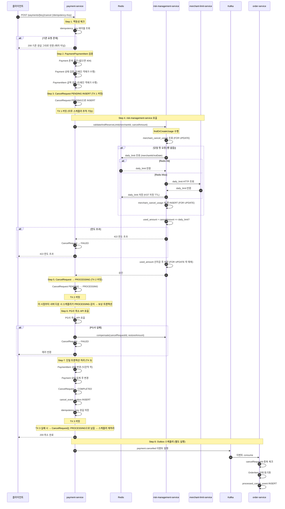

### 3-2. Step 1 — 멱등성 체크 상세

**왜 에러가 아닌 기존 응답을 반환하는가:**

```
네트워크 타임아웃 시나리오:
  1. 클라이언트가 취소 요청 전송
  2. 서버에서 취소 처리 완료 (200 응답 생성)
  3. 응답이 네트워크 도중 유실
  4. 클라이언트는 응답을 못 받았으니 재시도

여기서 409 에러를 반환하면:
  클라이언트 입장에서 "취소가 된 건지 안 된 건지" 모름
  → 혼란 발생

200 기존 응답을 반환하면:
  클라이언트는 "처음 요청이 성공했구나" → 정상 종료

멱등성 = 같은 요청 N번 = 동일한 결과
에러는 "다른 결과" → 멱등성 위반
```

**왜 paymentHistory가 아닌 별도 테이블인가:**

```
paymentHistory에서 확인하면:
  TPS 10,000 → 하루 864,000만 건 누적
  → 인덱스가 있어도 데이터 증가에 따라 느려짐
  → 멱등성 체크와 이력 조회가 같은 테이블 공유
     → 서로 부하를 주고받음

별도 idempotency_key 테이블:
  TTL(24시간) 관리 가능
  단일 책임: 멱등성 체크만 담당
  외부 서비스 호출 없이 자체 DB에서 처리
```

```sql
CREATE TABLE idempotency_key (
                                 id            BIGINT PRIMARY KEY AUTO_INCREMENT,
                                 idem_key      VARCHAR(64) NOT NULL,
                                 response_body JSON        NOT NULL,  -- 기존 응답 저장
                                 created_at    DATETIME(3) NOT NULL,
                                 expires_at    DATETIME(3) NOT NULL,  -- 24시간 후 만료
                                 UNIQUE KEY uk_idempotency_idem_key (idem_key)
);
```

### 3-3. Step 2 — Payment/PaymentItem 검증 상세

**PaymentItem을 payment-service에 스냅샷으로 저장하는 이유:**

```
취소 검증 시 "이 항목이 얼마짜리였는지" 알아야 함
→ 주문 모듈에 요청하면?
   모듈 간 DB 직접 접근 금지
   주문 모듈 장애 시 취소도 불가능해짐

→ 결제 시점에 PaymentItem을 payment-service DB에 저장
   item_name, item_price: 결제 시점 스냅샷
   product_id, product_auto_id: 버전 고정

취소 검증:
  paymentItemRepository.findAllByPaymentId(paymentId)
  → payment-service 자체 DB 조회
  → 주문/상품 모듈 호출 없이 금액 검증 가능
```

**동일 PaymentItem 동시 수정 문제 (케이스 3):**

```
고객:   PaymentItem A 50만원 취소 시도
가맹점: PaymentItem A 80만원 취소 시도 (동시)

둘 다 cancelled_amount = 0 조회
→ A: 0 + 50 <= 100 통과
→ B: 0 + 80 <= 100 통과
→ 둘 다 UPDATE → 데이터 불일치

해결: PaymentItem 낙관적 락
```

```sql
UPDATE payment_item
SET cancelled_amount = cancelled_amount + ?,
    version = version + 1
WHERE id = ?
  AND version = ?                              -- 내가 읽은 시점의 version
  AND cancelled_amount + ? <= item_amount      -- 언더플로우 방어
```

```
동시에 둘 다 시도하면 version이 다르므로 하나만 성공
실패한 쪽은 OptimisticLockException → 재조회 후 재시도 또는 에러
```

### 3-4. Step 3 — risk-management-service 상세

**내부 처리 순서:**

```
1. merchant-limit-service에서 daily_limit 조회
   (당일 첫 요청이면 스냅샷 저장, 이후엔 스냅샷 사용)

2. merchant_cancel_usage 조회 (FOR UPDATE — 락 획득)
   → 다른 트랜잭션은 이 시점부터 대기

3. used_amount + 요청금액 > daily_limit?
   → 초과면 락 해제 + 422 에러 반환

4. 통과하면 used_amount 선차감

5. 트랜잭션 커밋 (락 해제)

6. payment-service에 승인 응답
```

**선차감인 이유:**

```
사후차감이면:
  동시 요청에서 둘 다 취소 처리까지 완료된 후
  한도 초과를 알게 됨
  → 이미 환불이 2번 발생한 상태

선차감이면:
  검증과 차감을 원자적으로 처리 (FOR UPDATE)
  → 하나가 차감하는 동안 다른 요청은 대기
  → 한도 초과 시 즉시 거부 가능
```

**FOR UPDATE를 선택한 이유:**

```
낙관적 락 (version):
  충돌 시 재시도
  한도 초과 시나리오에서 재시도해도 한도 초과 → 또 실패
  결국 직렬화하는 것과 결과 동일
  재시도 과정에서 불필요한 DB 부하 발생

비관적 락 (FOR UPDATE):
  처음부터 직렬화
  한도 초과 시 즉시 거부 → 불필요한 재시도 없음
  금융 도메인에서 정확성 > 처리량
```

### 3-5. Step 3~6 — 트랜잭션 경계 상세

**왜 트랜잭션을 3개로 나누는가:**

```
TX 1 (CancelRequest PENDING INSERT):
  risk 호출 전에 별도로 커밋
  이유: TX 3이 실패해도 CancelRequest 행이 DB에 남아있어야
        스케줄러가 추적하고 보상 트랜잭션을 실행할 수 있음
        TX 3에 포함시키면 실패 시 행 자체가 사라짐
        → 스케줄러가 추적 불가 → 보상 불가

TX 2 (CancelRequest → PROCESSING):
  risk 커밋 후 별도로 커밋
  이유: "한도 차감됨, 취소 처리 중" 상태를 DB에 기록
        서버가 TX 3 도중 다운되면 PROCESSING 상태가 남음
        → 스케줄러가 5분 초과 PROCESSING 감지
        → used_amount 재차감 없이 TX 3만 재처리

TX 3 (단일 커밋):
  PaymentItem, Payment, COMPLETED, Outbox, idempotency_key
  이유: 이 5가지는 하나라도 실패하면 전부 롤백
        "PaymentItem은 변경됐는데 Outbox는 없음" 같은
        불일치 상태가 남으면 안 됨
```

**TX 3 내부 순서와 이유:**

```
[TX 3 시작]

1. PaymentItem 상태 변경 + cancelled_amount 누적
   (낙관적 락으로 동시 수정 방어)

2. Payment 상태 집계 후 변경
   PaymentItem 전체 확인 후 결정:
     cancelled_amount 합계 == total_amount → CANCELLED
     합계 < total_amount → PARTIAL_CANCELLED
   이유: PaymentItem이 먼저 변경돼야 집계 가능

3. CancelRequest → COMPLETED

4. cancel_event_outbox INSERT
   이유: 1~3이 모두 성공해야 Kafka 발행 자격이 생김

5. idempotency_key 응답 저장
   이유: 여기서 저장해야 재시도 시 완성된 응답 반환 가능

[TX 3 커밋]

TX 3 실패 시:
  CancelRequest는 PROCESSING 상태로 DB에 남음 (TX 2에서 커밋됨)
  → 복구 스케줄러가 5분 초과 PROCESSING 감지
  → used_amount 재차감 없이 TX 3만 재처리
```

---

## 4. 코드로 보는 취소 플로우

### 4-1. PG사 취소 포함 전체 TX 경계

```java
@Service
@RequiredArgsConstructor
public class CancelPaymentService implements CancelPaymentUseCase {

    private final PaymentRepository paymentRepository;
    private final PaymentItemRepository paymentItemRepository;
    private final CancelRequestRepository cancelRequestRepository;
    private final IdempotencyKeyManager idempotencyKeyManager;
    private final RiskManagementService riskManagementService;  // HTTP 클라이언트
    private final PgCancelClient pgCancelClient;                // PG사 HTTP 클라이언트
    private final CancelEventOutboxRepository outboxRepository;
    private final CompensationRetryRepository compensationRetryRepository;

    public CancelPaymentResponse cancel(
            String paymentKey, Long userId,
            String idempotencyKey, CancelPaymentRequest request
    ) {
        // ── Step 1. 멱등성 체크 ──────────────────────────────
        // idempotency_key 테이블 조회 (DB 조회, TX 없음)
        Optional<CancelPaymentResponse> existing =
                idempotencyKeyManager.findResponse(idempotencyKey);
        if (existing.isPresent()) {
            return existing.get();  // 기존 응답 그대로 반환 (재처리 없음)
        }

        // ── Step 2. Payment/PaymentItem 검증 ────────────────
        // TX 없음 — 조회만 수행
        Payment payment = paymentRepository.findByPaymentKey(paymentKey)
                .orElseThrow(() -> new PaymentNotFoundException(paymentKey));

        payment.validateCancellable();  // 도메인 객체가 상태 검증

        List<PaymentItem> items =
                paymentItemRepository.findAllByPaymentId(payment.getId());

        cancelDomainService.validateCancelItems(items, request.cancelItems());

        // ── Step 3. TX 1 — CancelRequest PENDING INSERT ──────
        // risk 호출 전에 별도 커밋 (스케줄러 추적 가능하도록)
        CancelRequest cancelRequest = saveCancelRequestAsPending(
                payment, idempotencyKey, request, userId
        );

        // ── Step 4. risk-management-service 호출 (HTTP) ──────
        // TX 없음 — 외부 HTTP 호출
        try {
            riskManagementService.validateAndReserveLimit(
                    payment.getMerchantId(),
                    request.cancelAmount()
            );
        } catch (MerchantCancelLimitExceededException e) {
            // 한도 초과 — risk는 호출 안 됐거나 차감 없이 에러 반환
            failCancelRequest(cancelRequest, e.getMessage());
            throw e;
        } catch (RiskServiceException e) {
            // risk 서비스 장애
            failCancelRequest(cancelRequest, e.getMessage());
            throw e;
        }

        // ── Step 5. TX 2 — CancelRequest PROCESSING ──────────
        // risk 커밋 완료 후 별도 커밋
        // 이 시점부터 서버 다운 시 스케줄러가 보상 트랜잭션 실행
        markAsProcessing(cancelRequest);

        // ── Step 6. PG사 취소 API 호출 (HTTP) ────────────────
        // TX 없음 — 외부 HTTP 호출
        // PG사 성공 후에만 DB 처리 수행
        try {
            pgCancelClient.cancel(
                    payment.getPaymentKey(),
                    payment.getPgType(),
                    request.cancelAmount()
            );
        } catch (PgCancelFailedException e) {
            // PG사 취소 실패
            // risk에서 선차감한 used_amount 원복 필요
            failWithCompensation(cancelRequest, payment.getMerchantId(),
                    request.cancelAmount(), e.getMessage());
            throw e;
        } catch (PgCancelTimeoutException e) {
            // PG사 타임아웃 — 실제로 취소됐는지 불명확
            // PROCESSING 상태로 두고 스케줄러가 PG사 조회 후 판단
            throw e;
        }

        // ── Step 7. TX 3 — 단일 트랜잭션 ────────────────────
        return completeCancel(cancelRequest, payment, items, request, idempotencyKey);
    }

    // TX 1
    @Transactional
    private CancelRequest saveCancelRequestAsPending(
            Payment payment, String idempotencyKey,
            CancelPaymentRequest request, Long userId
    ) {
        CancelRequest cancelRequest = CancelRequest.create(
                payment.getId(), idempotencyKey,
                request.cancelAmount(), request.cancelReason(),
                CancellerType.USER, userId
        );
        return cancelRequestRepository.save(cancelRequest);
    }

    // TX 2
    @Transactional
    private void markAsProcessing(CancelRequest cancelRequest) {
        cancelRequest.toProcessing();
        cancelRequestRepository.save(cancelRequest);
    }

    // TX 3
    @Transactional
    private CancelPaymentResponse completeCancel(
            CancelRequest cancelRequest, Payment payment,
            List<PaymentItem> items, CancelPaymentRequest request,
            String idempotencyKey
    ) {
        // PaymentItem 상태 변경 (낙관적 락)
        List<PaymentItem> updatedItems =
                cancelDomainService.applyCancelToItems(items, request.cancelItems());
        paymentItemRepository.saveAll(updatedItems);

        // Payment 상태 집계
        payment.recalculateStatus(updatedItems);
        paymentRepository.save(payment);

        // CancelRequest COMPLETED
        cancelRequest.toCompleted();
        cancelRequestRepository.save(cancelRequest);

        // Outbox INSERT
        outboxRepository.save(CancelEventOutbox.of(cancelRequest, payment));

        // 응답 저장 (재시도 시 동일 응답 반환)
        CancelPaymentResponse response = CancelPaymentResponse.of(cancelRequest, updatedItems);
        idempotencyKeyManager.save(idempotencyKey, response);

        return response;
    }

    // 보상 트랜잭션
    private void failWithCompensation(
            CancelRequest cancelRequest, Long merchantId,
            BigDecimal restoreAmount, String reason
    ) {
        failCancelRequest(cancelRequest, reason);

        try {
            // risk-management-service에 HTTP로 보상 요청
            riskManagementService.compensate(
                    cancelRequest.getId().toString(), restoreAmount
            );
        } catch (Exception e) {
            // 보상도 실패 → 스케줄러에 위임
            compensationRetryRepository.save(
                    CompensationRetry.create(
                            cancelRequest.getId().toString(), merchantId, restoreAmount
                    )
            );
        }
    }

    @Transactional
    private void failCancelRequest(CancelRequest cancelRequest, String reason) {
        cancelRequest.toFailed(reason);
        cancelRequestRepository.save(cancelRequest);
    }
}
```

---

### 4-2. PG사 성공/실패 케이스

**왜 PG사 먼저, DB 나중인가 — 순서 비교:**

| 방식 | PG사 성공 + DB 실패 | DB 성공 + PG사 실패 |
|------|-------------------|-------------------|
| A. PG사 먼저 | 환불 됨, DB만 맞추면 됨 → 스케줄러 재처리 가능 | 해당 없음 |
| B. DB 먼저 | 해당 없음 | 시스템은 취소 완료, 실제 환불 안 됨 → 고객 피해 |

```
방식 A 선택 이유:
  PG사 성공 + DB 실패:
    환불은 됐고 DB만 맞추면 됨
    TX 3은 멱등하게 재시도 가능
    고객 피해 없음

  방식 B의 문제:
    DB 성공 + PG사 실패 시
    DB를 취소 전 상태로 되돌려야 함
    PaymentItem.cancelled_amount 원복
    Payment 상태 원복
    Outbox 삭제까지 필요
    → 보상이 훨씬 복잡하고 위험
    → 실패 시 고객 피해 (환불 안 됨)
```

**각 케이스별 처리:**

```
PG사 취소 성공 → TX 3 진행

PG사 취소 실패 (명확한 실패):
  → risk used_amount 보상 트랜잭션 즉시 실행
  → CancelRequest → FAILED
  → 클라이언트에 에러 반환

PG사 타임아웃 (불명확):
  → CancelRequest PROCESSING 상태 유지
  → 스케줄러가 PG사에 취소 결과 조회 (GET /cancel/{cancelKey})
  → 성공이면 TX 3 진행, 실패이면 보상 + FAILED

PG사 중복 취소 요청:
  → PG사도 멱등성 지원
  → 같은 cancelKey로 재요청 시 기존 결과 반환
  → 안전하게 재시도 가능
```

**PG사 성공 + TX 3 실패 상세 처리:**

```java
// PG사 성공 후 TX 3 실패 시
// used_amount 보상하면 안 됨
// 이유: PG사 취소가 이미 완료됐으니 취소는 완료된 것
//       DB만 맞추면 되는 상황
// → 보상 트랜잭션 실행하지 않음 → 스케줄러에 위임

try {
        pgCancelClient.cancel(payment.getPaymentKey(), ...);
        } catch (PgCancelFailedException e) {
// PG사 실패 → 보상 + FAILED
failWithCompensation(cancelRequest, ...);
    throw e;
}

// PG사 성공
        try {
completeCancel(cancelRequest, payment, items, request, idempotencyKey);
} catch (Exception e) {
        // TX 3 실패
        // CancelRequest는 PROCESSING으로 남음 (TX 2에서 커밋됨)
        // 보상 트랜잭션 실행하지 않음 (PG사 이미 완료됨)
        // 스케줄러가 PG사 조회 후 TX 3만 재시도
        log.error("TX 3 실패 - PG사 취소는 완료됨. 스케줄러 재처리 대기: " +
                          "cancelRequestId={}", cancelRequest.getId(), e);
        throw e;
}
```

**복구 스케줄러 — PG사 조회 후 판단:**

```java
@Transactional
public void recoverProcessing(CancelRequest request) {
    PgCancelResult pgResult =
            pgCancelClient.getResult(request.getPaymentKey());

    if (pgResult.isSuccess()) {
        // PG사 취소 완료 → TX 3만 재시도
        // used_amount 재차감 없음 (PROCESSING = 이미 차감됨)
        // PG사 재호출 없음 (이미 완료됨)
        completeCancel(request);

    } else if (pgResult.isNotCancelled()) {
        // PG사 취소 안 됨 (드문 케이스)
        // used_amount 보상 + FAILED
        request.toFailed("PG사 취소 미완료");
        cancelRequestRepository.save(request);
        riskManagementService.compensate(
                request.getId().toString(),
                request.getCancelAmount()
        );
    }
}
```

**TX 3이 멱등한 이유:**

```
TX 3을 여러 번 실행해도 결과가 동일:

PaymentItem:
  cancelled_amount + cancelAmount <= item_amount 조건 체크
  이미 반영됐으면 낙관적 락 충돌 → 재조회 후 확인

Payment:
  PaymentItem 전체 합산으로 상태 결정 → 항상 동일한 결과

CancelRequest:
  COMPLETED 상태면 더 이상 변경 안 함

Outbox:
  cancel_request_id UK → 이미 있으면 INSERT 실패 → no-op

idempotency_key:
  idem_key UK → 이미 있으면 INSERT 실패 → no-op
```

---

### 4-3. 락 코드 상세

**락 1 — idempotency_key UK 제약 (케이스 1: 동일 요청 중복)**

```java
// IdempotencyKeyManager.java
@Transactional
public void save(String idemKey, CancelPaymentResponse response) {
    try {
        idempotencyKeyRepository.save(
                IdempotencyKey.create(idemKey, response)
        );
    } catch (DataIntegrityViolationException e) {
        // UK 중복 → 이미 처리된 요청
        // 무시하고 진행 (기존 값 유지)
    }
}

public Optional<CancelPaymentResponse> findResponse(String idemKey) {
    return idempotencyKeyRepository.findByIdemKey(idemKey)
            .map(key -> deserialize(key.getResponseBody()));
}
```

```sql
-- DB 레벨에서 중복 차단
-- 두 요청이 동시에 INSERT 시도 시 하나만 성공
UNIQUE KEY uk_idempotency_idem_key (idem_key)
```

---

**락 2 — merchant_cancel_usage FOR UPDATE (케이스 2: 가맹점 한도 동시 차감)**

```java
// risk-management-service 내부
// MerchantCancelUsageRepository.java
@Lock(LockModeType.PESSIMISTIC_WRITE)
@Query("SELECT u FROM MerchantCancelUsage u " +
        "WHERE u.merchantId = :merchantId AND u.kstDate = :kstDate")
Optional<MerchantCancelUsage> findByMerchantIdAndDateForUpdate(
        Long merchantId, LocalDate kstDate
);
```

```java
// RiskManagementCancelService.java
@Transactional
public void validateAndReserveLimit(
        Long merchantId,
        BigDecimal cancelAmount
) {
    LocalDate kstToday = LocalDate.now(ZoneId.of("Asia/Seoul"));

    // 당일 첫 요청이면 merchant-limit-service에서 daily_limit 조회 후 행 생성
    MerchantCancelUsage usage = findOrCreateUsage(merchantId, kstToday);

    // FOR UPDATE로 이미 락이 걸린 상태에서 검증
    if (usage.getUsedAmount().add(cancelAmount)
            .compareTo(usage.getDailyLimit()) > 0) {
        throw new MerchantCancelLimitExceededException(
                cancelAmount,
                usage.getDailyLimit().subtract(usage.getUsedAmount()),
                usage.getDailyLimit()
        );
    }

    // 검증 통과 → 선차감
    usage.addUsedAmount(cancelAmount);
    merchantCancelUsageRepository.save(usage);
    // 트랜잭션 커밋 시 FOR UPDATE 락 해제
}
```

```
동작 방식:
  사용자 A: FOR UPDATE → 락 획득 → 검증 → 차감 → 커밋 (락 해제)
  사용자 B: FOR UPDATE → 대기 (A가 커밋될 때까지)
            → A 커밋 후 락 획득 → 검증 → 한도 초과 시 에러
```

---

**락 3 — PaymentItem 낙관적 락 (케이스 3: 동일 항목 동시 수정)**

```java
// PaymentItem.java (도메인 엔티티)
@Entity
public class PaymentItem {
    @Version
    private int version;  // JPA가 자동으로 version 컬럼 관리

    public void applyCancelAmount(BigDecimal cancelAmount) {
        if (this.cancelledAmount.add(cancelAmount)
                .compareTo(this.itemAmount) > 0) {
            throw new CancelAmountExceededException(
                    this.id, cancelAmount,
                    this.itemAmount.subtract(this.cancelledAmount)
            );
        }
        this.cancelledAmount = this.cancelledAmount.add(cancelAmount);
        recalculateStatus();
    }
}
```

```sql
-- JPA가 UPDATE 시 version 조건 자동 추가
UPDATE payment_item
SET cancelled_amount = cancelled_amount + ?,
    status = ?,
    version = version + 1
WHERE id = ?
  AND version = ?;  -- 내가 읽은 시점의 version과 다르면 0 rows updated

-- 0 rows updated → OptimisticLockException 발생
```

```java
// 낙관적 락 실패 처리
try {
        paymentItemRepository.saveAll(updatedItems);
} catch (OptimisticLockingFailureException e) {
        // 다른 트랜잭션이 먼저 수정함
        // 재조회 후 재검증
        throw new CancelConflictException("동시 취소 요청이 발생했습니다. 다시 시도해주세요.");
}
```

---

### 4-4. 스케줄러 코드

**스케줄러 1 — 복구 스케줄러 (PROCESSING 5분 초과 건)**

```java
@Component
@RequiredArgsConstructor
public class CancelRecoveryScheduler {

    private final CancelRequestRepository cancelRequestRepository;
    private final CancelRecoveryService cancelRecoveryService;

    @Scheduled(fixedDelay = 60_000)  // 60초마다
    @SchedulerLock(name = "cancel-recovery", lockAtMostFor = "55s")
    public void recover() {
        LocalDateTime threshold = LocalDateTime.now(ZoneOffset.UTC)
                .minusMinutes(5);

        List<CancelRequest> stuckRequests =
                cancelRequestRepository.findStuckProcessingRequests(threshold);

        for (CancelRequest request : stuckRequests) {
            try {
                cancelRecoveryService.recoverProcessing(request);
            } catch (Exception e) {
                log.error("복구 실패: cancelRequestId={}", request.getId(), e);
            }
        }
    }
}

@Service
public class CancelRecoveryService {

    @Transactional
    public void recoverProcessing(CancelRequest request) {
        // PROCESSING = used_amount 이미 차감됨
        // PG사 취소 결과 먼저 확인
        PgCancelResult pgResult = pgCancelClient.getResult(request.getPaymentKey());

        if (pgResult.isSuccess()) {
            // PG사 취소 성공 → TX 3 재처리 (used_amount 재차감 없음)
            completeCancel(request);
        } else {
            // PG사 취소 실패 또는 미수행 → 보상 트랜잭션
            request.toFailed("복구 스케줄러: PG사 취소 미완료");
            cancelRequestRepository.save(request);
            riskManagementService.compensate(
                    request.getId().toString(), request.getCancelAmount()
            );
        }
    }
}
```

---

**스케줄러 2 — Outbox 발행 스케줄러**

```java
@Component
@RequiredArgsConstructor
public class CancelEventOutboxScheduler {

    private final CancelEventOutboxRepository outboxRepository;
    private final KafkaEventPublisher kafkaEventPublisher;

    @Scheduled(fixedDelay = 10_000)  // 10초마다
    @SchedulerLock(name = "outbox-publisher", lockAtMostFor = "9s")
    public void publish() {
        List<CancelEventOutbox> pendingEvents =
                outboxRepository.findByStatusOrderByCreatedAt(
                        OutboxStatus.PENDING, PageRequest.of(0, 100)
                );

        for (CancelEventOutbox outbox : pendingEvents) {
            try {
                kafkaEventPublisher.publish(
                        "payment.cancelled",
                        outbox.getPayload()
                );
                // 발행 성공 → PUBLISHED 업데이트
                outbox.markAsPublished();
                outboxRepository.save(outbox);
            } catch (Exception e) {
                log.error("Outbox 발행 실패: outboxId={}", outbox.getId(), e);
                // 다음 스케줄러 실행 시 재시도 (PENDING 유지)
            }
        }
    }
}
```

---

**스케줄러 3 — 보상 재시도 스케줄러**

```java
@Component
@RequiredArgsConstructor
public class CompensationRetryScheduler {

    private final CompensationRetryRepository compensationRetryRepository;
    private final RiskManagementService riskManagementService;

    @Scheduled(fixedDelay = 30_000)  // 30초마다
    @SchedulerLock(name = "compensation-retry", lockAtMostFor = "25s")
    public void retry() {
        LocalDateTime now = LocalDateTime.now(ZoneOffset.UTC);

        List<CompensationRetry> retries =
                compensationRetryRepository.findPendingRetries(now, 100);

        for (CompensationRetry retry : retries) {
            try {
                riskManagementService.compensate(
                        retry.getCancelRequestId(), retry.getRestoreAmount()
                );
                // 보상 성공
                retry.markAsDone();
                compensationRetryRepository.save(retry);

            } catch (Exception e) {
                retry.incrementAttempt();  // attempt_count++

                if (retry.isExhausted()) {
                    // 5회 초과 → EXHAUSTED
                    retry.markAsExhausted();
                    alertService.sendExhaustedAlert(retry);
                } else {
                    // 지수 백오프: 30초 × 2^attemptCount
                    retry.scheduleNextRetry();
                }
                compensationRetryRepository.save(retry);
            }
        }
    }
}
```

```
ShedLock 동작:
  @SchedulerLock(name = "cancel-recovery", lockAtMostFor = "55s")
  → shedlock 테이블에 name="cancel-recovery" 행을 lock_until=NOW+55초로 INSERT
  → 다른 인스턴스가 같은 이름으로 시도 시 lock_until이 미래 → 실행 skip
  → 인스턴스 다운 시 lock_until 이후 자동 해제
```

---

## 4. HTTP 경계와 원자성

### 4-1. 핵심 전제

```
HTTP 요청은 트랜잭션 경계를 넘을 수 없다.

payment-service의 @Transactional과
risk-management-service의 @Transactional은
완전히 독립된 트랜잭션이다.
둘은 같은 트랜잭션으로 묶이지 않는다.
```

### 4-2. 케이스별 원자성 분석

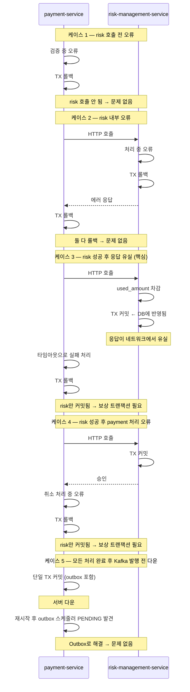

| 케이스 | 상황 | 결과 |
|--------|------|------|
| 1 | risk 호출 전 오류 | 둘 다 롤백 → 문제 없음 |
| 2 | risk 내부 오류 | 둘 다 롤백 → 문제 없음 |
| 3 | risk 성공 후 응답 유실 | risk만 커밋 → **보상 트랜잭션 필요** |
| 4 | risk 성공 후 payment 오류 | risk만 커밋 → **보상 트랜잭션 필요** |
| 5 | 취소 완료 후 Kafka 발행 전 다운 | Outbox 스케줄러 처리 |

### 4-6. 케이스 3, 4 보상 트랜잭션 상세

**케이스 3 — risk 응답 유실 시 흐름:**

```
상황:
  risk-management-service: used_amount 차감 커밋 완료
  응답이 네트워크에서 유실
  payment-service: 타임아웃 감지

이 시점에서 CancelRequest 상태:
  PENDING (TX 1에서 커밋됨)
  → PROCESSING으로 가지 못한 상태

payment-service 처리:
  타임아웃 catch → CancelRequest FAILED 기록
  → 보상 트랜잭션 즉시 실행
```

```java
// payment-service — risk HTTP 호출 catch
try {
        riskManagementService.validateAndReserveLimit(
        payment.getMerchantId(),
        request.cancelAmount()
    );
            } catch (ResourceAccessException e) {
// 타임아웃 또는 네트워크 유실
// risk가 커밋됐을 수도, 안 됐을 수도 있음
// 안전하게 보상 시도 (risk 측에서 멱등하게 처리)
failWithCompensation(cancelRequest, payment.getMerchantId(),
        request.cancelAmount(), "risk 응답 유실: " + e.getMessage());
        throw new RiskServiceUnavailableException();
}
```

```java
// risk-management-service — 보상 API (멱등)
@Transactional
public void compensate(String cancelRequestId, BigDecimal restoreAmount) {

    // 멱등 체크: 이미 보상됐으면 no-op
    // cancel_usage_compensation UK로 중복 방어
    int inserted = compensationRepository.insertIfAbsent(
            cancelRequestId, restoreAmount
    );

    if (inserted == 0) {
        // 이미 보상 완료된 건 → 그냥 반환
        log.info("이미 보상 완료된 건: cancelRequestId={}", cancelRequestId);
        return;
    }

    // 실제 원복
    // used_amount가 restoreAmount 미만이면 0으로 (언더플로우 방어)
    merchantCancelUsageRepository.decreaseUsedAmount(
            cancelRequestId, restoreAmount
    );
}
```

```sql
-- cancel_usage_compensation INSERT (UK 중복 시 no-op)
INSERT IGNORE INTO cancel_usage_compensation
  (cancel_request_id, merchant_id, restore_amount, status)
VALUES (?, ?, ?, 'COMPLETED');

-- used_amount 원복 (언더플로우 방어)
UPDATE merchant_cancel_usage
SET used_amount = GREATEST(0, used_amount - ?)
WHERE merchant_id = ?
  AND kst_date = ?;
```

**케이스 3 핵심 — 보상이 실제로 필요한지 불명확한 경우:**

```
risk가 커밋됐을 수도, 안 됐을 수도 있는 상황에서
보상 API를 호출하면?

risk가 커밋 안 됐다면:
  merchant_cancel_usage에 차감이 없음
  보상 API 호출 → cancel_usage_compensation INSERT
  → used_amount - restoreAmount 시도
  → GREATEST(0, 0 - 30만원) = 0 (언더플로우 방어)
  → 결과: 이상 없음

risk가 커밋 됐다면:
  used_amount가 차감된 상태
  보상 API 호출 → used_amount 원복
  → 결과: 정상 복구

어느 경우든 안전하게 처리됨
→ 불명확한 상황에서 보상 API 호출은 항상 안전
```

---

**케이스 4 — risk 성공 후 payment 처리 오류 흐름:**

```
상황:
  risk-management-service: used_amount 차감 커밋 완료
  payment-service: TX 3 처리 중 오류 (PaymentItem 수정 실패 등)

이 시점에서 CancelRequest 상태:
  PROCESSING (TX 2에서 커밋됨)
  TX 3이 롤백됐으므로 PROCESSING 그대로 남음
```

```java
// TX 3 내부에서 오류 발생 시
@Transactional
private CancelPaymentResponse completeCancel(...) {
    try {
        // PaymentItem 낙관적 락 충돌 등
        paymentItemRepository.saveAll(updatedItems);
        ...
    } catch (OptimisticLockingFailureException e) {
        // TX 3 롤백됨 → CancelRequest는 PROCESSING 상태로 남음
        // 여기서 보상 트랜잭션 직접 실행 불가
        // (이미 TX 3 롤백 → 이 메서드 내 추가 DB 작업 불가)
        throw e;
    }
}

// TX 3 외부 (CancelPaymentService.cancel)에서 처리
try {
completeCancel(cancelRequest, payment, items, request, idempotencyKey);
} catch (Exception e) {
        // TX 3 실패 → CancelRequest가 PROCESSING 상태로 남아있음
        // 방법 1: 즉시 보상 시도
        try {
failCancelRequestDirectly(cancelRequest.getId()); // PROCESSING → FAILED
        riskManagementService.compensate(
        cancelRequest.getId().toString(), request.cancelAmount()
        );
                } catch (Exception compensateEx) {
        // 보상도 실패 → compensation_retry에 기록
        // 스케줄러가 재시도
        compensationRetryRepository.save(
        CompensationRetry.create(
                cancelRequest.getId().toString(),
                payment.getMerchantId(),
                request.cancelAmount()
            )
                    );
                    }
                    throw e;
}
```

**케이스 4 — 복구 스케줄러가 처리하는 경로:**

```
서버 다운으로 케이스 4 catch 블록도 실행 못 한 경우:
  CancelRequest가 PROCESSING 상태로 5분 이상 남음
  → 복구 스케줄러 감지

복구 스케줄러 판단:
  PG사에 취소 결과 조회
    → PG사 취소 성공: TX 3 재처리 (COMPLETED 방향)
    → PG사 취소 미수행: FAILED + 보상 트랜잭션

TX 3 재처리 시 주의:
  used_amount는 이미 차감됨 → 재차감 금지
  PG사 취소는 이미 됐거나 스케줄러가 다시 호출
  PG사 멱등성으로 중복 호출 방어
```

---

## 5. daily_limit 조회 전략 비교

### 5-1. 현재 설계 — DB 스냅샷

```
당일 첫 요청:
  merchant-limit-service HTTP 호출 → daily_limit 조회
  merchant_cancel_usage에 스냅샷 저장 (kst_date 기준)

이후 요청:
  merchant_cancel_usage 조회 (자체 DB)
  HTTP 호출 없음

한도 변경:
  다음날 첫 요청 시 반영
```

| 항목 | 평가 |
|------|------|
| 구현 복잡도 | 낮음 |
| 조회 속도 | 빠름 (자체 DB) |
| 정합성 | 당일 변경 반영 안 됨 |
| 인프라 추가 | 없음 |
| 장애 격리 | merchant-limit 장애 시 당일 첫 요청만 영향 |

---

### 5-2. Redis 우선 + DB 폴백

```
요청 시:
  Redis에서 merchantId:kstDate 키 조회
    → Hit: Redis 값 사용 (HTTP 호출 없음)
    → Miss: merchant-limit-service HTTP 호출
            → Redis에 KST 자정 TTL로 저장
            → 이후 요청은 Redis 사용

Redis TTL:
  KST 자정까지 남은 시간으로 설정
  → 다음날 자동 만료 → 새 daily_limit 자동 적용
```

```java
// findOrCreateUsage — Redis 우선 + HTTP 폴백 + DB 폴백
@Transactional
private MerchantCancelUsage findOrCreateUsage(
        Long merchantId, LocalDate kstDate
) {
    return merchantCancelUsageRepository
            .findByMerchantIdAndDateForUpdate(merchantId, kstDate)  // FOR UPDATE
            .orElseGet(() -> {
                // 당일 첫 요청 → daily_limit 조회 (Redis 우선)
                BigDecimal dailyLimit = getDailyLimitWithFallback(merchantId, kstDate);

                return merchantCancelUsageRepository.save(
                        MerchantCancelUsage.create(merchantId, kstDate, dailyLimit)
                );
            });
}

private BigDecimal getDailyLimitWithFallback(
        Long merchantId, LocalDate kstDate
) {
    String key = "daily_limit:" + merchantId + ":" + kstDate;

    try {
        // 1순위: Redis 조회
        String cached = redisTemplate.opsForValue().get(key);
        if (cached != null) {
            return new BigDecimal(cached);
        }

        // 2순위: merchant-limit-service HTTP 호출
        BigDecimal limit = merchantLimitClient.getDailyLimit(merchantId);

        // KST 자정까지 TTL 계산 후 Redis 저장
        Duration ttl = Duration.between(
                LocalDateTime.now(ZoneId.of("Asia/Seoul")),
                kstDate.plusDays(1).atStartOfDay(ZoneId.of("Asia/Seoul"))
                        .toLocalDateTime()
        );
        redisTemplate.opsForValue().set(key, limit.toString(), ttl);

        return limit;

    } catch (RedisException e) {
        // Redis 장애 → 3순위: HTTP 직접 호출 (Redis 없이)
        log.warn("Redis 조회 실패. HTTP 폴백: merchantId={}", merchantId, e);
        return merchantLimitClient.getDailyLimit(merchantId);
    }
}
```

```
Redis 장애 시 흐름:
  Redis 조회 실패 → catch
  → merchant-limit-service HTTP 직접 호출
  → 서비스 정상 유지 (Redis 없이도 동작)

Redis 장애 + merchant-limit 장애 시:
  당일 첫 요청만 실패
  이미 merchant_cancel_usage 행이 있는 요청은 정상 처리
```

| 항목 | 평가 |
|------|------|
| 구현 복잡도 | 중간 |
| 조회 속도 | 매우 빠름 (Redis in-memory) |
| 정합성 | 당일 변경 반영 안 됨 (TTL 만료 전까지) |
| 인프라 추가 | Redis 클러스터 필요 |
| 장애 격리 | Redis 장애 시 HTTP 폴백, 이중 안전망 |

---

### 5-3. 다른 대안들

**대안 1 — 매 요청마다 merchant-limit-service 직접 호출**

```
장점: 항상 최신 한도 반영
단점: 매 취소 요청마다 HTTP 호출 발생
      merchant-limit-service 장애 = 모든 취소 불가
      TPS 10,000에서 10,000 req/s HTTP 트래픽 발생
→ 성능/안정성 모두 취약 → 채택 불가
```

**대안 2 — Kafka 이벤트로 한도 변경 즉시 반영**

```
merchant-limit-service에서 한도 변경 시
Kafka 이벤트 발행 → risk-management-service가 consume
→ merchant_cancel_usage.daily_limit 즉시 업데이트

장점: 당일 한도 변경 즉시 반영
단점: Kafka 지연 시간 동안 반영 안 됨
      구현 복잡도 높음
      한도 변경이 드문 이벤트에 Kafka 연동 과잉
→ 한도 변경이 실시간 반영이 꼭 필요한 경우에만 채택
```

**대안 3 — Local Cache (Caffeine)**

```
Redis 없이 애플리케이션 메모리에 캐시

장점: 인프라 추가 없음, 매우 빠름
단점: 인스턴스마다 캐시가 다름
      인스턴스 A: daily_limit = 100만원 (구버전)
      인스턴스 B: daily_limit = 200만원 (신버전)
      → 같은 가맹점 요청이 어느 인스턴스로 가느냐에 따라 한도가 달라짐
→ 분산 환경에서 정합성 보장 불가 → 채택 불가
```

---

### 5-4. 전략 비교표

| 전략 | 속도 | 정합성 | 인프라 | 장애 격리 | 추천 |
|------|------|--------|--------|---------|------|
| DB 스냅샷 (현재) | 빠름 | 다음날 반영 | 없음 | 첫 요청만 영향 | 초기 단계 |
| Redis + DB 폴백 | 매우 빠름 | 다음날 반영 | Redis | Redis 장애 시 DB | TPS 1000+ |
| 매 요청 HTTP | 느림 | 즉시 반영 | 없음 | 한도서비스 다운=전체 장애 | 채택 불가 |
| Kafka 이벤트 | 빠름 | 수초 내 반영 | Kafka | 지연 가능 | 즉시 반영 필수 시 |
| Local Cache | 매우 빠름 | 인스턴스마다 다름 | 없음 | 없음 | 채택 불가 |

**현재 DB 스냅샷 선택 이유:**

```
취소 한도는 계약 기반이라 당일 즉시 반영이 불필요
추가 인프라(Redis) 없이 동일한 성능 달성
merchant-limit-service 장애가 당일 첫 요청에만 영향

TPS가 1,000을 넘어가는 시점에:
  당일 첫 요청 HTTP 호출이 병목이 될 수 있음
  → Redis + DB 폴백으로 전환 검토
```

---

## 6. idempotency_key 테이블 설계 고찰

### 6-1. 별도 테이블 vs cancel_request에 합치기

**cancel_request에 합치는 방법:**

```sql
-- cancel_request에 이미 idempotency_key UK가 있음
-- response_body, expires_at 컬럼만 추가하면 됨
ALTER TABLE cancel_request
    ADD COLUMN response_body JSON NULL,
  ADD COLUMN expires_at DATETIME(3) NULL;
```

```java
// 재시도 시 조회
Optional<CancelRequest> existing =
        cancelRequestRepository.findByIdempotencyKey(idempotencyKey);

if (existing.isPresent() && existing.get().isCompleted()) {
        return deserialize(existing.get().getResponseBody());
        }
```

**두 방식 비교:**

| 항목 | 별도 테이블 (현재) | cancel_request에 합치기 |
|------|-------------------|----------------------|
| 테이블 수 | +1 | 변경 없음 |
| 단일 책임 | 멱등성만 담당 | 멱등성 + 취소 요청 혼재 |
| TTL 관리 | 독립적으로 관리 | cancel_request와 생명주기 공유 |
| 범용성 | 다른 API에도 재사용 가능 | 취소 API 전용 |
| response_body NULL | 없음 | COMPLETED 아닌 건 NULL |

**합치면 안 되는 경우:**
```
결제 요청, 환불 등 다른 API도 멱등성이 필요하다면
cancel_request는 취소에 특화된 테이블
→ 범용 idempotency_key 테이블이 적합

취소 API만 멱등성이 필요하다면:
→ cancel_request에 합쳐도 됨 (테이블 수 절감)
```

**별도 테이블을 선택한 이유:**
```
1. 단일 책임: 멱등성 관리와 취소 요청 관리는 다른 역할
2. 범용성: 추후 결제, 환불 API도 동일 테이블로 멱등성 보장 가능
3. TTL 독립: expires_at 기반 만료 처리가 cancel_request와 무관
```

---

## 7. 락 전략 심화

### 7-1. 락 종류 비교

| 락 종류 | 범위 | 유지 시간 | 용도 |
|---------|------|---------|------|
| UK 제약 | 단일 DB, INSERT 중복 | 트랜잭션 | 중복 행 방어 |
| Row Lock (FOR UPDATE) | 단일 DB, 특정 행 | 트랜잭션 커밋까지 | 읽기-수정-쓰기 원자성 |
| 낙관적 락 (version) | 단일 DB | 없음 (충돌 감지만) | 쓰기 충돌 감지 후 재시도 |
| 분산락 | 여러 인스턴스 | 명시적 TTL | 인스턴스 간 실행 제어 |

### 7-2. 분산락이 필요한 이유

```
UK / Row Lock / 낙관적 락:
  단일 DB 트랜잭션 내에서만 유효
  인스턴스 A의 TX와 인스턴스 B의 TX는 서로 다른 연결
  → 두 인스턴스의 실행 순서를 제어할 수 없음

분산락이 필요한 상황:
  스케줄러가 여러 인스턴스에서 동시에 실행될 때
  "전체 클러스터에서 단 하나의 인스턴스만 실행"을 보장해야 할 때
```

**스케줄러 중복 실행 문제:**

```
인스턴스 A, B, C 모두 60초마다 복구 스케줄러 실행

A: PROCESSING 건 조회 → cancelRequestId=1 발견
B: PROCESSING 건 조회 → cancelRequestId=1 발견 (동시)
C: PROCESSING 건 조회 → cancelRequestId=1 발견 (동시)

A, B, C 모두 cancelRequestId=1 재처리 시도
→ 보상 트랜잭션 3번 실행
→ Outbox 중복 발행
→ Kafka 메시지 3번 발행
```

### 7-3. ShedLock 동작 원리

```sql
CREATE TABLE shedlock (
                          name       VARCHAR(64)  PRIMARY KEY,
                          lock_until DATETIME(3)  NOT NULL,
                          locked_at  DATETIME(3)  NOT NULL,
                          locked_by  VARCHAR(255) NOT NULL
);
```

```
스케줄러 실행 시:
  1. shedlock 테이블에서 name="cancel-recovery" 행 조회
  2. lock_until이 현재 시각보다 미래이면 → 이미 다른 인스턴스 실행 중
     → 실행 skip
  3. lock_until이 과거이면 (또는 행 없으면) → 락 획득
     → lock_until = NOW + 55초, locked_by = 현재 인스턴스
     → 스케줄러 실행
  4. 실행 완료 후 lock_until 업데이트 (자동 해제)
```

```java
@Scheduled(fixedDelay = 60_000)
@SchedulerLock(name = "cancel-recovery", lockAtMostFor = "55s")
public void recover() {
    // 이 메서드는 전체 클러스터에서 동시에 하나만 실행
}
```

```
lockAtMostFor = "55s":
  실행 중 인스턴스가 다운되면
  최대 55초 후 다른 인스턴스가 락 획득 가능
  (인스턴스 다운 감지 후 자동 복구)

실행 주기(60초) > lockAtMostFor(55초):
  정상 실행 완료 후 락이 해제됨
  다음 주기에 다시 락 획득 가능
```

### 7-4. ShedLock 대안 비교

| 방법 | 원리 | 장점 | 단점 |
|------|------|------|------|
| ShedLock (현재) | DB 행으로 분산 락 | 추가 인프라 없음, 구현 단순 | DB 의존, 락 해제가 수동 또는 TTL |
| Redis 분산락 | SET NX PX + Lua | 빠름, TTL 자동 만료 | Redis 장애 시 모든 스케줄러 중단 |
| Quartz Cluster | 전용 스케줄러 DB | 기능 풍부, 모니터링 용이 | 별도 인프라, 복잡도 높음 |
| 단일 인스턴스 실행 | 스케줄러 전용 인스턴스 분리 | 가장 단순 | 해당 인스턴스 다운 시 스케줄 중단 |

**ShedLock 선택 이유:**
```
이미 MySQL을 쓰고 있어서 추가 인프라 없음
@SchedulerLock 어노테이션 하나로 적용
Redis 장애와 무관하게 스케줄러 동작 보장

Redis 도입 후 전환 검토 시:
  Redis 분산락이 더 빠르고 TTL 관리가 명확
  → RedisLockProvider로 교체 가능 (ShedLock이 provider 교체 지원)
```

### 7-5. Redis 분산락 vs ShedLock 상세 비교

```
ShedLock (DB):
  락 획득: UPDATE shedlock SET lock_until=NOW+55s WHERE lock_until < NOW
  원자성: DB UPDATE의 원자성으로 보장
  장애: MySQL 장애 시 락 획득 불가 → 스케줄러 중단
        (어차피 MySQL 장애면 스케줄러 의미 없음)

Redis 분산락:
  락 획득: SET lock_key value NX PX 55000
  원자성: Redis 단일 명령어의 원자성으로 보장
  장애: Redis 장애 시 모든 인스턴스가 락 획득 불가 → 스케줄러 전체 중단
        Redis Cluster 구성으로 가용성 높일 수 있음

Redlock (Redis 다중 노드):
  Redis 노드 N개 중 N/2+1개에서 락 획득해야 유효
  단일 Redis 장애에도 락 유지
  구현 복잡도 높음
```

### 7-6. 우리 시스템 락 전체 정리

```
Record Lock (FOR UPDATE):
  merchant_cancel_usage — 가맹점 한도 동시 차감 방어

낙관적 락 (version):
  payment_item — 동일 항목 동시 수정 방어

UK 제약:
  idempotency_key — 중복 요청 방어
  cancel_usage_compensation — 중복 보상 방어
  processed_cancel_event — Kafka 중복 처리 방어
  cancel_event_outbox (cancel_request_id UK) — 중복 Outbox INSERT 방어

ShedLock:
  cancel-recovery 스케줄러
  outbox-publisher 스케줄러
  compensation-retry 스케줄러
```

---

## 8. PG사 성공 후 Outbox INSERT 실패 케이스

### 8-1. 이 케이스가 별도 케이스인가

아니야. **PG사 성공 + TX 3 실패** 케이스와 동일한 흐름이야.

```
TX 3 안의 처리 순서:
  1. PaymentItem 상태 변경
  2. Payment 상태 변경
  3. CancelRequest → COMPLETED
  4. cancel_event_outbox INSERT  ← 여기서 실패
  5. idempotency_key 저장

4번에서 실패하면 TX 3 전체 롤백
→ 1, 2, 3, 4, 5 모두 롤백
→ CancelRequest는 PROCESSING 상태로 남음 (TX 2에서 커밋됨)
→ PG사는 이미 취소 완료됨

= PG사 성공 + TX 3 실패와 완전히 동일한 상황
→ 복구 스케줄러가 PROCESSING 5분 초과 감지
→ PG사 결과 조회 → 성공 확인 → TX 3 재시도
```

### 8-2. Outbox INSERT가 실패하는 원인

```
원인 1: cancel_request_id UK 충돌
  이미 Outbox 행이 존재
  → 이전 TX 3 시도에서 Outbox만 INSERT 됐다가 이후 롤백이 안 된 경우
  → 실제로는 발생하지 않음 (TX 3 전체가 원자적으로 롤백되기 때문)
  → UK 충돌이 발생했다면 이미 Outbox가 있다는 의미
     → Outbox 스케줄러가 발행할 것 → 오히려 정상

원인 2: DB 용량 부족, 디스크 장애
  더 근본적인 문제
  Outbox INSERT뿐 아니라 모든 DB 쓰기 실패
  → 운영 차원의 대응 필요
```

### 8-3. 대안 — Outbox INSERT 실패를 별도로 처리해야 하는가

**대안 1 — 현재 설계: TX 3 롤백 후 스케줄러에 위임**

```
장점:
  별도 처리 로직 없음
  TX 3이 멱등하므로 재시도 안전
  스케줄러가 일관되게 처리

단점:
  최대 5분 지연 (스케줄러 감지 시간)
  그 사이 Kafka 이벤트 발행 안 됨
  → order-service가 취소 완료를 모름
```

**대안 2 — Outbox INSERT만 별도 재시도**

```java
@Transactional
private CancelPaymentResponse completeCancel(...) {
    paymentItemRepository.saveAll(updatedItems);
    paymentRepository.save(payment);
    cancelRequestRepository.save(cancelRequest.toCompleted());
    idempotencyKeyManager.save(idempotencyKey, response);
    // Outbox INSERT는 TX 밖에서 별도 처리
}

// TX 커밋 후
try {
        outboxRepository.save(CancelEventOutbox.of(cancelRequest, payment));
        } catch (Exception e) {
        // INSERT 실패 시 보정 스케줄러 또는 별도 retry
        outboxRetryRepository.save(...);
}
```

```
문제:
  Outbox INSERT를 TX 밖으로 꺼내면
  PaymentItem 변경 커밋 후 Outbox INSERT 전 서버 다운 시
  이벤트가 영원히 발행 안 됨
  → Outbox Pattern의 핵심 보장을 깨뜨림

  Outbox INSERT가 TX 안에 있어야
  "PaymentItem 변경과 이벤트가 원자적으로 기록됨"이 보장됨
```

**대안 3 — CDC (Debezium)**

```
payment_item 테이블 변경을 binlog로 감지
→ 직접 Kafka로 발행
→ Outbox 테이블 자체가 불필요

장점:
  Outbox INSERT 실패 문제 자체가 없어짐
  DB 변경 → Kafka 발행이 자동

단점:
  Debezium 인프라 추가 필요
  binlog 설정, CDC 파이프라인 운영 복잡도
  현재 규모에서 과잉
```

### 8-4. 현재 설계를 선택한 이유

```
Outbox INSERT는 TX 3의 마지막 단계
TX 3 자체가 멱등하게 설계됨
  → 실패 시 스케줄러가 TX 3 전체를 안전하게 재시도 가능

cancel_event_outbox UK (cancel_request_id):
  TX 3 재시도 시 Outbox INSERT 중복 방어
  이미 있으면 INSERT 실패 → no-op → TX 3 계속 진행

결론:
  Outbox INSERT 실패를 별도로 처리하는 것보다
  TX 3 전체를 멱등하게 재시도하는 것이 더 단순하고 안전
  모든 실패 케이스를 스케줄러 하나로 일관되게 처리
```

**TX 3 멱등성 보장 방법 (재확인):**

| 작업 | 멱등 보장 수단 |
|------|-------------|
| PaymentItem 변경 | version 낙관적 락, 이미 반영됐으면 확인 후 skip |
| Payment 상태 변경 | PaymentItem 합산 결과 → 항상 동일한 결과 |
| CancelRequest COMPLETED | 이미 COMPLETED면 변경 없음 |
| Outbox INSERT | cancel_request_id UK → 중복 시 no-op |
| idempotency_key 저장 | idem_key UK → 중복 시 no-op |

**멱등성 레이어별 적용:**

| 레이어 | 보장 수단 | 이유 |
|--------|---------|------|
| API 진입 | idempotency_key UK | 네트워크 재시도 방어 |
| used_amount 보상 | cancel_usage_compensation UK | 보상 중복 실행 방어 |
| Kafka Consumer | processed_cancel_event UK | 메시지 중복 처리 방어 |
| 보상 재시도 | compensation_retry UK | 재시도 중복 방어 |

> **예상 질문**: DB UK 제약 대신 Redis를 쓰지 않은 이유는?  
> **답변**: Redis는 in-memory 저장소라 장애 시 데이터가 유실될 수 있습니다. 멱등성이 깨지면 환불이 2번 발생하는 금융 사고가 생기므로 MySQL의 트랜잭션과 영속성을 활용했습니다.

---

### 5-2. 동시성 제어 (3가지 케이스)

**케이스 1 — 동일 요청 중복 (같은 Idempotency-Key)**

```
해결: idempotency_key UK 제약
  동일 키로 INSERT 시도 시 하나만 성공
  → 네트워크 재시도로 인한 중복 처리 방어
```

**케이스 2 — 가맹점 한도 동시 차감**

```
해결: merchant_cancel_usage FOR UPDATE
  조회와 차감을 하나의 트랜잭션에서 원자적으로 처리
  락을 잡은 동안 다른 트랜잭션은 대기
```

**케이스 3 — 동일 PaymentItem 동시 수정**

```
고객과 가맹점이 동시에 같은 PaymentItem 취소 시도
Idempotency-Key가 달라서 둘 다 통과
→ PaymentItem 낙관적 락 (version 컬럼)으로 해결
```

---

### 5-3. SAGA 패턴 (Choreography 방식)

**우리 시스템이 SAGA 패턴을 사용하는 이유:**

```
분산 환경에서 여러 서비스에 걸친 트랜잭션을
각 서비스의 로컬 트랜잭션 + 실패 시 보상 트랜잭션으로 처리

HTTP 경계를 넘으면 원자성이 깨지기 때문에
2PC(Two-Phase Commit) 같은 분산 트랜잭션 대신 SAGA를 선택
```

**Choreography vs Orchestration:**

```
Choreography (채택):
  각 서비스가 직접 다음 서비스를 호출하고
  실패 시 직접 보상 API를 호출
  → 별도 오케스트레이터 불필요, 단순
  → 흐름이 분산되어 있어 추적이 어려움

Orchestration:
  별도 오케스트레이터가 전체 흐름을 관리
  → 흐름이 한 곳에 집중되어 가시성 좋음
  → 오케스트레이터 자체가 단일 장애점
```

**우리 시스템의 SAGA 흐름:**

```
1. payment-service: 검증 (로컬 TX)
       ↓ 성공
2. risk-management-service: used_amount 선차감 (로컬 TX)
       ↓ 성공
3. payment-service: PaymentItem 변경 + Outbox (로컬 TX)
       ↓ 성공
4. order-service: OrderItem 상태 변경 (로컬 TX, Kafka 경유)

실패 시 역순으로 보상:
3번 실패 → 2번 보상 (used_amount 원복)
2번 실패 → 1번은 DB 변경 없었으니 보상 불필요
```

---

### 5-4. 보상 트랜잭션

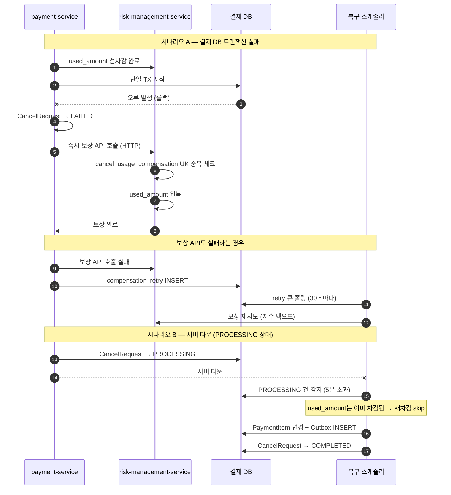

**보상도 멱등해야 하는 이유:**

```
보상 API 호출 → 응답이 네트워크에서 유실
→ payment-service는 실패로 판단 → compensation_retry INSERT
→ 스케줄러가 다시 보상 API 호출
→ 보상이 2번 실행됨 → used_amount가 2번 원복됨
→ 한도가 실제보다 많아짐

방어: cancel_usage_compensation UK
  같은 cancelRequestId로 보상 2번 시도 시
  두 번째는 INSERT 실패 → no-op
```

**보상 재시도 지수 백오프:**

| attempt | 대기 시간 | 비고 |
|---------|----------|------|
| 1 | 30초 | |
| 2 | 1분 | |
| 3 | 2분 | |
| 4 | 4분 | |
| 5 | EXHAUSTED | 운영팀 알림 → 수동 보정 |

**전체 실패 분류표:**

| 실패 지점 | 한도 차감 상태 | 취소 처리 상태 | 보상 행동 |
|-----------|--------------|--------------|----------|
| 위험관리 검증 실패 | 미차감 | 미처리 | 없음 |
| 한도 초과 | 미차감 | 미처리 | 없음 |
| 결제 DB 트랜잭션 실패 | **차감 완료** | 미처리 | 즉시 보상 API 호출 |
| 서버 다운 (PROCESSING) | **차감 완료** | 미처리 | 스케줄러 재처리 |
| 보상 API 실패 | **차감 완료** | FAILED | compensation_retry → 재시도 |
| 보상 5회 초과 | **차감 완료** | FAILED | EXHAUSTED + 수동 처리 |
| Outbox 발행 실패 | 차감 완료 | 완료 | Outbox 스케줄러 재발행 |

---

### 5-5. 서버 재시작 내구성

**CancelRequest 상태 머신:**

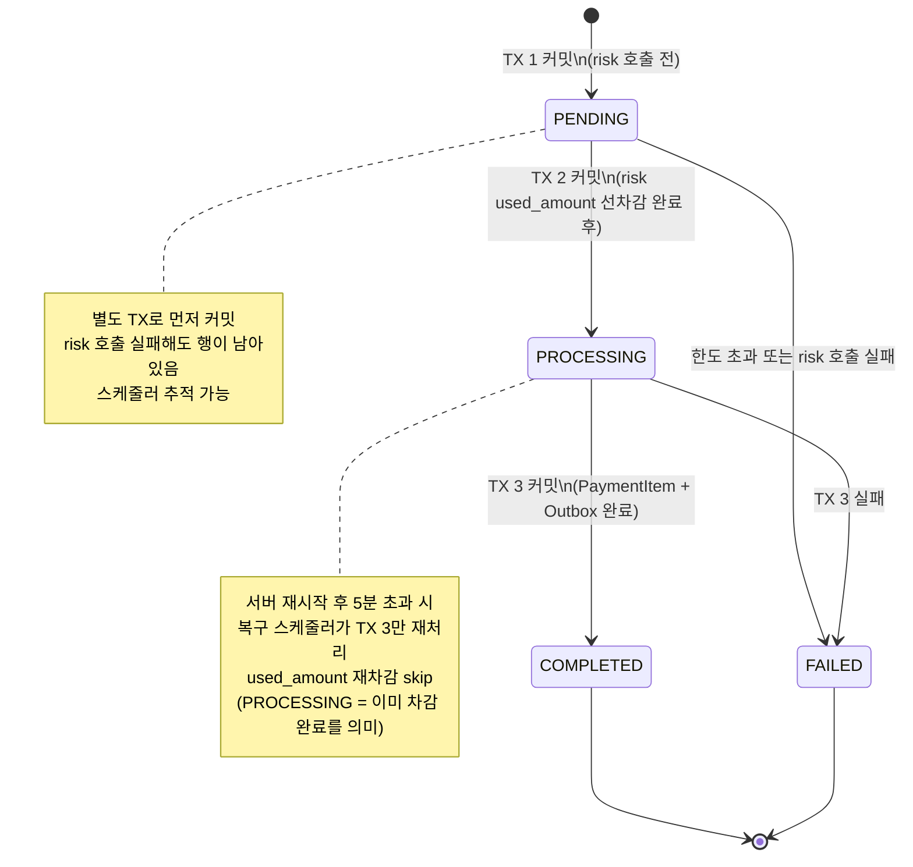

**PROCESSING 상태가 중요한 이유:**

```
PENDING 상태에서 다운:
  used_amount 차감 전 → 처음부터 재처리 가능

PROCESSING 상태에서 다운:
  used_amount 이미 차감됨
  → 재처리 시 한도 재차감하면 이중 차감 발생
  → PROCESSING 재처리 경로에서는 차감 단계 반드시 skip
```

---

### 5-6. Outbox Pattern

**문제:**

```
취소 완료 후 Kafka에 이벤트를 발행해야 하는데
DB 커밋과 Kafka 발행 사이에 서버가 다운되면?

DB: 취소 완료 상태
Kafka: 이벤트 미발행 → 주문 모듈이 영원히 취소를 모름
```

**왜 안전한가:**

```
Case 1: DB 커밋 성공, 스케줄러 실행 전 서버 다운
  → 재시작 후 스케줄러가 PENDING 행 발견 → 재발행

Case 2: Kafka 발행 성공, PUBLISHED 업데이트 전 서버 다운
  → 재시작 후 다시 발행 (중복 발행)
  → Consumer의 processed_cancel_event UK로 중복 처리 방어

Case 3: DB 커밋 실패
  → Outbox 행도 롤백 → 이벤트 미발행 (정상)
```

---

### 5-7. Kafka 설계

**토픽 설계:**

| 토픽 | 파티션 수 | Retention | 용도 |
|------|---------|-----------|------|
| `payment.cancelled` | 10 | 7일 | 취소 완료 이벤트 |
| `payment.cancelled.retry` | 10 | 7일 | Consumer 실패 재시도 |
| `payment.cancelled.DLQ` | 3 | 30일 | 3회 초과 실패 격리 |

**DLQ 재시도 플로우:**

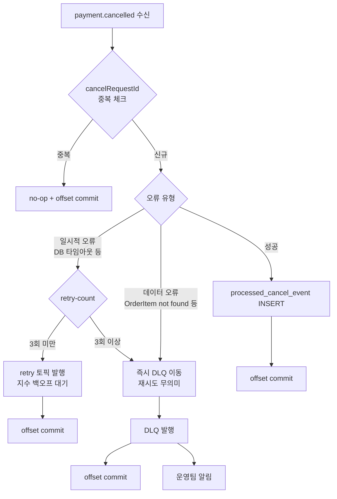

**offset 커밋을 처리 완료 후에 하는 이유:**

```
자동 커밋이면:
  메시지 수신 후 일정 시간마다 자동 커밋
  처리 중 서버 다운 시 offset은 커밋됐지만 처리는 안 됨
  → 메시지 유실

수동 커밋이면:
  처리 완료(DB 커밋) 또는 DLQ 이동 후에만 커밋
  서버 다운 후 재시작 시 미커밋 offset부터 재처리
  → processed_cancel_event UK로 중복 처리 방어
```

---

## 6. 상태 전이 규칙

### 6-1. Payment 상태 전이

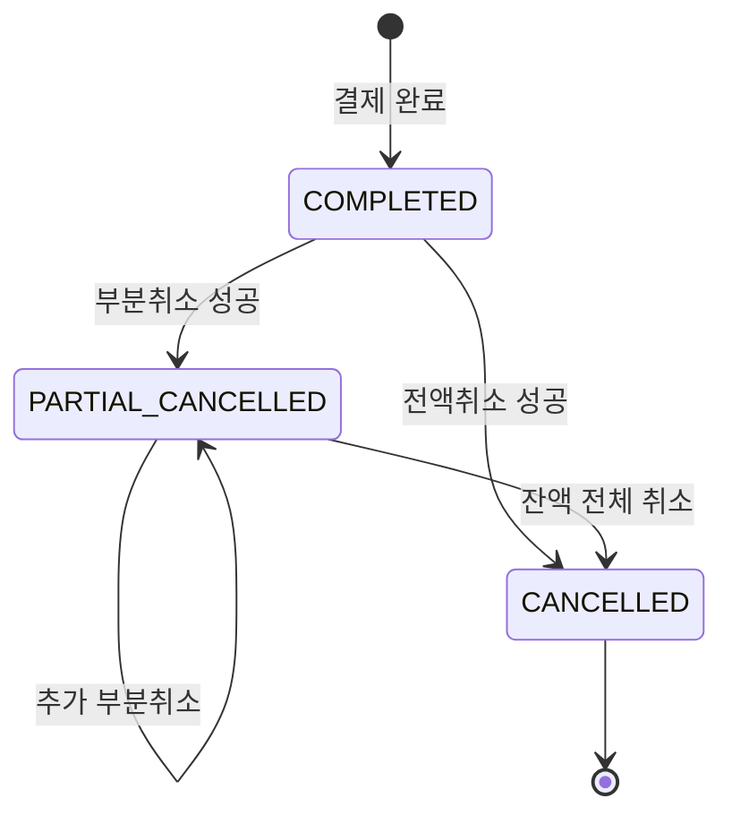

### 6-2. PaymentItem 상태 전이

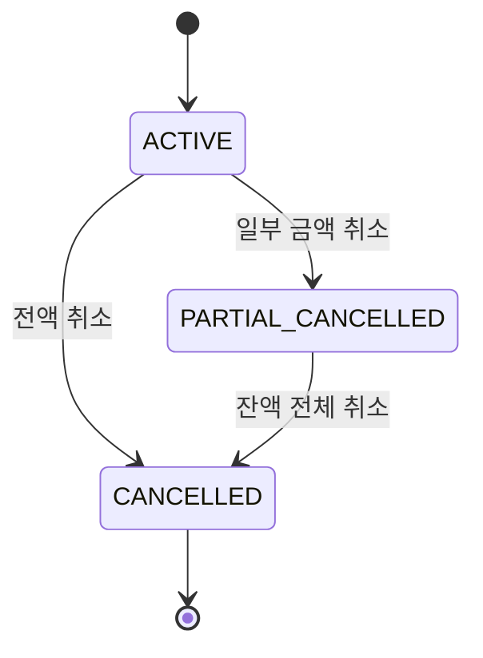

### 6-3. 취소 불가 상태

```
Payment 취소 불가: PENDING, CANCELLED, CANCEL_FAILED
PaymentItem 취소 불가: CANCELLED
Order 취소 불가: DELIVERING 이후
```

### 6-4. 검증 순서와 이유

```
1. 요청 형식 오류 (400)
2. 인가 오류 (403)
3. 리소스 없음 (404) — Payment 존재 확인
4. 멱등 중복 (409)
5. 비즈니스 규칙 (422):
     Payment 상태
     PaymentItem 상태
     취소 금액 검증
     취소 기간 검증
     가맹점 한도 검증 (risk-management-service)

순서가 중요한 이유:
  한도 검증(5번)을 리소스 확인(3번) 전에 하면
  존재하지 않는 Payment에 대해 한도가 차감될 수 있음
```

---

## 7. API 설계

### 7-1. 취소 요청 API

```
POST /v1/payments/{paymentKey}/cancel

헤더:
  Authorization: Bearer {token}
  Idempotency-Key: {UUID}

요청:
{
  "cancelAmount": 300000,
  "cancelReason": "고객 단순 변심",
  "cancelItems": [
    { "paymentItemId": 2, "cancelAmount": 300000 }
  ]
}

응답 200:
{
  "cancelRequestId": "cr_abc123",
  "paymentKey": "pay_xyz",
  "cancelAmount": 300000,
  "currency": "KRW",
  "status": "COMPLETED",
  "cancellerType": "USER",
  "cancelledItems": [
    { "paymentItemId": 2, "cancelAmount": 300000, "status": "CANCELLED" }
  ],
  "completedAt": "2026-04-13T10:00:00.000Z"
}
```

**paymentKey를 URL에 사용한 이유:**

```
paymentId(내부 PK): 순차적 숫자
  → 전체 결제 건수 유추 가능
  → 다른 결제 ID 추측 접근 가능 → 보안 취약

paymentKey(PG사 발급 키): 불투명 키
  → 추측 불가
  → 클라이언트가 결제 완료 후 응답으로 받은 값
  → URL에 쓰기 적합
```

### 7-2. 조회 API

```
GET /v1/payments/{paymentKey}/cancel/{cancelRequestId}
GET /v1/payments/{paymentKey}/cancels?page=0&size=20
```

---

## 8. 데이터 설계

### 8-1. 모듈별 테이블 구조

**payment-service**

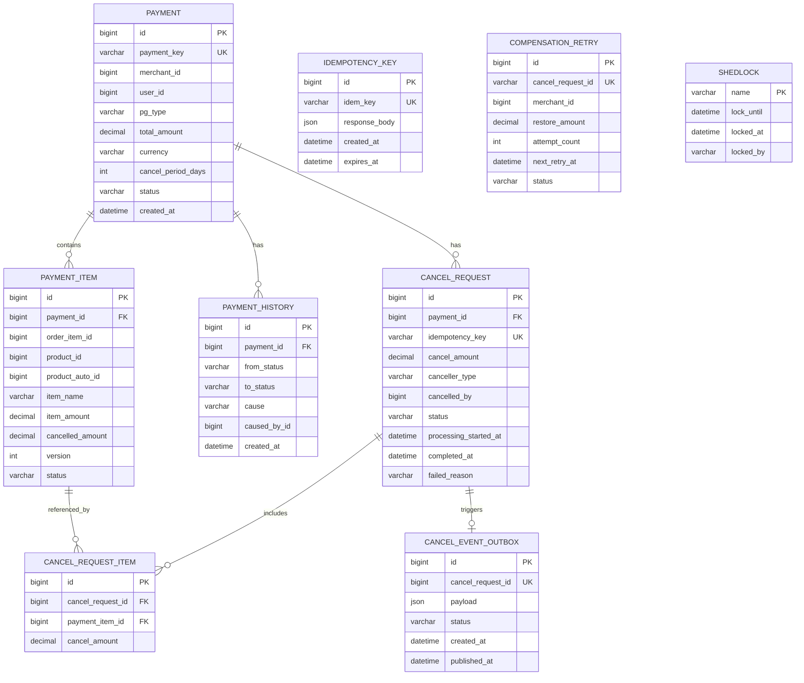

**order-service**

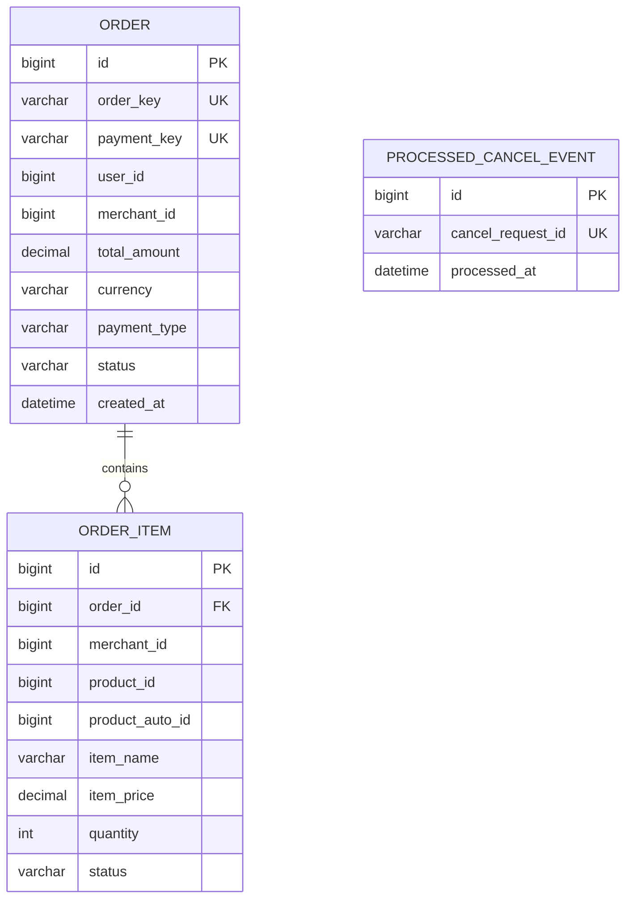

**merchant-limit-service**

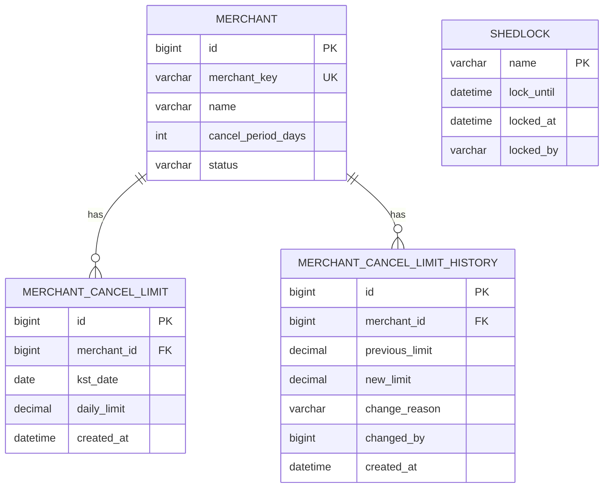

**risk-management-service**

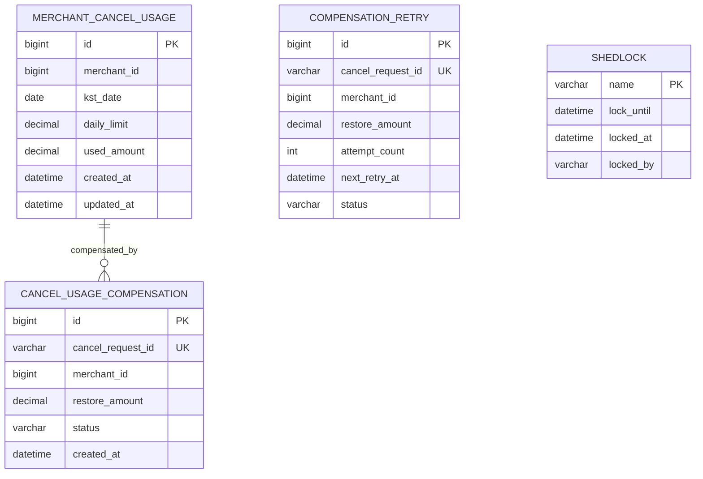

**product-service**

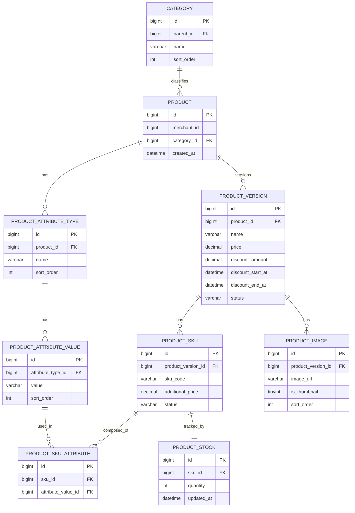

### 8-2. 핵심 테이블 관계

```
payment (결제 원장)
  └── payment_item (결제 항목, 부분취소 추적)
  └── payment_history (상태 변경 이력)
  └── cancel_request (취소 요청)
      └── cancel_request_item (취소 항목)
  └── cancel_event_outbox (Kafka 발행 보장)

idempotency_key (API 멱등성)
compensation_retry (보상 재시도)
shedlock (분산 스케줄러)
```

### 8-2. 금액 타입

```
FLOAT / DOUBLE 금지 이유:
  0.1 + 0.2 = 0.30000000004
  부동소수점 오차 → 금융에서 절대 금지

선택: DECIMAL(19,2) + currency VARCHAR(3)
  고정소수점으로 정확한 소수점 처리
  Java에서 BigDecimal로 매핑
  currency: ISO 4217 코드 (KRW, USD, EUR)
```

### 8-3. 상품 버저닝

```
product (원본, 불변)
product_version (버전별 상세)
product_sku (버전별 속성 조합 — 색상, 사이즈)

실제 가격 = product_version.price
           - product_version.discount_amount
           + product_sku.additional_price

payment_item 스냅샷:
  product_auto_id: 결제 시점 버전 고정
  item_name, item_price: 결제 시점 값
  → 나중에 상품 정보 변경돼도 결제 내역 불변
```

---

## 9. 확장성 고려

### 9-1. TPS 단계별 전략

| 단계 | TPS | 전략 |
|------|-----|------|
| 초기 | 100 | 단일 인스턴스, 기본 설정 |
| 성장 | 1,000 | 수평 확장, Connection Pool 튜닝 |
| 목표 | 10,000 | 파티션 증설, 가맹점별 샤딩 검토 |

### 9-2. 병목 예상 지점

```
병목 1: MySQL FOR UPDATE 락 대기
  현재: 가맹점별 단일 행 락
  해결: 가맹점 ID 기반 샤딩
  → 동일 가맹점 요청은 같은 샤드로 라우팅

병목 2: Outbox 스케줄러 지연
  현재: 10초 주기 스케줄러
  해결: Debezium CDC → binlog 기반 실시간 발행

병목 3: Kafka Consumer Lag
  현재: Consumer 인스턴스 파티션 수까지 증설 가능
  파티션 수를 처음에 넉넉하게 설정한 이유
```

### 9-3. Circuit Breaker

```
risk-management-service 장애 시: Fail-closed → 취소 차단

이유:
  Fail-open하면 한도 없이 무제한 취소 → 금융 사고

상태 전이:
  CLOSED(정상) → 실패율 50% 초과 → OPEN(fast-fail, 30초)
  OPEN → 30초 후 → HALF_OPEN → 성공 시 CLOSED 복구
```

---

## 10. 아키텍처 패턴 정리

| 패턴 | 적용 위치 | 해결한 문제 |
|------|---------|----------|
| Idempotency Key | API 레이어 | 중복 요청 |
| Pessimistic Lock | 가맹점 한도 차감 | 동시성 (케이스 2) |
| Optimistic Lock | PaymentItem 수정 | 동시성 (케이스 3) |
| SAGA (Choreography) | 전체 취소 플로우 | 분산 트랜잭션 |
| Outbox Pattern | Kafka 발행 | DB-Kafka 원자성 |
| Compensation Transaction | 한도 원복 | 부분 실패 복구 |
| State Machine | CancelRequest | 서버 재시작 내구성 |
| Circuit Breaker | 외부 서비스 호출 | 장애 격리 |
| ShedLock | 스케줄러 | 분산 중복 실행 방지 |
| Snapshot | 결제 시점 데이터 | 모듈 간 데이터 독립 |
| DLQ + Retry Topic | Kafka Consumer | 처리 실패 격리 |

---

## 11. 예상 면접 질문

### 설계 관련

1. 이 시스템에서 가장 어려웠던 부분은?
2. 분산 트랜잭션을 어떻게 처리했나요?
3. SAGA 패턴의 Choreography와 Orchestration 차이는?
4. Outbox Pattern의 단점과 보완 방법은?
5. 멱등성을 여러 레이어에서 보장한 이유는?
6. Circuit Breaker를 Fail-closed로 설정한 이유는?
7. 레이어를 왜 분리했나요? 도메인을 프레임워크와 분리한 이유는?

### 동시성 관련

8. 동시성 문제가 몇 가지 케이스로 발생하는지, 각각 어떻게 해결했는지?
9. Pessimistic Lock과 Optimistic Lock을 각각 어디에 사용했는지, 이유는?
10. FOR UPDATE 사용 시 데드락은 어떻게 방지했나요?
11. 선차감 방식을 선택한 이유는?

### HTTP 경계와 트랜잭션 관련

12. HTTP 요청으로 외부 서비스를 호출할 때 트랜잭션 원자성이 보장되나요?
13. risk-management-service 커밋 후 payment-service가 실패하면 어떻게 되나요?
14. 보상 트랜잭션도 멱등하게 설계한 이유는?

### Kafka 관련

15. Kafka와 RabbitMQ의 차이는?
16. At-least-once를 선택하고 Exactly-once를 선택하지 않은 이유는?
17. Kafka 순서 보장은 어떻게 하나요?
18. DLQ에 메시지가 쌓였을 때 처리 방법은?
19. offset 커밋을 수동으로 하는 이유는?

### DB 관련

20. DECIMAL과 FLOAT의 차이와 금융에서 FLOAT을 쓰면 안 되는 이유는?
21. DB를 모듈별로 분리한 이유와 단점은?
22. 스냅샷 방식의 장단점은?

### 장애 대응 관련

23. 서버가 재시작됐을 때 어떻게 복구하나요?
24. PROCESSING 재처리 시 이중 차감을 어떻게 방지하나요?
25. EXHAUSTED 상태가 발생하면 어떻게 처리하나요?

