# 실전 버그 — OUTBOX 폴러 라이브락 (커넥션 풀 굶음)

> 발견: 2026-07-12 AWS 발행패턴 실측 (관련 [`publish-pattern-benchmark.md`](./publish-pattern-benchmark.md))
> 대상 코드: `payment-service` `CancelEventOutboxPublisher` + `CancelEventOutboxRepository`
> 상태: **미수정** — 수정 방향은 §5, 추적은 다음 실험(폴러 전용 DataSource → CDC)

## 0. 한 줄 요약

OUTBOX 모드에서 취소가 고부하로 들어오면, **아웃박스 폴러가 payment 앱과 공유하는 Hikari 풀(10)에서 커넥션을 못 얻어** `markPublished`가 실패한다. 그 결과 가장 오래된 배치가 영영 PENDING으로 남아 **매 폴마다 같은 head를 재조회·재발송**하는 **라이브락**에 빠진다 — 폴러는 미친 듯이 바쁜데(수십만 건 발송) 아웃박스는 한 발도 못 빠지고, 꼬리 이벤트는 영원히 발행되지 않으며 Kafka는 중복 메시지로 폭주한다.

## 1. 증상 (관측)

2026-07-12 실측(OUTBOX, `poll=1s`, `batch=1000`, 취소 stress 50→400 VU 6분, 100k 시드):

| 지표 | 값 | 의미 |
|---|---|---|
| `cancel_event_outbox` PENDING | 79,811 (전량) | 아웃박스가 전혀 안 빠짐 |
| `cancel_event_outbox` PUBLISHED | **0** (런 내내) | 한 건도 발행 표시 안 됨 |
| `kafka_producer_record_send_total` | **424,530** | 폴러는 42만 번 발송(활발) |
| order `processed_cancel_event` | **1,000** | 실제 소비된 고유 이벤트는 1,000뿐 |
| payment 로그 | `HikariPool ... Connection is not available` (markPublished) | 커넥션 타임아웃 |

**424,530 발송 vs 1,000 고유 처리** = 같은 ~1,000건을 **약 424회 재발송**했다는 뜻.

## 2. 근본 원인 — 공유 커넥션 풀 경합

폴러는 payment 앱과 **같은 DataSource(Hikari 풀 10)** 를 쓴다. 취소 부하 피크(220 rps)에서 이 풀은 요청 처리로 포화된다(active 10 / pending ~189). 이 상태에서 폴러 `publish()`의 흐름:

```
publish():
  findPendingBatch(1000)   // 커넥션 필요 — 초반엔 겨우 획득
  send() 비동기 발사         // Kafka — DB 풀 무관, 성공
  markPublished(ids)        // 커넥션 필요 — 풀 포화로 30s 타임아웃 → 예외!  ← 여기서 터짐
  // 예외로 publish() 중단, "발행 완료" 로그 미도달
```

`markPublished`가 커넥션을 못 얻어 예외 → **발송은 됐는데 아웃박스 행은 PUBLISHED로 못 바꾼다.**

## 3. 왜 라이브락인가

`findPendingBatch`는 **가장 오래된 것부터** 가져온다:

```java
// CancelEventOutboxRepositoryImpl.findPendingBatch
findByStatusOrderByCreatedAtAsc("PENDING", PageRequest.of(0, limit))
//                    ~~~~~~~~~~~~~~~~~~~~~~~~ ORDER BY created_at ASC LIMIT
```

markPublished가 계속 실패하면 **맨 앞 1,000건이 영영 PENDING** → 매 폴이 **같은 1,000건을 다시 조회 → 다시 발송 → 또 markPublished 실패** 를 반복한다.

- **바쁨(활발)**: 42만 건 발송, CPU·Kafka 활활 — 얼어붙은 게 아니다(deadlock 아님).
- **진전 0**: 같은 head만 재발송, 꼬리 78,811건은 커서가 도달조차 못 함.
- → **라이브락**(폴러가 head 재발송을 무한 반복) + 꼬리 **starvation**.

> 아이러니: `send()` 비동기 병렬화(PR #57)가 재발송을 *더 빠르게* 만들어 라이브락을 **더 격렬하게** 했다(naive 순차 발송일 땐 재발송 횟수가 더 적었음).

```mermaid
flowchart TD
  A["폴 시작"] --> B["findPendingBatch<br/>ORDER BY created_at ASC LIMIT 1000<br/>→ 항상 같은 head 1000건"]
  B --> C["send() 비동기 발사<br/>→ Kafka 성공(중복)"]
  C --> D{"markPublished<br/>커넥션 확보?"}
  D -->|"풀 포화 → 타임아웃"| E["예외 → 행 PENDING 유지"]
  E --> A
  D -.->|"부하 없을 때만"| F["PUBLISHED 전환<br/>(정상)"]
  C -.-> G["order: 같은 1000건 중복 수신<br/>→ dedup → 고유 1000만 처리"]
```



## 4. 영향

- **꼬리 이벤트 영구 미발행**: 부하 지속 시 오래된 head를 못 넘겨 새 이벤트가 order로 안 감 → 주문 상태 동기화 무기한 지연.
- **Kafka 중복 폭주**: 고유 1,000건에 42만 발송. 브로커·order 컨슈머에 불필요한 부하(order는 `processed_cancel_event` UK로 dedup하니 정합성은 유지되나 자원 낭비).
- **at-least-once 가정 붕괴**: "실패하면 다음 폴에 재시도"라는 설계는 **markPublished가 언젠가 성공한다**를 전제한다. 지속적 풀 굶음에선 그 전제가 깨져 라이브락이 된다.
- 프로덕션 조건: OUTBOX 발행 + 앱이 자기 커넥션 풀을 포화시키는 고부하 = 재현 조건. (현재 기본 발행은 INLINE이라 즉시 위험은 아니나, OUTBOX 채택 시 실존.)

## 5. 왜 폴러 내부 최적화로 안 풀리나 → 수정 방향

**폴러 내부를 아무리 최적화해도 못 고친다.** 실측으로 반증됨:
- `markPublished` 배치 UPDATE(건당 커넥션 1000회 → 1회): 그래도 **커넥션 1개는 필요**한데 그 1개를 못 얻는다.
- `send()` 비동기/병렬화: Kafka는 DB 풀과 무관해 발송은 빨라지나, **markPublished의 풀 경합은 그대로** (오히려 재발송만 가속).

병목은 **폴러 내부 효율이 아니라 "앱과 공유하는 DB 커넥션 풀"이라는 자원 봉투**다. 고치려면 자원을 격리한다:

1. **폴러 전용 DataSource (최소 인앱 fix)** — 폴러에 소형 풀(2–3 커넥션)을 앱 풀과 **분리** 배정. 앱이 메인 풀을 포화시켜도 폴러는 전용 커넥션으로 `markPublished` 성공 → 라이브락 해소. `send-then-mark` 불변식 유지.
2. **CDC (Debezium 등, 완전판)** — 발행을 **별도 프로세스**로 빼고 binlog tailing. 앱 커넥션 풀을 아예 안 쓰므로 경합 자체가 소멸. 순차 발송·폴 상한도 함께 제거.

> 잘못된 fix: 풀 크기 늘리기 — payment DB는 2코어(m7g.large)라 풀 10이 이미 공식 상한(`(2×2)+1≈5`), 늘리면 DB 스래싱. 폴러에 **별도** 소형 풀을 주는 게 정답(총량이 아니라 격리).
> `mark-before-send`로 바꾸는 것도 금지 — 발송 실패 시 "발행됨으로 표시됐으나 미발송" = 이벤트 유실. outbox 불변식은 반드시 `send-then-mark`.

## 6. 해결 — 폴러 전용 DataSource (PR #59, 재측정 확정)

**수정 방향 1(폴러 전용 DataSource)을 채택·구현(PR #59).** 폴러의 배수 경로(`findPendingBatch`·`markPublished`)를 소형 전용 HikariDataSource(2)로 격리 — 앱 메인 풀(10)이 취소 부하로 포화해도 폴러는 전용 커넥션으로 `markPublished` 성공. `insertPending`은 메인 풀(TX3 원자성) 유지.

**재측정(2026-07-12, OUTBOX poll=1s, stress 50→400 VU):**

| 폴러 | PENDING 피크 | order 처리 | producer_send | 라이브락 |
|---|---|---|---|---|
| naive (공유 풀) | 79,811~101,000 | 1,000 (갇힘) | 424,530 (×424 재발송) | ❌ |
| **전용 풀** | **14~330** | 52,774→수렴 | **77,508 (취소수 ×1)** | ✅ 해소 |

PENDING이 평탄(폴러가 실시간 배수), producer_send가 취소수와 1:1(재발송 폭주 소멸), order가 1,000 갇힘을 벗어나 수렴 → **실패 모드가 "스톨(라이브락) → 진전"으로 전환.** 라이브락 해소 확정.

## 7. CDC(Debezium)는 검토했으나 보류 — 근거 있는 YAGNI

수정 방향 2(CDC)는 폴러의 **남은 한계(단일 스레드 배수율 상한)**를 제거하는 완전판이나, **현재 부하에서 도입하지 않는다.**

- **폴러 전용 풀이 실측 부하(214 rps)를 이미 감당** — 라이브락은 해소됐고 백로그도 안 쌓인다.
- **CDC의 유일한 추가 이점(배수 headroom)은 우리가 생성할 수 없는 부하에서만 발현** — 취소율이 payment 앱 포화(~214 rps, 풀10·2코어 DB·커밋 벽)에 먼저 막혀, 드레인 천장을 자극하려면 취소 경로를 우회한 직접-INSERT 드레인 레이스 같은 인위적 부하가 필요하다. 실제 시스템이 그 부하에 도달하지 않는다.
- **CDC 인프라(Kafka Connect 워커 + Debezium 커넥터 + binlog 설정 + Outbox Event Router SMT/컨버터 바이트 호환 튜닝)는 무겁다** — 정당화할 부하 headroom 요구가 지금 없다.
- **재도입 트리거:** 취소 처리량이 스케일아웃/DB 확장으로 폴러의 단일 스레드 배수율 상한을 넘어서면, 그때 CDC(별도 프로세스 + binlog tailing으로 순차·풀 상한 제거)를 도입한다. 설계 검토(메시지 바이트 호환 = StringConverter 패스스루로 폴러와 동일 정규화 payload 컬럼 방출, 앱 변경 = `cancel.outbox.drain=POLLER|CDC` 플래그로 폴러 off)는 완료돼 있어 필요 시 빠르게 착수 가능.

## 8. 관련

- 발행 3모드 토글·outbox 도입: PR #56
- 폴러 최적화(배치 markPublished + async send): PR #57 — **이 버그를 못 고쳤고, 오히려 라이브락을 격렬하게 만들어 진단을 확정**
- **폴러 전용 DataSource(라이브락 해소): PR #59**
- 실측 절차: [`publish-pattern-benchmark.md`](./publish-pattern-benchmark.md)
