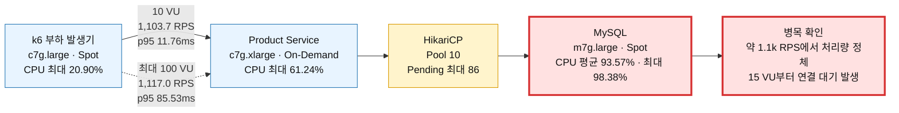

# Product Service AWS 부하 테스트 결과

- 측정일: 2026-08-19 (Asia/Seoul)
- 대상 커밋: `d0990a3d0561e91582097410adfe843eee7f5cd5`
- 대상 API: `GET /v1/products/{id}`
- 데이터셋: 상품 1,000개, 상품당 SKU 9개·이미지 3개
- 요청 분포: `realistic`
- 통신 경로: 동일 AZ 사설 IP, API Gateway 미경유

## 결론

현재 구성의 처리량 상한은 약 **1.1k RPS**이며 첫 병목은 **MySQL**이다. 10 VU에서 MySQL CPU가 이미 높은 수준에 도달했고, 15 VU부터 HikariCP 연결 대기가 발생했다. 이후 VU를 최대 100까지 높여도 처리량은 거의 증가하지 않고 응답 지연만 증가했다.

## 측정 구성

모든 노드는 `ap-northeast-2a`의 사설망에서 통신했다. NAT 인스턴스는 이미지와 소스 다운로드용 외부 통신에만 사용되어 측정 요청 경로에는 포함되지 않았다. Product Spot 용량을 확보하지 못해 Product 노드만 On-Demand로 전환했다.

## 종합 결과

| 구간 | 요청 수 | 평균 처리량 | p50 | p95 | p99 | 실패율 |
|---|---:|---:|---:|---:|---:|---:|
| Smoke, 1 VU·20회 | 20 | 36.24 RPS | 14.68ms | 32.38ms | 217.26ms | 0% |
| Baseline, 10 VU·3분 | 198,677 | 1,103.72 RPS | 8.66ms | 11.76ms | 19.02ms | 0% |
| Ramp, 10→50→100 VU·9분 | 603,268 | 1,116.99 RPS | 21.58ms | 85.53ms | 139.43ms | 0% |

Smoke는 기동 및 데이터 검증용이며 용량 판단에는 사용하지 않는다.

## 구간별 자원 사용량

| Ramp 구간 | 평균 RPS | k6 CPU | Product CPU | MySQL CPU |
|---|---:|---:|---:|---:|
| 10 VU, 3분 | 1,016.39 | 17.25% | 49.05% | 84.72% |
| 10→50 VU, 3분 | 1,112.89 | 19.64% | 59.27% | 97.94% |
| 50→100 VU, 3분 | 1,113.82 | 20.49% | 60.49% | 98.05% |

Ramp 전체 최대치는 MySQL CPU 98.38%, Product CPU 61.24%, k6 CPU 20.90%였다. 부하 발생기와 Product 노드는 포화 상태가 아니었다.

## 병목 근거

- 10 VU 기준선에서 MySQL CPU 평균 85.39%, Product CPU 평균 55.12%
- Ramp 안정 구간에서 MySQL CPU 약 97~98% 유지
- 15 VU부터 HikariCP pending 발생, 최대 86
- HikariCP active 최대 10으로 풀 상한 도달
- HikariCP timeout과 HTTP 오류는 0
- 10 VU 대비 최대 VU가 10배 증가했지만 처리량은 약 1.2%만 증가
- Ramp p95는 85.53ms, p99는 139.43ms로 기준선보다 크게 증가

따라서 현재 조회 경로는 Product CPU나 k6가 아니라 MySQL 처리 능력과 DB 연결 풀 앞에서 대기한다.

## 권고

1. 상품 상세 조회의 SQL 실행 계획과 쿼리 수를 먼저 측정한다.
2. 인덱스 및 N+1 조회 여부를 개선한 뒤 동일한 10→50 VU 구간을 재측정한다.
3. 쿼리 개선 후에도 DB CPU가 포화되면 MySQL 인스턴스 크기와 읽기 캐시 전략을 비교한다.
4. Hikari 풀 증설만으로는 DB CPU 포화가 심해질 수 있으므로 단독 변경하지 않는다.

## 결과 파일

- [Smoke summary](../../k6/results/20260819T091721Z-smoke-realistic-85772.summary.json)
- [Baseline summary](../../k6/results/20260819T091806Z-baseline-realistic-85854.summary.json)
- [Ramp summary](../../k6/results/20260819T092242Z-ramp-realistic-86189.summary.json)

## 자원 정리

측정 종료 후 Terraform 자원 23개를 삭제했다. NAT, k6, Product, MySQL EC2 인스턴스 4대는 모두 `terminated` 상태이며 Terraform state는 비어 있다.
