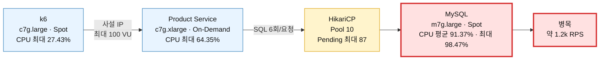

# Product 상세 쿼리 최적화 AWS 재측정 결과

- 측정일: 2026-08-19 (Asia/Seoul)
- 대상 커밋: `93c586a81e970558ed15eb43cd5a7957fc5d60b5`
- 대상 API: `GET /v1/products/{id}`
- 데이터셋: 상품 100,000개, SKU 900,000개
- 요청 분포: `realistic` (전체 PK 범위에서 균등 추출한 5,000개 ID)
- 통신 경로: `ap-northeast-2a` 동일 AZ 사설 IP, API Gateway 미경유

## 결론

재귀 CTE로 요청당 SQL을 8회에서 6회로 줄인 뒤, 10 VU 기준 처리량은 **1,103.72 → 1,143.75 RPS(+3.63%)**, 10→50→100 VU ramp 처리량은 **1,116.99 → 1,190.85 RPS(+6.61%)**로 증가했다. Ramp p95는 **85.53 → 78.10ms(-8.68%)**, p99는 **139.43 → 125.53ms(-9.98%)**로 감소했다.

다만 100 VU 구간에서 MySQL CPU가 평균 98.12%, Hikari active가 10, pending이 최대 87에 도달했다. 처리량 상한은 약 **1.2k RPS**로 이동했지만 첫 병목은 여전히 MySQL과 그 앞의 DB 연결 풀이다.

이전 측정은 상품 1,000개, 이번 측정은 100,000개이므로 순수한 코드 A/B는 아니다. 그럼에도 데이터가 100배 증가한 조건에서 처리량과 지연이 함께 개선됐고 오류가 없었다.

## 측정 구성



외부 다운로드는 `t4g.nano` NAT 인스턴스를 사용했고 측정 요청 경로에는 포함되지 않았다. k6와 MySQL은 Spot을 사용했다. Product `c7g.xlarge` Spot은 10분 이상 용량을 확보하지 못해 Product 한 대만 On-Demand로 전환했다.

## 쿼리 수 확인

계측을 켠 단일 AWS 요청의 Prometheus 결과는 다음과 같다.

```text
db_queries_per_request_count{uri="/v1/products/{id}"} 1
db_queries_per_request_sum{uri="/v1/products/{id}"} 6.0
```

따라서 실제 배포 환경에서도 요청당 SQL은 6회다. 용량 측정 전 Product를 재기동해 `db_queries_per_request` 메트릭이 사라진 것을 확인했다.

## 종합 결과

| 구간 | 요청 수 | 평균 처리량 | p50 | p95 | p99 | 실패율 |
|---|---:|---:|---:|---:|---:|---:|
| Smoke, 1 VU·20회 | 20 | 71.30 RPS | 13.38ms | 15.90ms | 16.48ms | 0% |
| Baseline, 10 VU·3분 | 205,901 | 1,143.75 RPS | 8.23ms | 11.45ms | 18.44ms | 0% |
| Ramp, 10→50→100 VU·9분 | 643,152 | 1,190.85 RPS | 21.26ms | 78.10ms | 125.53ms | 0% |

Smoke는 기동과 응답 형태 검증용이며 용량 판단에는 사용하지 않는다.

## 이전 기준선 비교

| 구간 | 지표 | 이전: SQL 8회·상품 1천 | 현재: SQL 6회·상품 10만 | 변화 |
|---|---|---:|---:|---:|
| Baseline | RPS | 1,103.72 | 1,143.75 | +3.63% |
| Baseline | p95 | 11.76ms | 11.45ms | -2.66% |
| Baseline | p99 | 19.02ms | 18.44ms | -3.07% |
| Ramp | RPS | 1,116.99 | 1,190.85 | +6.61% |
| Ramp | p95 | 85.53ms | 78.10ms | -8.68% |
| Ramp | p99 | 139.43ms | 125.53ms | -9.98% |

## 자원 사용량

| 구간 | k6 CPU 평균 | Product CPU 평균 | MySQL CPU 평균 | Hikari active 최대 | Hikari pending 최대 |
|---|---:|---:|---:|---:|---:|
| Baseline 10 VU | 20.33% | 50.76% | 74.38% | 10 | 0 |
| Ramp 전체 | 24.98% | 57.09% | 91.37% | 10 | 87 |

Ramp 전체 최대 CPU는 k6 27.43%, Product 64.35%, MySQL 98.47%였다.

| Ramp 구간 | 평균 RPS | k6 CPU | Product CPU | MySQL CPU |
|---|---:|---:|---:|---:|
| 10 VU, 3분 | 936.96 | 21.70% | 46.37% | 78.14% |
| 10→50 VU, 3분 | 1,162.17 | 26.18% | 61.16% | 97.85% |
| 50→100 VU, 3분 | 1,191.81 | 27.08% | 63.74% | 98.12% |

## 병목 판단

- 50 VU로 올라가는 구간부터 MySQL CPU가 약 98%에 도달했다.
- 이후 최대 100 VU까지 올려도 구간 처리량은 약 2.6%만 증가했다.
- Product와 k6 CPU에는 여유가 남았다.
- Hikari active는 풀 상한 10, pending은 최대 87이었다.
- HTTP 실패와 Hikari timeout은 관찰되지 않았다.

따라서 재귀 CTE는 왕복 비용을 줄여 처리량 상한을 높였지만, 다음 최적화 대상은 Product 인스턴스가 아니라 MySQL 읽기 처리량이다. Hikari 풀만 늘리면 포화된 DB에 동시 쿼리를 더 보내므로 단독 증설하지 않는다.

## 다음 실험

1. 동일 스택에서 MySQL `m7g.large → m7g.xlarge` A/B로 CPU 병목 인과를 확인한다.
2. 캐시 적중률을 별도 지표로 두고 상품 상세 Redis/read-through 캐시 전후를 비교한다.
3. 운영 트래픽 기준 hot-key 비율이 확정되면 `realistic` 분포를 그 비율로 보정한다.

## 결과 파일

- [Smoke summary](../../k6/results/20260819T131631Z-smoke-realistic-1766.summary.json)
- [Baseline summary](../../k6/results/20260819T131659Z-baseline-realistic-1830.summary.json)
- [Ramp summary](../../k6/results/20260819T132049Z-ramp-realistic-2146.summary.json)

## 자원 정리

측정 종료 후 Terraform 자원 23개를 삭제했다. k6, Product, MySQL, NAT EC2 4대의 `terminated` 상태와 빈 Terraform state를 확인했다.
