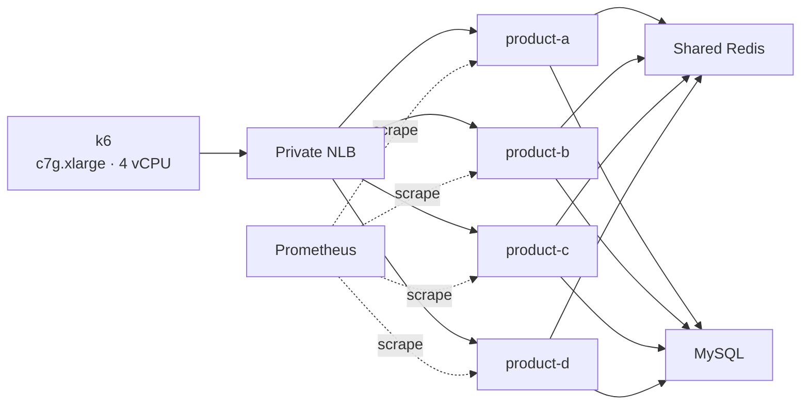

# Product 상세 수평 확장·부하 측정 결과

- 측정일: 2026-08-20 (Asia/Seoul)
- 대상 API: `GET /v1/products/{id}`
- 요청 분포: hot
- 측정 방식: k6 `constant-vus`, 각 2분
- 통신 경로: 동일 AZ 사설 IP의 k6 → private NLB → Product. API Gateway는 경유하지 않았다.

## 결론

Product 인스턴스를 2대에서 4대로 늘렸지만 약 8,000 RPS 부근의 상한은 크게 움직이지 않았다. 원인은 Product·MySQL·Redis가 아니라 2 vCPU k6 부하 생성기였다.

k6를 `c7g.large`(2 vCPU)에서 `c7g.xlarge`(4 vCPU)로 변경한 뒤 1,000 VU 처리량은 **7,906 → 11,021 RPS(+39.4%)**로 증가했다. 현재 다음 병목 후보는 Product JVM CPU다.

## 구성

## 처리량 결과

| 구성 | VU | RPS | p95 | p99 | 오류율 |
|---|---:|---:|---:|---:|---:|
| Product 2대 | 300 | 6,629 | 120ms | 181ms | 0% |
| Product 2대 | 500 | 6,718 | 192ms | 264ms | 0% |
| Product 2대 | 1,000 | 6,663 | 306ms | 388ms | 0% |
| Product 3대 | 300 | 7,498 | 165ms | 246ms | 0% |
| Product 3대 | 500 | 8,075 | 172ms | 246ms | 0% |
| Product 3대 | 750 | 7,996 | 204ms | 278ms | 0% |
| Product 3대 | 1,000 | 7,867 | 270ms | 351ms | 0% |
| Product 4대, k6 2 vCPU | 750 | 8,081 | 169ms | 208ms | 0% |
| Product 4대, k6 2 vCPU | 1,000 | 7,906 | 221ms | 254ms | 0% |
| Product 4대, k6 4 vCPU | 1,000 | **11,021** | 290ms | 377ms | 0% |

4 Product 노드의 750 VU 요청 수는 각각 약 24.4만~25.3만 건으로 균등했다. NLB 분배 불균형은 병목 원인이 아니었다.

## 병목 판정

### 1차: k6 부하 생성기

2 vCPU k6의 1,000 VU 구간에서 두 CPU 코어 사용률은 각각 약 68%였고 `load1`은 2.2였다. 이 3분 관측 창에는 부하 종료 후 유휴 시간이 포함되므로, 실제 2분 부하 구간에서는 k6가 포화 상태였다.

동일 조건에서 k6만 4 vCPU로 늘리자 RPS가 39.4% 증가했다. 따라서 약 8,000 RPS 상한은 서버 처리 한계가 아니라 k6의 JSON 파싱·응답 shape 검증·Prometheus remote-write 처리 한계였다.

### 2차: Product CPU 후보

4 vCPU k6의 1,000 VU 구간에서 k6 호스트 CPU는 52.6%였다. Product JVM CPU는 a/b/c/d 순으로 82.6%, 78.7%, 63.9%, 81.0%까지 상승했다. MySQL 호스트 CPU는 66.2%, `threads_running` 최대는 4였고 Redis 호스트 CPU는 10.7%였다.

따라서 다음 포화점 측정에서는 Product JVM CPU를 우선 관찰한다. 현 시점에서 MySQL·Redis를 주 병목으로 확정할 근거는 없다.

## Prometheus 관측 수정

product-c/d 추가 후 Prometheus targets에는 a/b만 남아 있었다. 호스트의 `product-only-prometheus.yml`은 최신이었지만, Git checkout이 파일 inode를 교체해 기존 Prometheus 컨테이너 bind mount에는 이전 파일이 남아 있었다.

`docker compose -f product-only.compose.yml up -d --force-recreate prometheus`로 Prometheus만 재생성했다. 이후 product-a/b/c/d의 `/actuator/prometheus` 대상 4개가 모두 `up`임을 확인했다. legacy `product`(10.0.1.23)는 down으로 남았으나 NLB target이 아니며 측정 경로에 포함되지 않는다.

## 후속 측정

1. 현재 k6 4 vCPU를 유지하고 1,250 VU 이상에서 Product CPU·p99·오류율을 함께 확인한다.
2. Product CPU가 포화되면 JFR을 부하 구간과 동기화해 Jackson 직렬화, Redis 역직렬화, DTO 조립, 객체 할당을 분리한다.
3. k6가 다시 포화되면 인스턴스 추가보다 k6를 두 대로 분산해 측정기 병목을 제거한다.

## 자원 정리

측정 종료 후 `terraform destroy`를 실행했다. Product 4대, k6, MySQL, Redis, 관측, NLB, NAT, VPC 및 IAM을 포함한 36개 리소스가 삭제됐고 Terraform state는 0개 리소스다.

## Product stock mixed ramp (AWS 측정 대기)

이 표의 값은 아직 측정하지 않았다. `k6/run-product-stock-mix-aws.sh`는 각 3분 구간의 정확한 UTC 시작·종료 시각, k6/Product-a~d/MySQL/Redis CPU·메모리, Product MySQL `threads_running`, 그리고 `product_stock_cache_total{outcome}`을 결과 번들에 저장한다. Terraform apply 및 readiness가 승인된 뒤 해당 번들을 기준으로만 채운다.

| Read/Write VU | Read RPS | Write RPS | Read p95/p99 | Write p95/p99 | 오류율 | k6 CPU/메모리 | Product-a/b/c/d CPU/메모리 | MySQL CPU/메모리·threads_running | Redis CPU/메모리 | Stock cache outcomes | 첫 포화 구성요소 |
|---|---:|---:|---|---|---:|---|---|---|---|---|---|
| 500 / 56 | 측정 대기 | 측정 대기 | 측정 대기 | 측정 대기 | 측정 대기 | 측정 대기 | 측정 대기 | 측정 대기 | 측정 대기 | 측정 대기 | 측정 대기 |
| 750 / 83 | 측정 대기 | 측정 대기 | 측정 대기 | 측정 대기 | 측정 대기 | 측정 대기 | 측정 대기 | 측정 대기 | 측정 대기 | 측정 대기 | 측정 대기 |
| 1000 / 111 | 측정 대기 | 측정 대기 | 측정 대기 | 측정 대기 | 측정 대기 | 측정 대기 | 측정 대기 | 측정 대기 | 측정 대기 | 측정 대기 | 측정 대기 |
| 1250 / 139 | 측정 대기 | 측정 대기 | 측정 대기 | 측정 대기 | 측정 대기 | 측정 대기 | 측정 대기 | 측정 대기 | 측정 대기 | 측정 대기 | 측정 대기 |
