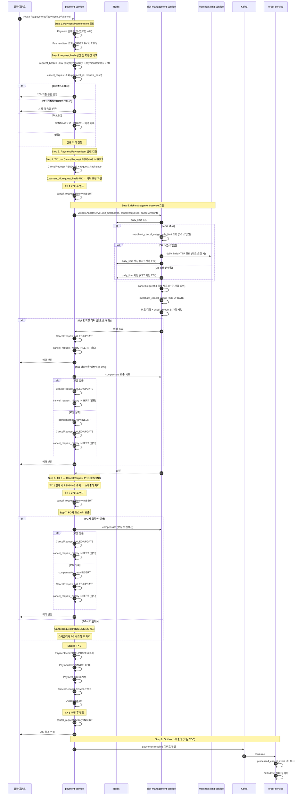
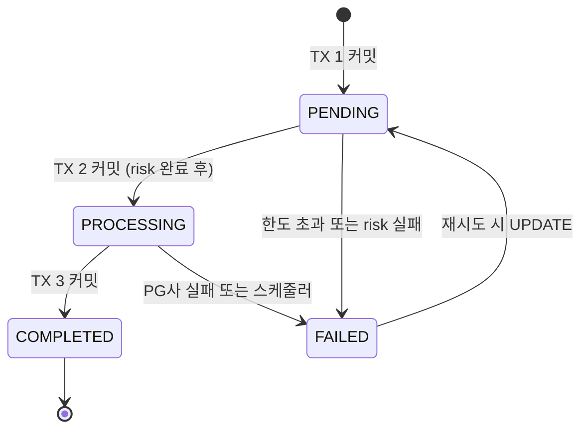
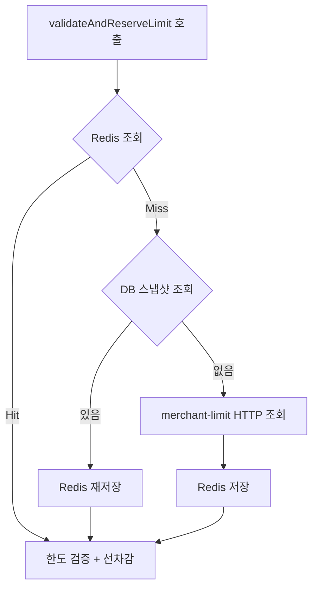
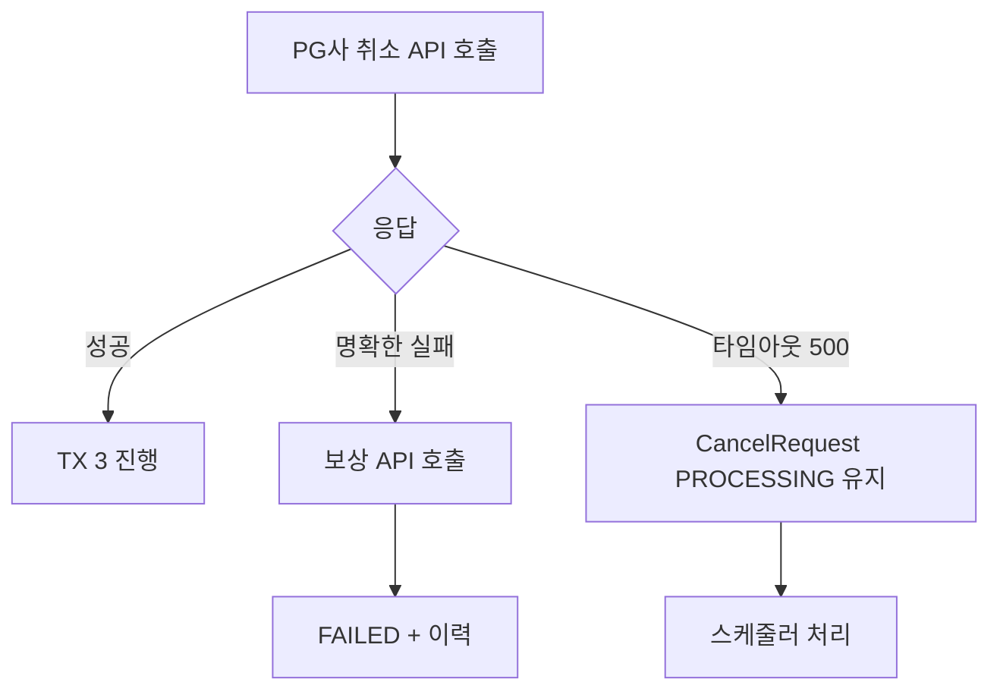
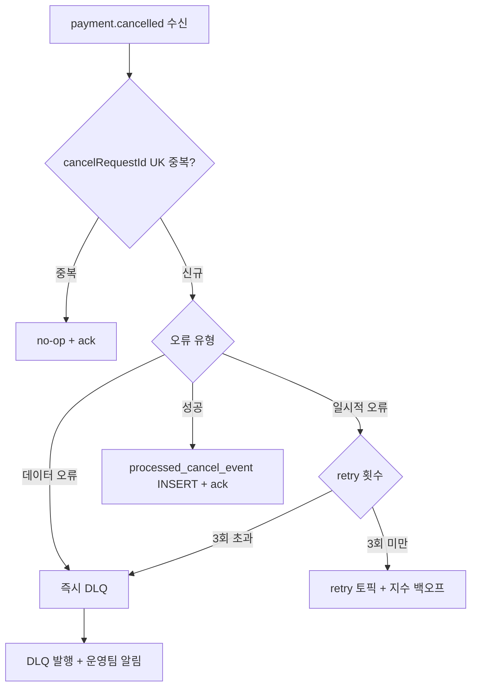

# 결제 취소 시스템 설계

> **⚠️ 메시징 방식 안내 (2026-07 기준)**
> 현재 `main` 브랜치의 취소 이벤트 발행은 **TX3 인라인**(`CancelTxWriter`에서 `kafkaTemplate.send()` 직접 호출)이다.
> 본문의 **Outbox / AFTER_COMMIT 서술은 대안 설계**이며 각각 `variant/outbox` · `variant/aftercommit` 브랜치에 해당한다.
> 인라인 발행 상세는 `docs/kafka-design.md` §"TX3 인라인 Kafka 발행" 참조.

## 목차

1. [전체 개요](#1-전체-개요)
2. [TX 1 이전 — 조회, 멱등성 체크, 검증](#2-tx-1-이전)
3. [TX 1 — CancelRequest PENDING INSERT](#3-tx-1)
4. [risk-management-service 호출 + TX 2](#4-risk-management-service-호출--tx-2)
5. [PG사 호출](#5-pg사-호출)
6. [TX 3 — 취소 완료 처리](#6-tx-3)
7. [Kafka — 이벤트 발행 및 소비](#7-kafka)
8. [스케줄러 — 복구 및 보상 재시도](#8-스케줄러)

---

# 1. 전체 개요

## 1. 서비스 구조

```
클라이언트
    │
    ▼
payment-service (8080)
    │
    ├── HTTP 동기 ──▶ risk-management-service (8083)
    │                    └── HTTP 동기 ──▶ merchant-limit-service (8082)
    │
    └── Kafka 비동기 ──▶ order-service (8081)

merchant-limit-service ──▶ Kafka ──▶ risk-management-service
                         (한도 변경 이벤트)
```

---

## 2. 전체 취소 플로우



---

## 3. 각 단계 요약

| 단계 | 설명 | 상세 문서 |
|------|------|---------|
| TX 1 이전 | 조회, request_hash 생성, 멱등성 체크, 검증 | 섹션 2 |
| TX 1 | CancelRequest PENDING INSERT, UK 차단 | 섹션 3 |
| risk + TX 2 | 한도 검증, 선차감, 가맹점 한도 변경 이벤트 | 섹션 4 |
| PG사 | PG사 취소 API, 타임아웃 처리 | 섹션 5 |
| TX 3 | PaymentItem/Payment 상태 변경, Outbox | 섹션 6 |
| Kafka | 취소 이벤트 발행, DLQ | 섹션 7 |
| 스케줄러 | 복구, 보상 재시도 | 섹션 8 |

---

## 4. CancelRequest 상태 머신



---

## 5. 핵심 설계 결정 요약

| 결정 | 이유 |
|------|------|
| request_hash 멱등키 | UUID 다른 동일 요청도 멱등 처리 |
| TX 1 분리 | risk 호출 전 기록 → 스케줄러 추적 가능 |
| 이력 TX 밖 | 이력 실패로 상태 변경 롤백 방지 |
| TX 3 FOR UPDATE 재조회 | 동시 취소 시 Payment 상태 불일치 방지 |
| Outbox Pattern | DB-Kafka 원자성 보장 |
| Redis + HTTP 폴백 | merchant-limit 장애 시에도 취소 가능 |
| compensation_retry | 보상 실패 시 스케줄러 재시도 |
# 2. TX 1 이전 — 조회, 멱등성 체크, 검증

## 1. 이 단계가 해결하는 문제

```
문제 1: 동일 요청이 재시도될 때 중복 처리 방지
문제 2: 취소 불가능한 상태에서 risk, PG사 호출 낭비 방지
문제 3: FAILED 건 재시도 시 UK 충돌 방지
```

---

## 2. 처리 순서

```
1. Payment 존재 확인 (없으면 404)
2. PaymentItem 조회 (ORDER BY id ASC)
3. request_hash 생성
4. 멱등성 체크 (상태별 분기)
5. Payment/PaymentItem 상태 검증
```

---

## 3. request_hash 생성

```
hash = SHA-256(paymentKey + paymentItemIds 오름차순 정렬)

아이템 단위 전액 취소만 가능:
  cancelAmount 불필요
  paymentItemIds 정렬로 동일 요청 식별

예시:
  paymentKey = "pay_xyz"
  cancelItems = [{ paymentItemId: 2 }, { paymentItemId: 1 }]
  → 정렬: [1, 2]
  → hash = SHA-256("pay_xyz" + "1,2")

재시도 시:
  동일 paymentKey + 동일 아이템 → 동일 hash → 멱등 처리
```

**왜 서버가 생성하는가:**

```
클라이언트 UUID 방식:
  UUID가 다르면 동일 요청도 새 요청으로 처리
  → 완벽한 멱등성 보장 불가

request_hash:
  요청 내용 자체로 식별
  클라이언트 UUID 불필요
  Idempotency-Key 헤더 불필요
```

---

## 4. 멱등성 체크 상태별 분기

| 상태 | 처리 |
|------|------|
| 없음 | 신규 처리 진행 |
| COMPLETED | 기존 응답 반환 (멱등) |
| PENDING | 처리 중 응답 반환 |
| PROCESSING | 처리 중 응답 반환 |
| FAILED | PENDING으로 UPDATE + 이력 기록 → 재처리 |

**FAILED → PENDING UPDATE 이유:**

```
새 INSERT 시 (payment_id, request_hash) UK 충돌
→ 기존 FAILED 건을 PENDING으로 UPDATE
→ UK 충돌 없음, DELETE 없음, 이력 보존

이력 기록:
  PENDING UPDATE + cancel_request_history INSERT
  상태 변경 추적
```

**PENDING/PROCESSING 중 재시도:**

```
서버 다운 후 재시작까지 클라이언트는 "처리 중" 응답
스케줄러가 5분 후 FAILED 처리
→ 이후 재시도 시 FAILED → PENDING → 정상 처리
```

---

## 5. Payment/PaymentItem 상태 검증

```
멱등성 체크 통과 후 검증:
  (이미 처리된 요청이면 검증도 불필요하므로 멱등 체크 후 수행)

Payment 검증:
  isActive(): COMPLETED or PARTIAL_CANCELLED
  CANCELLED이면 → 422

취소 기간 검증:
  payment.createdAt + payment.cancelPeriodDays >= 오늘
  초과 시 → 422 CANCEL_PERIOD_EXPIRED

PaymentItem 검증:
  요청한 아이템이 모두 ACTIVE 상태인지
  이미 CANCELLED이면 → 422
```

**cancelPeriodDays 스냅샷:**

```
결제 시점에 가맹점 정책을 payment에 저장
→ 나중에 가맹점 정책이 바뀌어도
  결제 시점 기준으로 취소 기간 적용

risk 호출 전에 차단:
  취소 기간 초과 → 불필요한 HTTP 호출 없음
```

**isActive() 도메인 메서드가 필요한 이유:**

```
Payment 상태:
  COMPLETED, PARTIAL_CANCELLED → 취소 가능
  CANCELLED → 취소 불가

직접 비교 시:
  status == 'COMPLETED'만 체크
  → PARTIAL_CANCELLED 누락 실수 가능

isActive() 메서드:
  return status == COMPLETED || status == PARTIAL_CANCELLED
  → 다른 서비스에서 실수 방지
  → 상태 추가 시 메서드만 수정
```

---

## 6. 실패 케이스

| 케이스 | 응답 |
|--------|------|
| Payment 없음 | 404 |
| Payment 취소 불가 상태 | 422 |
| 취소 기간 초과 | 422 CANCEL_PERIOD_EXPIRED |
| PaymentItem 이미 취소됨 | 422 |
| COMPLETED → 기존 응답 | 200 |
| PENDING/PROCESSING | 처리 중 |
# 3. TX 1 — CancelRequest PENDING INSERT

## 1. 이 단계가 해결하는 문제

```
문제 1: 따닥 요청 (동시 중복 요청) 차단
문제 2: risk 호출 전에 기록 → 서버 다운 시 스케줄러 추적 가능
문제 3: 이력 기록 원자성 (이력 실패해도 PENDING 상태 유지)
```

---

## 2. TX 1 내용

```
CancelRequest PENDING INSERT:
  payment_id
  request_hash
  cancel_amount (cancelItems의 item_amount 합산)
  status: PENDING
  canceller_type, cancelled_by

UNIQUE KEY (payment_id, request_hash)
```

**TX 1 이후 별도 실행:**

```
cancel_request_history INSERT
  status: PENDING
  이력은 보조 데이터
  실패해도 PENDING 상태 유지
  TX 1과 묶으면 이력 실패 시 PENDING도 롤백 → 스케줄러 추적 불가
```

---

## 3. (payment_id, request_hash) UK의 역할

**따닥 요청 차단:**

```
동시에 같은 요청 A, B 도달:
  A: INSERT 시도 → UK 인덱스 페이지 락 획득
  B: 같은 UK 값으로 INSERT 시도 → A 완료까지 대기
  A 커밋 → B INSERT 시도 → UK 충돌 → DataIntegrityViolationException

B의 catch 처리:
  cancel_request 조회 (payment_id, request_hash)
  → PENDING 상태 → "처리 중" 응답 반환

결과:
  A: 정상 처리
  B: "처리 중" 응답 (risk, PG사 불필요한 호출 없음)
```

**DB가 원자적으로 처리:**

```
"완전 동시"는 실제로 없음
DB 내부적으로 인덱스 페이지 락으로 직렬화
→ UK로 하나만 성공 보장
```

---

## 4. TX 1이 risk 호출 전에 있어야 하는 이유

```
TX 1 없이 risk 먼저 호출하면:
  used_amount 차감 완료
  CancelRequest 생성 전 서버 다운
  → CancelRequest 없음
  → 스케줄러가 추적 불가
  → used_amount 원복 불가

TX 1이 risk 전에 있으면:
  CancelRequest PENDING 기록
  서버 다운 후 스케줄러가 PENDING 감지
  → risk check API로 차감 여부 확인
  → 보상 트랜잭션 수행
```

---

## 5. TX 2 위치

```
TX 1: CancelRequest PENDING (risk 호출 전)
TX 2: CancelRequest PROCESSING (risk 성공 후)

TX 2 내용:
  CancelRequest PROCESSING UPDATE

TX 2 이후 별도:
  cancel_request_history INSERT

TX 2 실패 시:
  CancelRequest PENDING 유지
  스케줄러 5분 후 감지 → 보상 처리
```

---

## 6. FAILED 건 재시도 시 UK 처리

```
FAILED 건 남아있는 상태에서 재시도:
  request_hash 조회 → FAILED 발견
  새 INSERT → UK 충돌

해결:
  기존 FAILED 건 PENDING으로 UPDATE
  UK 충돌 없음
  DELETE 없음 → 이력 보존
  이후 정상 플로우 재진행
```
# 4. risk-management-service 호출 + TX 2

## 1. 이 단계가 해결하는 문제

```
문제 1: 가맹점 일일 한도 초과 취소 방지
문제 2: merchant-limit-service 장애 시에도 취소 가능
문제 3: 이중 차감 방지
문제 4: 가맹점 한도 변경 시 즉시 반영
```

---

## 2. daily_limit 조회 흐름



**Redis 키:**

```
daily_limit:{merchantId}:{kstDate}
TTL: KST 자정까지
```

**DB 스냅샷 (merchant_cancel_usage.daily_limit):**

```
Redis 장애 시 폴백:
  merchant_cancel_usage 테이블의 daily_limit 컬럼 사용
  → Redis 없어도 취소 가능

merchant-limit-service 장애 시:
  Redis 또는 DB 스냅샷으로 처리
  → 가맹점 서버 장애와 무관하게 취소 가능
```

---

## 3. 가맹점 한도 변경 — merchant.limit.updated Kafka

**흐름:**

```
merchant-limit-service:
  한도 변경 DB UPDATE
  @TransactionalEventListener(AFTER_COMMIT) → merchant.limit.updated 발행
  { merchantId }

risk-management-service Consumer:
  merchant-limit-service API 조회
    GET /internal/merchants/{merchantId}/cancel-limit
  → 최신 daily_limit 수신
  Redis daily_limit:{merchantId}:{kstDate} 갱신
  merchant_cancel_usage UPDATE (당일 행 있으면)
  → 이후 취소 요청부터 새 한도 적용
```

**페이로드를 `{ merchantId }`만 발행하는 이유:**

```
newLimit, kstDate를 페이로드에 포함하면:
  Consumer가 이벤트 내 값을 직접 사용
  → 이벤트 유실 / 순서 역전 시 stale 값이 캐시에 저장될 위험

{ merchantId }만 발행하고 Consumer가 API 조회:
  항상 최신 값을 가져옴
  Consumer 멱등성 자동 확보 (같은 merchantId 조회는 항상 동일 결과)
  newLimit / kstDate 없어도 처리 가능 → 페이로드 단순화

트레이드오프:
  API 조회 추가 (네트워크 1회)
  merchant-limit-service 의존성 증가
  → 한도 변경 빈도가 낮으므로 허용 가능
```

**파티션 키 = merchantId:**

```
같은 가맹점 연속 한도 변경:
  같은 파티션 → 하나의 Consumer가 순서대로 처리
  → 순서 역전 없음 (API 조회이므로 항상 최신값)
```

---

## 4. 선차감 + 이중 차감 방어

```java
@Transactional
public void validateAndReserveLimit(
    Long merchantId, String cancelRequestId, BigDecimal cancelAmount
) {
    // 이중 차감 방어
    if (cancelUsageHistoryRepository
            .existsByCancelRequestId(cancelRequestId)) {
        return;  // no-op
    }

    LocalDate kstToday = LocalDate.now(ZoneId.of("Asia/Seoul"));

    // 1순위: Redis 조회
    BigDecimal dailyLimit = redisTemplate.opsForValue()
        .get("daily_limit:" + merchantId + ":" + kstToday);

    if (dailyLimit == null) {
        // 2순위: DB 스냅샷 (Redis 장애 시 폴백 → merchant-limit 호출 없이 처리)
        MerchantCancelUsage snapshot =
            merchantCancelUsageRepository
                .findByMerchantIdAndDate(merchantId, kstToday);

        if (snapshot != null && snapshot.getDailyLimit() != null) {
            dailyLimit = snapshot.getDailyLimit();
            redisTemplate.opsForValue().set(...);  // Redis 재저장
        } else {
            // 3순위: merchant-limit HTTP 조회 (최초 요청 또는 스냅샷 없는 경우)
            dailyLimit = merchantLimitClient.getDailyLimit(merchantId, kstToday);
            redisTemplate.opsForValue().set(...);
        }
    }

    // FOR UPDATE (한도 검증 + 선차감)
    MerchantCancelUsage usage =
        merchantCancelUsageRepository
            .findByMerchantIdAndDateForUpdate(merchantId, kstToday)
            .orElseGet(() -> MerchantCancelUsage.create(merchantId, kstToday, dailyLimit));

    if (usage.getUsedAmount().add(cancelAmount)
            .compareTo(dailyLimit) > 0) {
        throw new CancelLimitExceededException(...);
    }

    usage.addUsedAmount(cancelAmount);
    merchantCancelUsageRepository.save(usage);

    // 이력 저장 (cancelRequestId UK)
    cancelUsageHistoryRepository.save(
        CancelUsageHistory.create(cancelRequestId, merchantId, cancelAmount)
    );
}
```

```
조회 순서가 중요한 이유:
  DB 스냅샷(daily_limit 컬럼)을 Redis 다음에 확인해야
  Redis 장애 시 merchant-limit 호출 없이 처리 가능
  → 서버 간 의존성 최소화 (금융 도메인)

  Redis Miss → 바로 merchant-limit 호출하면:
  DB 스냅샷의 의미가 없음
  merchant-limit 장애 + Redis 장애 시 취소 불가
```

**cancel_usage_history cancelRequestId UK:**

```
스케줄러 재처리 시 동일 cancelRequestId로 재호출:
  cancel_usage_history 있으면 → no-op
  → 이중 차감 방지

분산락 도입 시에도 동일한 방어선:
  분산락 TTL 만료 후 다른 인스턴스 재호출
  → UK로 차단
```

---

## 5. Circuit Breaker

```yaml
resilience4j:
  circuitbreaker:
    instances:
      risk-management:
        failureRateThreshold: 50
        slidingWindowSize: 10
        waitDurationInOpenState: 10s
        ignoreExceptions:
          - feign.FeignException.UnprocessableEntity  # 422 한도 초과
          - feign.FeignException.BadRequest           # 400
```

```
CLOSED: 정상 호출
OPEN: 즉시 차단 → fallback
HALF_OPEN: 복구 확인 중

400대 에러:
  서버 정상 동작 중
  CB 실패 카운트 안 됨
  catch에서 직접 처리

500대, 타임아웃:
  CB 실패 카운트
  임계치 초과 시 OPEN
```

---

## 6. 실패 케이스 처리

| 케이스 | 처리 |
|--------|------|
| 한도 초과 (422) | 보상 불필요, FAILED, 클라이언트 422 |
| risk 명확한 에러 | FAILED UPDATE + 이력 기록 |
| risk 타임아웃 | 보상 API 호출 → 성공: FAILED, 실패: compensation_retry |
| CB OPEN | CallNotPermittedException → 보상 불필요 (호출 안 됐으니까) |

**보상 트랜잭션:**

```
POST /internal/cancel-limit/compensate
  cancelRequestId, merchantId, restoreAmount

cancel_usage_compensation UK (cancelRequestId):
  이미 보상됐으면 no-op
  → 중복 보상 방지

보상 실패 시:
  compensation_retry INSERT (payment-service DB)
  스케줄러가 지수 백오프로 재시도
```

---

## 7. TX 2 — CancelRequest PROCESSING

```
risk 성공 후 CancelRequest PROCESSING UPDATE

TX 2 실패 시:
  CancelRequest PENDING 유지
  스케줄러 5분 후 감지
  → risk check API로 차감 여부 확인
  → 보상 처리 후 FAILED

TX 2 후 별도:
  cancel_request_history INSERT
  실패해도 PROCESSING 상태 유지
```
# 5. PG사 호출

## 1. 이 단계가 해결하는 문제

```
문제 1: PG사 응답 없을 때 상태 추적
문제 2: PG사 장애 시 내 서비스 보호 (Circuit Breaker)
문제 3: PG사 장기 미처리 시 운영팀 알림
```

---

## 2. PG사 호출 흐름



---

## 3. 명확한 실패 처리

```
PG사가 취소 불가 응답:
  카드사 정책, 취소 기간 만료 등
  → 보상 API 호출 (used_amount 원복)
  → CancelRequest FAILED UPDATE
  → 클라이언트 에러 반환

보상 실패 시:
  compensation_retry INSERT
  스케줄러가 재시도
```

---

## 4. 타임아웃 처리

```
PG사 응답 없음:
  CancelRequest PROCESSING 유지
  (스케줄러가 처리)

스케줄러 5분 후 감지:
  PG사 GET 조회
    성공: TX 3 재실행
    재시도 가능 실패: PG사 재호출
    재시도 불가 실패: 보상 + FAILED
    pending: pg_pending_since 기록

pg_pending_since 1시간 초과:
  보상 API 호출
  FAILED
  운영팀 알림
```

---

## 5. Circuit Breaker

```yaml
resilience4j:
  circuitbreaker:
    instances:
      pg-cancel:
        failureRateThreshold: 50
        slidingWindowSize: 10
        waitDurationInOpenState: 30s
        permittedNumberOfCallsInHalfOpenState: 2
```

```
CB OPEN 시:
  PG사 호출 차단
  CancelRequest PROCESSING 유지
  → 스케줄러가 CB 복구 후 처리

PG사는 waitDurationInOpenState 30초:
  risk보다 길게 설정
  PG사 복구 시간이 더 오래 걸릴 수 있음
```

---

## 6. 실패 케이스 정리

| 케이스 | 처리 | 보상 |
|--------|------|------|
| 명확한 실패 응답 | FAILED + 보상 | 필요 |
| 타임아웃 | PROCESSING 유지 → 스케줄러 | 스케줄러가 판단 |
| CB OPEN | PROCESSING 유지 → 스케줄러 | 스케줄러가 판단 |
| pending 1시간 초과 | FAILED + 보상 + 운영팀 알림 | 필요 |
# 6. TX 3 — 취소 완료 처리

## 1. 이 단계가 해결하는 문제

```
문제 1: 동시 취소 시 Payment 상태 불일치 방지
문제 2: DB-Kafka 발행 원자성 보장 (Outbox)
문제 3: 이력 실패로 취소 완료 롤백 방지
```

---

## 2. TX 3 내용

```
1. PaymentItem FOR UPDATE 재조회
2. 취소 대상 아이템 CANCELLED 처리
3. Payment 상태 재계산 (전체 아이템 기준)
4. CancelRequest COMPLETED
5. ApplicationEvent 발행 (TX 커밋 후 AFTER_COMMIT 리스너가 Kafka 발행)

TX 3 커밋 후 별도:
  cancel_request_history INSERT
  (실패해도 COMPLETED 유지)

TX 3 커밋 후 AFTER_COMMIT:
  KafkaProducer.send(payment.cancelled)
  실패 시 failed_kafka_event INSERT → 재시도 스케줄러 대상
```

---

## 3. PaymentItem FOR UPDATE 재조회가 필요한 이유

**동시 취소 시 문제:**

```
유저: PaymentItem A 취소 요청
가맹점: PaymentItem B 취소 요청 동시

각자 TX 1 이전에 조회한 데이터:
  유저: A(ACTIVE), B(ACTIVE)
  가맹점: A(ACTIVE), B(ACTIVE)

유저 TX 3:
  A CANCELLED 처리
  재계산: A(CANCELLED), B(ACTIVE) → PARTIAL_CANCELLED

가맹점 TX 3:
  B CANCELLED 처리
  재계산: A(ACTIVE), B(CANCELLED) → PARTIAL_CANCELLED

둘 다 커밋:
  실제 DB: A(CANCELLED), B(CANCELLED)
  Payment: PARTIAL_CANCELLED ← 틀림 (CANCELLED여야 함)
```

**해결:**

```java
@Transactional
public void completeCancel(CancelRequest cancelRequest, List<Long> cancelItemIds) {

    // TX 3에서 최신 상태 재조회 + 직렬화
    List<PaymentItem> latestItems =
        paymentItemRepository
            .findAllByPaymentIdForUpdate(cancelRequest.getPaymentId());

    // 취소 대상 CANCELLED 처리
    latestItems.stream()
        .filter(item -> cancelItemIds.contains(item.getId()))
        .forEach(PaymentItem::cancel);
    paymentItemRepository.saveAll(latestItems);

    // 최신 전체 아이템 기준 Payment 재계산
    Payment latestPayment =
        paymentRepository.findByIdForUpdate(cancelRequest.getPaymentId());
    latestPayment.recalculateStatus(latestItems);
    paymentRepository.save(latestPayment);

    // CancelRequest COMPLETED
    cancelRequest.toCompleted();
    cancelRequestRepository.save(cancelRequest);

    // Outbox INSERT
    outboxRepository.save(
        CancelEventOutbox.of(cancelRequest, latestPayment, latestItems)
    );
}
```

**TX 1 이전 FOR UPDATE를 안 하는 이유:**

```
TX 1 이전 FOR UPDATE:
  risk 호출 (수백ms) + PG사 호출 (수백ms~수초) 동안 락 유지
  → 처리량 급감

TX 3에서만 FOR UPDATE:
  락 범위: TX 3 내부 (수ms)
  DB 트랜잭션과 락이 원자적
  → 최신 상태 재계산 + 처리량 유지
```

---

## 4. Payment 상태 재계산

```
recalculateStatus(List<PaymentItem> items):
  모든 아이템 CANCELLED → CANCELLED
  일부만 CANCELLED → PARTIAL_CANCELLED
  모두 ACTIVE → COMPLETED

isActive() 도메인 메서드:
  COMPLETED or PARTIAL_CANCELLED → 취소 가능
  직접 상태 비교 대신 메서드 사용
  → 다른 서비스에서 상태 누락 실수 방지
```

---

## 5. AFTER_COMMIT Kafka 발행

```
TX 3 내에서 ApplicationEventPublisher.publishEvent(CancelCompletedEvent) 호출

@TransactionalEventListener(phase = AFTER_COMMIT)
public void onCancelCompleted(CancelCompletedEvent event) {
    try {
        kafkaTemplate.send("payment.cancelled", paymentKey, payload);
    } catch (Exception e) {
        // Kafka 발행 실패 → failed_kafka_event INSERT
        failedKafkaEventRepository.save(
            FailedKafkaEvent.of(event, e.getMessage())
        );
    }
}

failed_kafka_event:
  cancel_request_id UK
  topic
  payload (JSON)
  status: PENDING | PUBLISHED | EXHAUSTED
  retry_count
  last_error

재시도 스케줄러 (failed-kafka-publisher):
  PENDING 건 조회 → Kafka 재발행
  성공: PUBLISHED UPDATE
  5회 초과: EXHAUSTED → 운영팀 알림
```

**Outbox 대비 트레이드오프:**

```
Outbox Pattern (variant/outbox 브랜치):
  TX 3 안에 cancel_event_outbox INSERT → DB-Kafka 원자성 보장
  서버 다운 시 Outbox 스케줄러가 PENDING 건 재발행
  단점: cancel_event_outbox 테이블 + outbox-publisher 스케줄러 필요

AFTER_COMMIT (variant/aftercommit 브랜치):
  TX 3 커밋 후 Kafka 직접 발행 → 테이블/스케줄러 단순
  발행 실패 시 failed_kafka_event에만 기록
  단점: TX 3 커밋 직후 서버 다운 시 발행 누락 가능
        (AFTER_COMMIT 리스너 실행 전 다운 → failed_kafka_event도 없음)
        → 이 경우 processing-recovery 스케줄러가 취소 완료 건을 감지해 재발행

장애 복구 경로:
  Outbox: PENDING 행 존재 → 스케줄러 재발행 (자동)
  AFTER_COMMIT: failed_kafka_event 없으면
    processing-recovery 또는 수동 재발행 필요
```

---

## 6. 이력 기록 분리 원칙

```
TX 3 안에 이력 포함하면:
  이력 INSERT 실패 시 PaymentItem, Payment, Outbox 모두 롤백
  → 취소가 완료됐는데 재처리
  → 스케줄러 불필요한 부하

TX 3 밖에서 별도 실행:
  이력 실패해도 취소 완료 유지
  이력은 보조 데이터 (감사, 추적 목적)
  → 비즈니스 로직에 영향 없음
```

---

## 7. TX 3 재실행 시 멱등성

```
스케줄러가 TX 3 재실행:
  PaymentItem: 이미 CANCELLED면 동일 결과
  Payment: 상태 재계산 → 동일 결과
  CancelRequest: COMPLETED UPDATE → 동일 결과
  AFTER_COMMIT 리스너 재실행:
    failed_kafka_event: cancel_request_id UK
      이미 PUBLISHED면 INSERT 시도 시 UK 충돌 → skip
    Kafka: enable.idempotence=true
      동일 메시지 중복 발행해도 Consumer 멱등성으로 방어
```
# 7. Kafka — 이벤트 발행 및 소비

## 1. 토픽 구조

| 토픽 | 파티션 | Retention | 파티션 키 | 용도 |
|------|--------|-----------|---------|------|
| payment.cancelled | 10 | 7일 | paymentKey | 취소 완료 이벤트 |
| payment.cancelled.retry | 10 | 7일 | paymentKey | Consumer 실패 재시도 |
| payment.cancelled.DLQ | 3 | 30일 | - | 실패 격리 |
| merchant.limit.updated | 3 | 7일 | merchantId | 가맹점 한도 변경 이벤트 |

---

## 2. payment.cancelled 페이로드

```json
{
  "cancelRequestId": "cr_abc123",
  "paymentKey": "pay_xyz",
  "merchantId": 1,
  "cancelledItems": [
    {
      "paymentItemId": 1,
      "orderItemId": 10,
      "itemAmount": 300000
    }
  ],
  "cancelledAt": "2026-04-21T10:00:00.000Z"
}
```

**필드 설명:**

```
cancelRequestId: Consumer 멱등성 (processed_cancel_event UK)
paymentKey: 어떤 결제건인지
merchantId: 가맹점 구분
cancelledItems:
  paymentItemId: payment-service 기준 식별자
  orderItemId: order-service가 자기 DB에서 OrderItem 찾기 위해 필요
  itemAmount: 취소된 금액
cancelledAt: 취소 완료 시각
```

**페이로드 설계 원칙:**

```
풍부한 페이로드 지향:
  Consumer가 API 조회 없이 처리 가능
  payment-service 장애와 무관하게 처리

예외 — 대용량 데이터 (수십KB, 이미지):
  S3 링크 또는 최소 식별자만 포함
  Consumer가 필요 시 S3 또는 API로 조회
```

---

## 3. AFTER_COMMIT + failed_kafka_event

**문제:**

```
TX 3 커밋 후 Kafka 발행 시도:
  TX 3 커밋 성공
  Kafka 발행 중 서버 다운
  → 메시지 영구 유실 (Dual Write 문제)
```

**이 브랜치의 해결:**

```
@TransactionalEventListener(AFTER_COMMIT):
  TX 3 커밋 이후 Kafka 발행
  발행 성공 → 완료
  발행 실패 → failed_kafka_event INSERT (별도 저장소)

failed-kafka-publisher 스케줄러 (30초):
  failed_kafka_event PENDING → Kafka 재발행
  5회 초과 → EXHAUSTED → 운영팀 알림

AFTER_COMMIT 전 서버 다운:
  failed_kafka_event 없음
  processing-recovery 스케줄러가 COMPLETED 건 감지 → 재발행
  (또는 운영팀 수동 재발행)

TPS 1000+:
  failed_kafka_event 건수가 많아지면
  → CDC (Debezium) 전환 검토
```

---

## 4. merchant.limit.updated 페이로드

```json
{
  "merchantId": 1,
  "newLimit": 3000000,
  "kstDate": "2026-04-21"
}
```

**kstDate 포함 이유:**

```
당일뿐 아니라 이전 날짜 한도 변경도 가능
Consumer가 어느 날짜 행을 UPDATE할지 알아야 함
```

**Consumer 처리:**

```
Redis daily_limit:{merchantId}:{kstDate} 갱신
merchant_cancel_usage UPDATE (kstDate 행 있으면)
  SET daily_limit = newLimit

자연 멱등:
  UPDATE daily_limit = newLimit
  → 몇 번 실행해도 동일한 결과

파티션 키 merchantId:
  같은 가맹점 연속 한도 변경 시 순서 보장
  → version, updatedAt 비교 불필요
```

---

## 5. Consumer 멱등성

```
At-least-once + Consumer 멱등성 = 결과적 Exactly-once

order-service:
  수신 시 processed_cancel_event 조회
  cancel_request_id UK 있으면 → no-op + ack
  없으면 → OrderItem 상태 변경 + INSERT + ack

Producer:
  enable.idempotence=true
  acks=all
  수동 커밋
```

**확장 포인트:**

```
현재: payment.cancelled 전용 → cancel_request_id UK 충분

미래 이벤트 추가 시 (refund.completed 등):
  같은 테이블 처리하면 ID 충돌 가능
  해결: (event_type, event_id) 복합 UK
  또는: 이벤트별 별도 테이블 유지
```

---

## 6. 순서 보장

```
payment.cancelled:
  파티션 키 = paymentKey
  같은 결제건 이벤트 → 항상 같은 파티션
  → 동일 결제건 이벤트 처리 순서 보장

merchant.limit.updated:
  파티션 키 = merchantId
  같은 가맹점 한도 변경 → 항상 같은 파티션
  → 연속 변경 시 순서 보장
```

---

## 7. DLQ 처리



**운영팀 DLQ 처리:**

```
원인 파악:
  데이터 오류 → 수동 보정 후 재발행
  코드 오류 → 배포 후 재발행
  재발행 불가 → 폐기 + 수동 보정
```
# 8. 스케줄러 — 복구 및 보상 재시도

## 1. 스케줄러 4개 (payment-service)

| 스케줄러 | 주기 | lockAtMostFor | 역할 |
|---------|------|--------------|------|
| pending-recovery | 60초 | 55초 | PENDING 5분 초과 복구 |
| processing-recovery | 60초 | 55초 | PROCESSING 5분 초과 복구 |
| failed-kafka-publisher | 30초 | 25초 | Kafka 발행 실패 재시도 |
| compensation-retry | 30초 | 25초 | 보상 재시도 |

> outbox-publisher 제거 — cancel_event_outbox 테이블 제거에 따라.
> AFTER_COMMIT 리스너 발행 실패 건만 failed_kafka_event 테이블에서 재시도.

**Redis 분산락 (ElastiCache Multi-AZ):**

```
ShedLock → Redis 분산락으로 전환
shedlock 테이블 없음 → Redis 키로 대체

인스턴스 여러 대:
  하나의 인스턴스만 스케줄러 실행
  나머지는 대기

인스턴스 다운:
  lockAtMostFor 후 TTL 만료
  다른 인스턴스가 락 획득
```

---

## 2. pending-recovery

**대상: PENDING 5분 초과**

```
PENDING의 의미:
  TX 1 커밋됨
  risk 호출 전 서버 다운

risk 차감 여부 알 수 없음
→ 안전하게 check API 먼저 호출
```

**처리 흐름:**

```
GET /internal/cancel-limit/check?cancelRequestId=

charged=true:
  risk가 차감됨
  → compensate API 호출
    성공: FAILED UPDATE + 이력 기록
    실패: compensation_retry INSERT + FAILED UPDATE + 이력 기록

charged=false:
  차감 안 됨 → 보상 불필요
  → FAILED UPDATE + 이력 기록
```

---

## 3. processing-recovery

**대상: PROCESSING 5분 초과**

```
PROCESSING의 의미:
  risk 완료 (used_amount 차감됨)
  PG사 결과 불명확
```

**처리 흐름:**

```
PG사 GET 조회:

성공:
  TX 3 재실행
  (Outbox cancel_request_id UK 중복 체크 후 skip)

실패 (재시도 가능):
  PG사 취소 재호출 (최대 재시도 횟수 제한)

실패 (재시도 불가):
  보상 API 호출
    성공: FAILED UPDATE + 이력 기록
    실패: compensation_retry INSERT + FAILED UPDATE + 이력 기록

pending:
  pg_pending_since 기록 (최초 감지 시)
  1시간 초과:
    보상 API 호출
    FAILED UPDATE + 이력 기록
    운영팀 알림

PG사 GET 조회 실패:
  PROCESSING 유지
  다음 스케줄러 주기 재시도
```

---

## 4. outbox-publisher

```
Outbox PENDING 건 조회 (1000건씩)
→ Kafka 발행
→ PUBLISHED UPDATE

HTTP 호출 없음 (Kafka 발행만)

TPS 100에서:
  10초에 1000건 발생
  배치 크기 1000으로 충분

TPS 1000+:
  분산락으로 단일 실행
  → 배치 크기 늘려도 한계
  → CDC (Debezium) 전환 필수
```

---

## 5. compensation-retry

```
payment-service DB의 compensation_retry 조회
next_retry_at 도래한 건만

→ risk 보상 API 재호출
→ 성공: DONE
→ 실패: incrementAttempt + scheduleNextRetry (지수 백오프)
→ EXHAUSTED: 운영팀 알림 + 수동 보정

compensation_retry가 payment DB에 있는 이유:
  보상 API 호출 주체가 payment-service
  risk 장애 시에도 재시도 기록은 payment DB에 안전하게 보관
  risk 복구 후 스케줄러가 자동 재처리
```

---

## 6. risk 장애 시 영향 격리

```
risk 서버 장애:

pending-recovery / processing-recovery:
  보상 API 호출 실패
  → compensation_retry INSERT 시도
    성공: compensation-retry 스케줄러가 재처리
    실패: 에러 로그 + 운영팀 알림 (극히 드문 케이스)
  → 다음 건으로 넘어감 (스케줄러 중단 없음)

compensation-retry:
  risk 장애 지속 → 지수 백오프로 계속 시도
  risk 복구 시 자동 처리
  EXHAUSTED → 운영팀 알림
```

---

## 7. 운영팀 개입 시점

| 시점 | 원인 | 조치 |
|------|------|------|
| compensation_retry EXHAUSTED | 보상 5회 초과 실패 | used_amount 수동 원복 |
| compensation_retry INSERT 실패 | payment DB 장애 | 에러 로그 기반 수동 INSERT |
| PG사 pending 1시간 초과 | PG사 장기 미처리 | PG사 확인 후 수동 처리 |
| DLQ 메시지 | Kafka Consumer 실패 | 원인 파악 후 재발행 또는 폐기 |

---

## 8. TPS 확장 전략 및 병목 실증

### 부하 테스트 결과 (2026-04-28, k6, docker-compose 단일 인스턴스)

```
VU 1명:
  p99 92ms, 성공률 100%

VU 10명 (동시 취소 집중):
  merchant_cancel_usage FOR UPDATE 직렬화 → 락 대기 타임아웃
  → risk-management-service RISK_SERVICE_UNAVAILABLE
  → Circuit Breaker 실패율 50% 초과 → CB OPEN
  → 이후 모든 요청 즉시 차단
  → 최종 성공률 0.06%
```

### 병목 전파 경로

```
동시 취소 요청
  └─ merchant_cancel_usage FOR UPDATE 대기
       └─ DB 락 타임아웃
            └─ risk-service RISK_SERVICE_UNAVAILABLE 반환
                 └─ payment-service CB 실패율 누적
                      └─ CB OPEN → 정상 요청까지 차단
```

FOR UPDATE 타임아웃이 CB에 의해 증폭된다.
CB는 의도한 동작이나, 근본 원인은 FOR UPDATE 직렬화.

### 전환 기준 (설계 예측 → 실증 반영)

| 구분 | 설계 예측 | 실증 결과 |
|------|---------|---------|
| FOR UPDATE 한계 | TPS 1000+ | VU 10 수준 (동시 집중 시) |
| 분산락 전환 시점 | TPS 1000 | 대형 가맹점 온보딩 전 |
| CB 파라미터 | 기본값 유지 | failureRateThreshold / waitDurationInOpenState 재검토 권고 |

### 단계별 확장 전략

```
현재 (TPS 100 목표):
  단일 MySQL, FOR UPDATE 유지
  가맹점별 트래픽 분산이 전제
  특정 가맹점에 집중 시 병목 즉시 발생

단기 (대형 가맹점 온보딩 시):
  Redis 분산 카운터 도입 검토
    INCRBY used_amount:{merchantId}:{kstDate} 원자적 연산
    단, 장애 시 정합성 위험 → cancel_usage_history UK로 이중 차감 방어 필수
  Circuit Breaker 파라미터 조정
    waitDurationInOpenState: 락 타임아웃보다 짧게
    slidingWindowSize: 충분히 크게 (일시적 스파이크에 CB OPEN 방지)

중기 (TPS 1000+):
  Read Replica 도입
  Redis 분산락 전환 (스케줄러 → FOR UPDATE 모두)
  Outbox → CDC(Debezium) 전환

장기 (TPS 5000+):
  merchantId 기반 DB 샤딩
  FOR UPDATE 자체 제거 → 분산락만으로 직렬화
```
