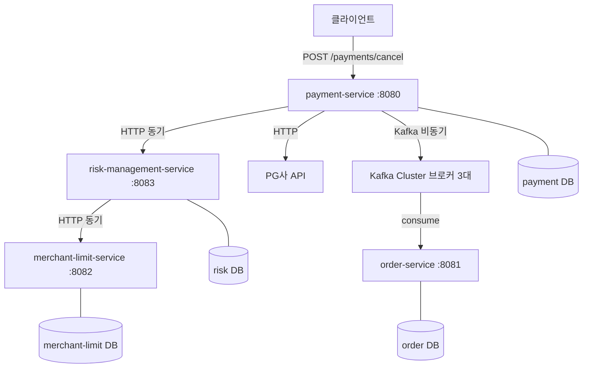
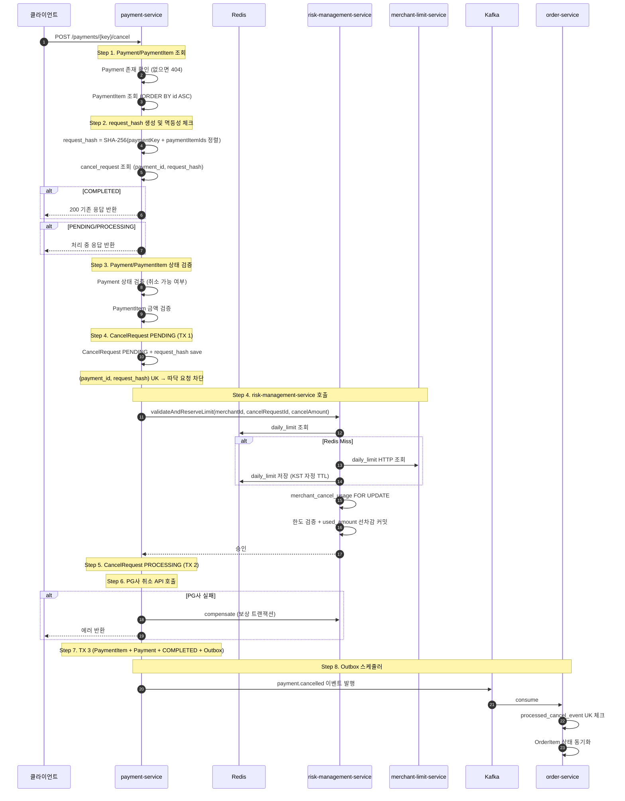
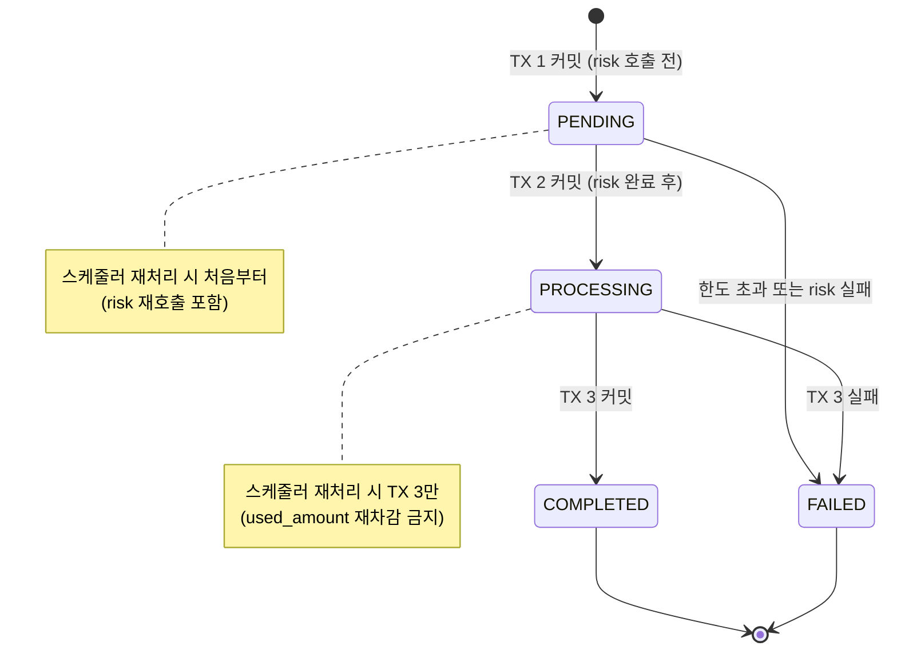
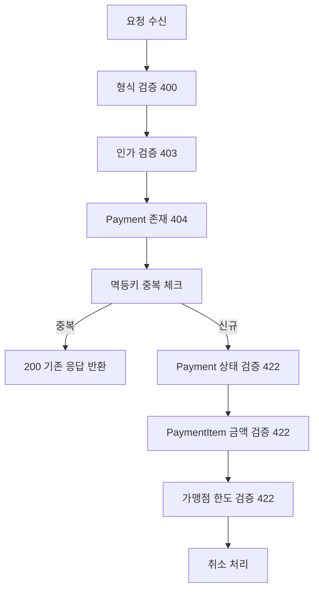
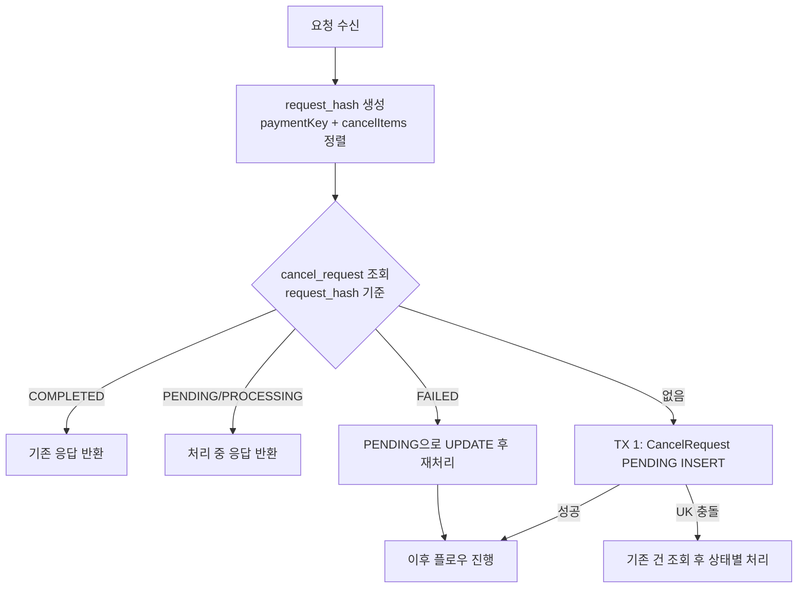
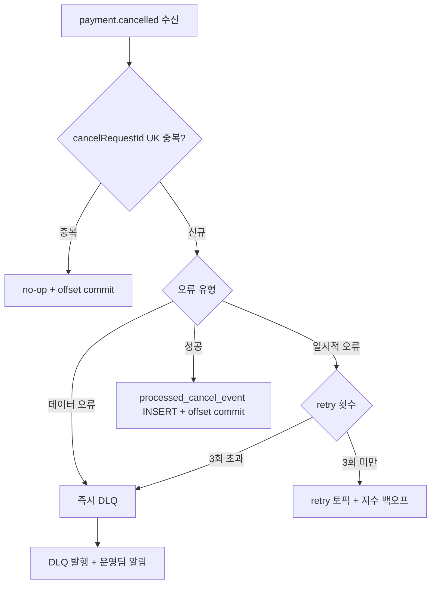

# 결제 취소 시스템 — 디자인 리뷰

> 작성일: 2026.04.18
> 작성자: 이주호

---

## 1. 요구사항

### 1-1. 배경

주문 서버의 주문 플로우와 결제 API는 이미 구축되어 있으며, 결제 취소 API 구축이 필요하다. 취소 요청은 payment-service로 시작되며, risk-management-service와 merchant-limit-service가 협력하여 가맹점별 일일 취소 한도를 관리한다.

### 1-2. 목표

- 결제 취소 API 구축 (부분 취소 포함)
- 멱등성 보장 (동일 취소 요청 중복 처리 방지)
- 가맹점별 일일 취소 한도 관리 및 동시성 제어
- 취소 이벤트를 Kafka로 발행하여 주문/적립금/정산 서버에 전달
- TPS 100 기준 설계, TPS 1000/10000 확장 고려

### 1-3. 핵심 문제

| 분류 | 문제 |
|------|------|
| 멱등성 | 네트워크 재시도로 동일 취소 2번 실행 시 환불 2회 발생 |
| 동시성 | 가맹점 한도 동시 차감 시 한도 초과 취소 가능 |
| 동시성 | 동일 PaymentItem 동시 수정 시 데이터 불일치 |
| 분산 트랜잭션 | HTTP 경계를 넘은 원자성 보장 불가 |
| 분산 트랜잭션 | DB 커밋과 Kafka 발행 사이 서버 다운 시 이벤트 유실 |
| 장애 복구 | 서버 재시작 시 처리 중이던 요청 복구 |
| 데이터 정합성 | 모듈 간 DB 직접 접근 금지로 조인 불가 |

---

## 2. 시스템 아키텍처

### 2-1. 전체 구조



### 2-2. 모듈 간 통신 전략

| 통신 방식 | 사용 구간 | 이유 |
|---------|---------|------|
| HTTP 동기 | payment → risk, risk → merchant-limit | 즉시 응답 필요, 실패 시 현재 플로우 중단 |
| HTTP 동기 | payment → PG사 | 실제 환불 수행, 결과 즉시 확인 필요 |
| Kafka 비동기 | payment → order | 취소 완료 후 알림, 즉시 응답 불필요 |

### 2-3. 취소 플로우 요약



### 2-4. CancelRequest 상태 머신



---

## 3. Database Design

### 3-1. payment-service DB

**payment (결제 원장)**

| 컬럼 | 타입 | 설명 |
|------|------|------|
| id | BIGINT PK | |
| payment_key | VARCHAR(64) UK | PG사 발급 키 |
| merchant_id | BIGINT | 가맹점 ID |
| user_id | BIGINT | 유저 ID |
| total_amount | DECIMAL(19,2) | 결제 총액 |
| currency | VARCHAR(3) | KRW |
| status | VARCHAR(20) | COMPLETED / PARTIAL_CANCELLED / CANCELLED |

**payment_item (결제 항목 — 아이템 단위 취소)**

| 컬럼 | 타입 | 설명 |
|------|------|------|
| id | BIGINT PK | |
| payment_id | BIGINT FK | |
| item_name | VARCHAR(255) | 결제 시점 스냅샷 |
| item_amount | DECIMAL(19,2) | 결제 시점 가격 |
| status | VARCHAR(20) | ACTIVE / CANCELLED |

```
cancelled_amount 제거:
  아이템 단위 전액 취소만 가능
  → 누적 취소액 추적 불필요
  → status로만 관리

version (낙관적 락) 제거:
  동일 PaymentItem 동시 수정 케이스 3이
  아이템 단위 전액 취소로 단순화됨
  → status UK로 방어 가능
```

**cancel_request (취소 요청)**

| 컬럼 | 타입 | 설명 |
|------|------|------|
| id | BIGINT PK | |
| payment_id | BIGINT FK | |
| request_hash | VARCHAR(64) | SHA-256(paymentKey + paymentItemIds 정렬) |
| cancel_amount | DECIMAL(19,2) | |
| status | VARCHAR(20) | PENDING / PROCESSING / COMPLETED / FAILED |
| pg_pending_since | DATETIME(3) | PG사 pending 최초 감지 시각 |
| UNIQUE KEY | (payment_id, request_hash) | TX 1에서 따닥 요청 차단 |

```
idempotency_key 테이블 제거:
  cancel_request.request_hash UK가 중복 차단 담당 (TX 1)
  재시도 시 cancel_request에서 COMPLETED 조회 후 응답 생성
  response_body 별도 저장 불필요
```

**cancel_event_outbox (Kafka 발행 보장)**

| 컬럼 | 타입 | 설명 |
|------|------|------|
| id | BIGINT PK | |
| cancel_request_id | BIGINT UK | |
| payload | JSON | 발행할 이벤트 |
| status | VARCHAR(20) | PENDING / PUBLISHED |

### 3-2. risk-management-service DB

**merchant_cancel_usage (가맹점 일일 소진 내역)**

| 컬럼 | 타입 | 설명 |
|------|------|------|
| id | BIGINT PK | |
| merchant_id | BIGINT | |
| kst_date | DATE | KST 기준 날짜 |
| daily_limit | DECIMAL(19,2) | 당일 한도 스냅샷 |
| used_amount | DECIMAL(19,2) | 소진 누적액 |

**cancel_usage_history (차감 이력 — 이중 차감 방어)**

| 컬럼 | 타입 | 설명 |
|------|------|------|
| id | BIGINT PK | |
| cancel_request_id | VARCHAR(64) UK | |
| merchant_id | BIGINT | |
| cancel_amount | DECIMAL(19,2) | |

**cancel_usage_compensation (보상 멱등성)**

| 컬럼 | 타입 | 설명 |
|------|------|------|
| id | BIGINT PK | |
| cancel_request_id | VARCHAR(64) UK | |
| restore_amount | DECIMAL(19,2) | |

**compensation_retry (보상 재시도)**

| 컬럼 | 타입 | 설명 |
|------|------|------|
| id | BIGINT PK | |
| cancel_request_id | VARCHAR(64) UK | |
| attempt_count | INT | |
| next_retry_at | DATETIME(3) | 지수 백오프 |
| status | VARCHAR(20) | PENDING / DONE / EXHAUSTED |

### 3-3. merchant-limit-service DB

**merchant (가맹점)**

| 컬럼 | 타입 | 설명 |
|------|------|------|
| id | BIGINT PK | |
| merchant_key | VARCHAR(64) UK | |
| name | VARCHAR(255) | |
| cancel_period_days | INT | 취소 가능 기간 |

**merchant_cancel_limit (일일 한도)**

| 컬럼 | 타입 | 설명 |
|------|------|------|
| id | BIGINT PK | |
| merchant_id | BIGINT FK | |
| kst_date | DATE | |
| daily_limit | DECIMAL(19,2) | |

### 3-4. order-service DB

**order_item (주문 항목)**

| 컬럼 | 타입 | 설명 |
|------|------|------|
| id | BIGINT PK | |
| order_id | BIGINT FK | |
| status | VARCHAR(20) | ACTIVE / CANCELLED |

**processed_cancel_event (Kafka 멱등성)**

| 컬럼 | 타입 | 설명 |
|------|------|------|
| id | BIGINT PK | |
| cancel_request_id | VARCHAR(64) UK | |
| processed_at | DATETIME(3) | |

---

## 4. API Design

### 4-1. 결제 취소 API (External)

```
POST /v1/payments/{paymentKey}/cancel

헤더:
  Authorization: Bearer {token}
  Idempotency-Key: {UUID}    ← 클라이언트가 생성

요청:
{
  "cancelAmount": 300000,
  "cancelReason": "고객 단순 변심",
  "cancelItems": [
    { "paymentItemId": 2, "cancelAmount": 300000 }
  ]
}

응답 200 (성공):
{
  "cancelRequestId": "cr_abc123",
  "paymentKey": "pay_xyz",
  "cancelAmount": 300000,
  "status": "COMPLETED",
  "cancelledItems": [
    { "paymentItemId": 2, "cancelAmount": 300000, "status": "CANCELLED" }
  ],
  "completedAt": "2026-04-18T10:00:00.000Z"
}

응답 400 (형식 오류):
{ "code": "INVALID_REQUEST", "message": "cancelAmount는 0보다 커야 합니다" }

응답 404 (결제 없음):
{ "code": "PAYMENT_NOT_FOUND", "message": "결제 정보를 찾을 수 없습니다" }

응답 422 (비즈니스 오류):
{ "code": "CANCEL_LIMIT_EXCEEDED", "message": "가맹점 일일 취소 한도를 초과했습니다",
  "remainingLimit": 200000, "dailyLimit": 5000000 }
{ "code": "PAYMENT_ITEM_ALREADY_CANCELLED", "message": "이미 취소된 항목입니다" }
{ "code": "CANCEL_AMOUNT_EXCEEDED", "message": "취소 금액이 잔여 금액을 초과합니다" }
```

### 4-2. 취소 조회 API (External)

```
GET /v1/payments/{paymentKey}/cancel/{cancelRequestId}

응답 200:
{
  "cancelRequestId": "cr_abc123",
  "paymentKey": "pay_xyz",
  "cancelAmount": 300000,
  "status": "COMPLETED",
  "cancelledItems": [...],
  "completedAt": "2026-04-18T10:00:00.000Z"
}

GET /v1/payments/{paymentKey}/cancels?page=0&size=20

응답 200:
{
  "content": [ { ... } ],
  "totalElements": 3,
  "page": 0,
  "size": 20
}
```

### 4-3. Internal API — payment → risk-management

**한도 검증 및 선차감**

```
POST /internal/cancel-limit/validate-and-reserve

요청:
{
  "merchantId": 1,
  "cancelRequestId": "cr_abc123",
  "cancelAmount": 300000,
  "kstDate": "2026-04-18"
}

응답 200 (성공):
{
  "merchantId": 1,
  "dailyLimit": 5000000,
  "usedAmount": 300000,
  "remainingLimit": 4700000
}

응답 422 (한도 초과):
{
  "code": "CANCEL_LIMIT_EXCEEDED",
  "dailyLimit": 5000000,
  "usedAmount": 4800000,
  "remainingLimit": 200000,
  "requestAmount": 300000
}

응답 503 (서비스 장애):
{ "code": "SERVICE_UNAVAILABLE", "message": "일시적 오류가 발생했습니다" }
```

**보상 트랜잭션 (used_amount 원복)**

```
POST /internal/cancel-limit/compensate

요청:
{
  "cancelRequestId": "cr_abc123",
  "merchantId": 1,
  "restoreAmount": 300000
}

응답 200 (성공 또는 이미 보상됨 — 멱등):
{
  "cancelRequestId": "cr_abc123",
  "restored": true
}

응답 200 (이미 보상 완료 — no-op):
{
  "cancelRequestId": "cr_abc123",
  "restored": false,
  "reason": "ALREADY_COMPENSATED"
}
```

### 4-4. Internal API — risk-management → merchant-limit

**일일 한도 조회**

```
GET /internal/merchants/{merchantId}/cancel-limit?kstDate=2026-04-18

응답 200:
{
  "merchantId": 1,
  "kstDate": "2026-04-18",
  "dailyLimit": 5000000
}

응답 404 (가맹점 없음):
{ "code": "MERCHANT_NOT_FOUND", "message": "가맹점 정보를 찾을 수 없습니다" }
```

### 4-5. 검증 순서



### 4-6. 멱등성 처리 (개선된 설계)

**핵심 설계 변경:**

```
기존: Idempotency-Key (클라이언트 UUID)
개선: request_hash (서버가 생성)

이유:
  UUID가 다른 동일 요청은 새 요청으로 처리됨
  → 완벽한 멱등성 보장 불가
  request_hash로 요청 내용 자체를 식별
  → UUID 없이도 멱등 처리 가능
  → 클라이언트 구현 단순화
```

**request_hash 생성:**

```
hash = SHA-256(paymentKey + paymentItemIds 오름차순 정렬)

아이템 단위 전액 취소만 가능하므로:
  cancelAmount 불필요 (항상 item_amount 전액)
  cancelledAmount 불필요 (ACTIVE/CANCELLED 상태로만 구분)

예시:
  A(30만), B(50만) 취소 요청:
    hash = SHA-256(paymentKey + "A,B")

  재시도 (같은 아이템):
    hash = SHA-256(paymentKey + "A,B") → 동일 → 멱등 처리
```

**처리 흐름:**



**상태별 처리:**

| 상태 | 처리 |
|------|------|
| 없음 | 신규 INSERT (PENDING) → 이후 플로우 |
| PENDING | 처리 중 응답 반환 |
| PROCESSING | 처리 중 응답 반환 |
| COMPLETED | 기존 응답 반환 (멱등) |
| FAILED | 기존 건 PENDING으로 UPDATE → 이후 플로우 재진행 |

**FAILED → PENDING UPDATE 이유:**

```
FAILED = 취소가 안 된 상태 → 재시도 허용

새 INSERT 시 UK 충돌 발생
→ 기존 FAILED 건을 PENDING으로 UPDATE
→ UK 충돌 없음, DELETE 없음
→ 이후 정상 플로우 진행

이력 보존:
  cancel_request_history 테이블에
  FAILED 시점 + PENDING 재시도 시점 기록
```

**cancel_request_history (이력 보존):**

| 컬럼 | 타입 | 설명 |
|------|------|------|
| id | BIGINT PK | |
| cancel_request_id | BIGINT FK | |
| status | VARCHAR(20) | 변경된 상태 |
| reason | VARCHAR(500) | 실패 사유 등 |
| created_at | DATETIME(3) | 상태 변경 시각 |

**Idempotency-Key 헤더 제거:**

| 방식 | 장점 | 단점 | 채택 |
|------|------|------|------|
| 클라이언트 UUID | 업계 표준 | UUID 달라도 동일 요청 인식 불가 | - |
| request_hash (서버 생성) | 완벽한 멱등성, 클라이언트 단순 | 클라이언트 UUID 포기 | ✓ |

### 4-7. 동시성 처리

| 케이스 | 상황 | 해결 방법 |
|--------|------|---------|
| 케이스 1 | 동일 요청 중복 (따닥 요청) | cancel_request (payment_id, request_hash) UK (TX 1) |
| 케이스 2 | 가맹점 한도 동시 차감 | merchant_cancel_usage FOR UPDATE |
| 케이스 3 | 동일 PaymentItem 동시 취소 | cancel_request (payment_id, request_hash) UK (TX 1) |

**케이스 2 — FOR UPDATE 선택 이유:**

| 방법 | 설명 | 채택 |
|------|------|------|
| FOR UPDATE | 조회+차감 원자적 처리, 직렬화 | ✓ |
| 낙관적 락 | 충돌 시 재시도, 한도 초과 시 재시도도 실패 | - |
| Redis 분산 카운터 | 빠름, 락 없음 | TPS 급증 시 검토 |

**케이스 3 — cancel_request UK로 해결:**

```
아이템 단위 전액 취소만 가능
동일 PaymentItem 동시 취소 시도:
  request_hash = SHA-256(paymentKey + paymentItemId)
  → 같은 hash → TX 1 UK 충돌 → 하나만 성공
  → 낙관적 락 불필요
```

---

## 5. Kafka Design

### 5-1. 토픽 구조

| 토픽 | 파티션 | Retention | 용도 |
|------|--------|-----------|------|
| payment.cancelled | 10 | 7일 | 취소 완료 이벤트 |
| payment.cancelled.retry | 10 | 7일 | Consumer 실패 재시도 |
| payment.cancelled.DLQ | 3 | 30일 | 실패 격리 |

### 5-2. 순서 보장

```
파티션 키 = paymentKey

같은 결제건의 이벤트는 항상 같은 파티션
→ 파티션 내 offset 순서 보장
→ 동일 결제건 이벤트 처리 순서 보장
```

### 5-3. 멱등성 (Exactly-once)

```
At-least-once + Consumer 멱등성 = 결과적 Exactly-once

Producer: enable.idempotence=true + acks=all + 수동 커밋
Consumer: processed_cancel_event UK → 중복 수신 시 no-op
```

**acks 설정 비교:**

| 값 | 의미 | 유실 위험 | 채택 |
|----|------|---------|------|
| acks=0 | 응답 안 기다림 | 높음 | - |
| acks=1 | Leader만 확인 | Leader 다운 시 유실 | - |
| acks=all | 모든 ISR 확인 | 없음 | ✓ |

### 5-4. Outbox Pattern

**문제:** DB 커밋과 Kafka 발행 사이 서버 다운 시 이벤트 영구 유실

**해결:** cancel_event_outbox 테이블을 TX 3에 원자적으로 INSERT → 스케줄러가 발행

**대안 비교:**

| 방법 | 지연 | 복잡도 | 채택 |
|------|------|--------|------|
| Outbox + 스케줄러 | 최대 10초 | 낮음 | ✓ |
| CDC (Debezium) | 수ms | 높음 | TPS 급증 또는 수신 서비스 증가 시 |
| Dual Write | - | 낮음 | 원자성 미보장 → 불가 |
| Kafka Transactions | 수ms | 매우 높음 | - |

### 5-5. DLQ 처리 흐름



---

## 6. 설계 결정 대안 분석

### 6-1. 트랜잭션 경계 분리

**결정: TX 1 / TX 2 / TX 3 으로 분리**

| TX | 내용 | 분리 이유 |
|----|------|---------|
| TX 1 | CancelRequest PENDING INSERT | risk 호출 전 커밋 → 스케줄러 추적 가능 |
| TX 2 | CancelRequest PROCESSING | risk 완료 후 커밋 → 이중 차감 방지 기준 |
| TX 3 | PaymentItem + Payment + COMPLETED + Outbox | 원자성 보장 |

**단일 트랜잭션 미채택 이유:**
- HTTP 호출 구간에도 DB 커넥션 점유 → 커넥션 풀 고갈
- 단계별 커밋 불가 → 서버 재시작 시 복구 위치 파악 불가

### 6-2. SAGA 패턴 (Choreography)

**결정: Choreography 방식**

| 방식 | 장점 | 단점 | 채택 |
|------|------|------|------|
| Choreography | 별도 오케스트레이터 불필요, 단순 | 흐름 추적 분산 | ✓ |
| Orchestration | 흐름 가시성 좋음 | 오케스트레이터 단일 장애점 | - |

### 6-3. daily_limit 조회 전략

**현재: DB 스냅샷**

| 전략 | 속도 | 즉시 반영 | 인프라 | 채택 |
|------|------|---------|--------|------|
| DB 스냅샷 | 빠름 | 다음날 | 없음 | ✓ (현재) |
| Redis + DB 폴백 | 매우 빠름 | 다음날 | Redis | TPS 1000+ |
| 매 요청 HTTP | 느림 | 즉시 | 없음 | 불가 |
| Kafka 이벤트 | 빠름 | 수초 | Kafka | 즉시 반영 필요 시 |

**당일 즉시 반영 요구사항 발생 시:**
- Kafka 이벤트 방식 채택
- merchant-limit-service에서 한도 변경 이벤트 발행
- risk-management-service가 consume → Redis 갱신 + DB 업데이트
- 이유: Redis 직접 접근 시 서비스 간 강한 결합 발생

### 6-4. 분산 스케줄러 (ShedLock)

**결정: ShedLock**

| 방법 | 인프라 | 장점 | 단점 | 채택 |
|------|--------|------|------|------|
| ShedLock | MySQL (이미 있음) | 추가 인프라 없음 | DB 의존 | ✓ |
| Redis 분산락 | Redis 필요 | 빠름, TTL 자동 | Redis 장애 시 중단 | Redis 도입 시 |
| Named Lock | MySQL | 추가 인프라 없음 | 가시성 낮음 | - |

---

## 7. TPS 확장 전략

**TPS 100 (현재):**

```
HTTP:
  스레드 풀 200개로 충분
  인스턴스 2대

DB:
  단일 MySQL
  FOR UPDATE, UK로 동시성 제어
  Redis 도입 (daily_limit 캐시, merchant-limit 폴백)

스케줄러:
  Outbox 10초마다 100건 처리
  TPS 100 = 10초에 1000건 발생
  → 배치 크기 1000으로 즉시 조정 필요 (이미 문제)
  복구/보상 스케줄러: 장애 케이스 드묾 → 문제 없음
```

**TPS 1000:**

```
HTTP:
  인스턴스 4대 수평 확장
  Virtual Thread 도입 검토

DB:
  Read Replica 추가 (쓰기 Primary, 읽기 Replica)
  ShedLock → Redis 분산락 전환

스케줄러:
  Outbox 10초에 10000건 발생
  → 스케줄러 주기 1초로 단축
  복구/보상 스케줄러: 장애 케이스 증가 → 주기 조정
```

**TPS 5000:**

```
HTTP:
  인스턴스 10대+
  risk-service 수평 확장 필요
  Circuit Breaker 강화

DB:
  merchantId 기준 DB 샤딩
  FOR UPDATE → Redis 분산락 전환 필수
  shedlock 전용 DB 분리

스케줄러:
  Outbox 스케줄러 한계
  → CDC(Debezium) 전환 필수 (binlog 기반 실시간 발행)
  복구/보상 스케줄러: Redis 분산락으로 안전하게 유지
```

**TPS 10000+:**

```
HTTP:
  gRPC 전환 검토 (HTTP/2 멀티플렉싱)
  비동기 전환 검토 (금융 도메인 위험 감수)
  PG사 TPS 제한 협의 필요

DB:
  샤드 수 증가
  각 샤드에 Read Replica 추가
  CQRS 도입 (읽기/쓰기 완전 분리)

스케줄러:
  CDC 이미 도입됨
  복구/보상 스케줄러 파티셔닝 검토
```

**예상 병목 발생 순서:**

```
1. Outbox 스케줄러 처리량 (TPS 100에서 이미 문제)
2. 인스턴스 스레드 풀 고갈
3. merchant_cancel_usage FOR UPDATE
4. payment DB 쓰기 부하
5. risk-service HTTP 처리량
6. Kafka Consumer Lag
7. PG사 TPS 제한
```

**동시성 제어 전환 계획:**

```
현재 (단일 DB):
  FOR UPDATE → DB 트랜잭션과 락이 원자적
  서버 다운 시 DB가 자동 롤백

TPS 1000: ShedLock만 Redis 분산락 전환
TPS 5000+: FOR UPDATE → Redis 분산락 전환 필수
  (샤드 간 데드락 방지)
  보상 트랜잭션 로직 강화 필요
  전환 용이: TPS 1000에 Redis 이미 도입됨
```
