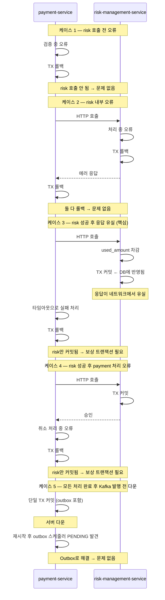

## 4. 코드로 보는 취소 플로우

### 4-1. PG사 취소 포함 전체 TX 경계

```java
@Service
@RequiredArgsConstructor
public class CancelPaymentService implements CancelPaymentUseCase {

    private final PaymentRepository paymentRepository;
    private final PaymentItemRepository paymentItemRepository;
    private final CancelRequestRepository cancelRequestRepository;
    private final IdempotencyKeyManager idempotencyKeyManager;
    private final RiskManagementService riskManagementService;  // HTTP 클라이언트
    private final PgCancelClient pgCancelClient;                // PG사 HTTP 클라이언트
    private final CancelEventOutboxRepository outboxRepository;
    private final CompensationRetryRepository compensationRetryRepository;

    public CancelPaymentResponse cancel(
        String paymentKey, Long userId,
        String idempotencyKey, CancelPaymentRequest request
    ) {
        // ── Step 1. 멱등성 체크 ──────────────────────────────
        // idempotency_key 테이블 조회 (DB 조회, TX 없음)
        Optional<CancelPaymentResponse> existing =
            idempotencyKeyManager.findResponse(idempotencyKey);
        if (existing.isPresent()) {
            return existing.get();  // 기존 응답 그대로 반환 (재처리 없음)
        }

        // ── Step 2. Payment/PaymentItem 검증 ────────────────
        // TX 없음 — 조회만 수행
        Payment payment = paymentRepository.findByPaymentKey(paymentKey)
            .orElseThrow(() -> new PaymentNotFoundException(paymentKey));

        payment.validateCancellable();  // 도메인 객체가 상태 검증

        List<PaymentItem> items =
            paymentItemRepository.findAllByPaymentId(payment.getId());

        cancelDomainService.validateCancelItems(items, request.cancelItems());

        // ── Step 3. TX 1 — CancelRequest PENDING INSERT ──────
        // risk 호출 전에 별도 커밋 (스케줄러 추적 가능하도록)
        CancelRequest cancelRequest = saveCancelRequestAsPending(
            payment, idempotencyKey, request, userId
        );

        // ── Step 4. risk-management-service 호출 (HTTP) ──────
        // TX 없음 — 외부 HTTP 호출
        try {
            riskManagementService.validateAndReserveLimit(
                payment.getMerchantId(),
                cancelRequest.getId().toString(),
                request.cancelAmount()
            );
        } catch (MerchantCancelLimitExceededException e) {
            // 한도 초과 — risk는 호출 안 됐거나 차감 없이 에러 반환
            failCancelRequest(cancelRequest, e.getMessage());
            throw e;
        } catch (RiskServiceException e) {
            // risk 서비스 장애
            failCancelRequest(cancelRequest, e.getMessage());
            throw e;
        }

        // ── Step 5. TX 2 — CancelRequest PROCESSING ──────────
        // risk 커밋 완료 후 별도 커밋
        // 이 시점부터 서버 다운 시 스케줄러가 보상 트랜잭션 실행
        markAsProcessing(cancelRequest);

        // ── Step 6. PG사 취소 API 호출 (HTTP) ────────────────
        // TX 없음 — 외부 HTTP 호출
        // PG사 성공 후에만 DB 처리 수행
        try {
            pgCancelClient.cancel(
                payment.getPaymentKey(),
                payment.getPgType(),
                request.cancelAmount()
            );
        } catch (PgCancelFailedException e) {
            // PG사 취소 실패
            // risk에서 선차감한 used_amount 원복 필요
            failWithCompensation(cancelRequest, payment.getMerchantId(),
                request.cancelAmount(), e.getMessage());
            throw e;
        } catch (PgCancelTimeoutException e) {
            // PG사 타임아웃 — 실제로 취소됐는지 불명확
            // PROCESSING 상태로 두고 스케줄러가 PG사 조회 후 판단
            throw e;
        }

        // ── Step 7. TX 3 — 단일 트랜잭션 ────────────────────
        return completeCancel(cancelRequest, payment, items, request, idempotencyKey);
    }

    // TX 1
    @Transactional
    private CancelRequest saveCancelRequestAsPending(
        Payment payment, String idempotencyKey,
        CancelPaymentRequest request, Long userId
    ) {
        CancelRequest cancelRequest = CancelRequest.create(
            payment.getId(), idempotencyKey,
            request.cancelAmount(), request.cancelReason(),
            CancellerType.USER, userId
        );
        return cancelRequestRepository.save(cancelRequest);
    }

    // TX 2
    @Transactional
    private void markAsProcessing(CancelRequest cancelRequest) {
        cancelRequest.toProcessing();
        cancelRequestRepository.save(cancelRequest);
    }

    // TX 3
    @Transactional
    private CancelPaymentResponse completeCancel(
        CancelRequest cancelRequest, Payment payment,
        List<PaymentItem> items, CancelPaymentRequest request,
        String idempotencyKey
    ) {
        // PaymentItem 상태 변경 (낙관적 락)
        List<PaymentItem> updatedItems =
            cancelDomainService.applyCancelToItems(items, request.cancelItems());
        paymentItemRepository.saveAll(updatedItems);

        // Payment 상태 집계
        payment.recalculateStatus(updatedItems);
        paymentRepository.save(payment);

        // CancelRequest COMPLETED
        cancelRequest.toCompleted();
        cancelRequestRepository.save(cancelRequest);

        // Outbox INSERT
        outboxRepository.save(CancelEventOutbox.of(cancelRequest, payment));

        // 응답 저장 (재시도 시 동일 응답 반환)
        CancelPaymentResponse response = CancelPaymentResponse.of(cancelRequest, updatedItems);
        idempotencyKeyManager.save(idempotencyKey, response);

        return response;
    }

    // 보상 트랜잭션
    private void failWithCompensation(
        CancelRequest cancelRequest, Long merchantId,
        BigDecimal restoreAmount, String reason
    ) {
        failCancelRequest(cancelRequest, reason);

        try {
            // risk-management-service에 HTTP로 보상 요청
            riskManagementService.compensate(
                cancelRequest.getId().toString(), restoreAmount
            );
        } catch (Exception e) {
            // 보상도 실패 → 스케줄러에 위임
            compensationRetryRepository.save(
                CompensationRetry.create(
                    cancelRequest.getId().toString(), merchantId, restoreAmount
                )
            );
        }
    }

    @Transactional
    private void failCancelRequest(CancelRequest cancelRequest, String reason) {
        cancelRequest.toFailed(reason);
        cancelRequestRepository.save(cancelRequest);
    }
}
```

---

### 4-2. PG사 성공/실패 케이스

**왜 PG사 먼저, DB 나중인가 — 순서 비교:**

| 방식 | PG사 성공 + DB 실패 | DB 성공 + PG사 실패 |
|------|-------------------|-------------------|
| A. PG사 먼저 | 환불 됨, DB만 맞추면 됨 → 스케줄러 재처리 가능 | 해당 없음 |
| B. DB 먼저 | 해당 없음 | 시스템은 취소 완료, 실제 환불 안 됨 → 고객 피해 |

```
방식 A 선택 이유:
  PG사 성공 + DB 실패:
    환불은 됐고 DB만 맞추면 됨
    TX 3은 멱등하게 재시도 가능
    고객 피해 없음

  방식 B의 문제:
    DB 성공 + PG사 실패 시
    DB를 취소 전 상태로 되돌려야 함
    PaymentItem.cancelled_amount 원복
    Payment 상태 원복
    Outbox 삭제까지 필요
    → 보상이 훨씬 복잡하고 위험
    → 실패 시 고객 피해 (환불 안 됨)
```

**각 케이스별 처리:**

```
PG사 취소 성공 → TX 3 진행

PG사 취소 실패 (명확한 실패):
  → risk used_amount 보상 트랜잭션 즉시 실행
  → CancelRequest → FAILED
  → 클라이언트에 에러 반환

PG사 타임아웃 (불명확):
  → CancelRequest PROCESSING 상태 유지
  → 스케줄러가 PG사에 취소 결과 조회 (GET /cancel/{cancelKey})
  → 성공이면 TX 3 진행, 실패이면 보상 + FAILED

PG사 중복 취소 요청:
  → PG사도 멱등성 지원
  → 같은 cancelKey로 재요청 시 기존 결과 반환
  → 안전하게 재시도 가능
```

**PG사 성공 + TX 3 실패 상세 처리:**

```java
// PG사 성공 후 TX 3 실패 시
// used_amount 보상하면 안 됨
// 이유: PG사 취소가 이미 완료됐으니 취소는 완료된 것
//       DB만 맞추면 되는 상황
// → 보상 트랜잭션 실행하지 않음 → 스케줄러에 위임

try {
    pgCancelClient.cancel(payment.getPaymentKey(), ...);
} catch (PgCancelFailedException e) {
    // PG사 실패 → 보상 + FAILED
    failWithCompensation(cancelRequest, ...);
    throw e;
}

// PG사 성공
try {
    completeCancel(cancelRequest, payment, items, request, idempotencyKey);
} catch (Exception e) {
    // TX 3 실패
    // CancelRequest는 PROCESSING으로 남음 (TX 2에서 커밋됨)
    // 보상 트랜잭션 실행하지 않음 (PG사 이미 완료됨)
    // 스케줄러가 PG사 조회 후 TX 3만 재시도
    log.error("TX 3 실패 - PG사 취소는 완료됨. 스케줄러 재처리 대기: " +
        "cancelRequestId={}", cancelRequest.getId(), e);
    throw e;
}
```

**복구 스케줄러 — PG사 조회 후 판단:**

```java
@Transactional
public void recoverProcessing(CancelRequest request) {
    // PROCESSING 건 = PG사 취소 호출까지 완료됐거나 타임아웃으로 결과 모르는 상태
    // PG사에 이미 호출한 취소의 결과를 조회 (재취소가 아님)
    PgCancelResult pgResult =
        pgCancelClient.getResult(request.getPaymentKey());

    if (pgResult.isSuccess()) {
        // PG사 취소 완료 확인 → TX 3만 재시도
        // used_amount 재차감 없음 (PROCESSING = 이미 차감됨)
        // PG사 재호출 없음 (이미 완료됨)
        completeCancel(request);

    } else if (pgResult.isNotCancelled()) {
        // PG사가 취소 요청을 처리하지 못한 상태
        if (pgResult.isRetryable()) {
            // 재시도 가능: PG사 취소 재호출
            try {
                pgCancelClient.cancel(request.getPaymentKey(),
                    request.getPgType(), request.getCancelAmount());
                completeCancel(request);  // 성공 시 TX 3
            } catch (Exception e) {
                // 재시도도 실패 → FAILED + 보상
                request.toFailed("PG사 취소 재시도 실패");
                cancelRequestRepository.save(request);
                riskManagementService.compensate(
                    request.getId().toString(), request.getCancelAmount()
                );
            }
        } else {
            // 재시도 불가 (취소 불가 상태) → FAILED + 보상
            request.toFailed("PG사 취소 불가");
            cancelRequestRepository.save(request);
            riskManagementService.compensate(
                request.getId().toString(), request.getCancelAmount()
            );
        }

    }
    // pgResult.isPending() → PROCESSING 유지, 다음 스케줄러(60초 후) 재조회
}
```

**TX 3이 멱등한 이유:**

```
TX 3을 여러 번 실행해도 결과가 동일:

PaymentItem:
  cancelled_amount + cancelAmount <= item_amount 조건 체크
  이미 반영됐으면 낙관적 락 충돌 → 재조회 후 확인

Payment:
  PaymentItem 전체 합산으로 상태 결정 → 항상 동일한 결과

CancelRequest:
  COMPLETED 상태면 더 이상 변경 안 함

Outbox:
  cancel_request_id UK → 이미 있으면 INSERT 실패 → no-op

idempotency_key:
  idem_key UK → 이미 있으면 INSERT 실패 → no-op
```

---

### 4-3. 락 코드 상세

**락 1 — idempotency_key UK 제약 (케이스 1: 동일 요청 중복)**

```java
// IdempotencyKeyManager.java
@Transactional
public void save(String idemKey, CancelPaymentResponse response) {
    try {
        idempotencyKeyRepository.save(
            IdempotencyKey.create(idemKey, response)
        );
    } catch (DataIntegrityViolationException e) {
        // UK 중복 → 이미 처리된 요청
        // 무시하고 진행 (기존 값 유지)
    }
}

public Optional<CancelPaymentResponse> findResponse(String idemKey) {
    return idempotencyKeyRepository.findByIdemKey(idemKey)
        .map(key -> deserialize(key.getResponseBody()));
}
```

```sql
-- DB 레벨에서 중복 차단
-- 두 요청이 동시에 INSERT 시도 시 하나만 성공
UNIQUE KEY uk_idempotency_idem_key (idem_key)
```

---

**락 2 — merchant_cancel_usage FOR UPDATE (케이스 2: 가맹점 한도 동시 차감)**

```java
// risk-management-service 내부
// MerchantCancelUsageRepository.java
@Lock(LockModeType.PESSIMISTIC_WRITE)
@Query("SELECT u FROM MerchantCancelUsage u " +
       "WHERE u.merchantId = :merchantId AND u.kstDate = :kstDate")
Optional<MerchantCancelUsage> findByMerchantIdAndDateForUpdate(
    Long merchantId, LocalDate kstDate
);
```

```java
// RiskManagementCancelService.java
@Transactional
public void validateAndReserveLimit(
    Long merchantId,
    String cancelRequestId,
    BigDecimal cancelAmount
) {
    // 이미 처리한 cancelRequestId면 skip (TX 2 실패 시 이중 차감 방어)
    if (cancelUsageHistoryRepository.existsByCancelRequestId(cancelRequestId)) {
        return;  // no-op
    }

    LocalDate kstToday = LocalDate.now(ZoneId.of("Asia/Seoul"));

    // 당일 첫 요청이면 merchant-limit-service에서 daily_limit 조회 후 행 생성
    MerchantCancelUsage usage = findOrCreateUsage(merchantId, kstToday);

    // FOR UPDATE로 이미 락이 걸린 상태에서 검증
    if (usage.getUsedAmount().add(cancelAmount)
            .compareTo(usage.getDailyLimit()) > 0) {
        throw new MerchantCancelLimitExceededException(
            cancelAmount,
            usage.getDailyLimit().subtract(usage.getUsedAmount()),
            usage.getDailyLimit()
        );
    }

    // 검증 통과 → 선차감
    usage.addUsedAmount(cancelAmount);
    merchantCancelUsageRepository.save(usage);
    // 트랜잭션 커밋 시 FOR UPDATE 락 해제
}
```

```
동작 방식:
  사용자 A: FOR UPDATE → 락 획득 → 검증 → 차감 → 커밋 (락 해제)
  사용자 B: FOR UPDATE → 대기 (A가 커밋될 때까지)
            → A 커밋 후 락 획득 → 검증 → 한도 초과 시 에러
```

---

**락 3 — PaymentItem 낙관적 락 (케이스 3: 동일 항목 동시 수정)**

```java
// PaymentItem.java (도메인 엔티티)
@Entity
public class PaymentItem {
    @Version
    private int version;  // JPA가 자동으로 version 컬럼 관리

    public void applyCancelAmount(BigDecimal cancelAmount) {
        if (this.cancelledAmount.add(cancelAmount)
                .compareTo(this.itemAmount) > 0) {
            throw new CancelAmountExceededException(
                this.id, cancelAmount,
                this.itemAmount.subtract(this.cancelledAmount)
            );
        }
        this.cancelledAmount = this.cancelledAmount.add(cancelAmount);
        recalculateStatus();
    }
}
```

```sql
-- JPA가 UPDATE 시 version 조건 자동 추가
UPDATE payment_item
SET cancelled_amount = cancelled_amount + ?,
    status = ?,
    version = version + 1
WHERE id = ?
AND version = ?;  -- 내가 읽은 시점의 version과 다르면 0 rows updated

-- 0 rows updated → OptimisticLockException 발생
```

```java
// 낙관적 락 실패 처리
try {
    paymentItemRepository.saveAll(updatedItems);
} catch (OptimisticLockingFailureException e) {
    // 다른 트랜잭션이 먼저 수정함
    // 재조회 후 재검증
    throw new CancelConflictException("동시 취소 요청이 발생했습니다. 다시 시도해주세요.");
}
```

---

### 4-4. 스케줄러 코드

**스케줄러 1 — 복구 스케줄러 (PROCESSING 5분 초과 건)**

```java
@Component
@RequiredArgsConstructor
public class CancelRecoveryScheduler {

    private final CancelRequestRepository cancelRequestRepository;
    private final CancelRecoveryService cancelRecoveryService;

    @Scheduled(fixedDelay = 60_000)  // 60초마다
    @SchedulerLock(name = "cancel-recovery", lockAtMostFor = "55s")
    public void recover() {
        LocalDateTime threshold = LocalDateTime.now(ZoneOffset.UTC)
            .minusMinutes(5);

        // PENDING 5분 초과 처리
        List<CancelRequest> stuckPendingRequests =
            cancelRequestRepository.findStuckPendingRequests(threshold);

        for (CancelRequest request : stuckPendingRequests) {
            try {
                cancelRecoveryService.recoverPending(request);
            } catch (Exception e) {
                log.error("PENDING 복구 실패: cancelRequestId={}", request.getId(), e);
            }
        }

        // PROCESSING 5분 초과 처리
        List<CancelRequest> stuckProcessingRequests =
            cancelRequestRepository.findStuckProcessingRequests(threshold);

        for (CancelRequest request : stuckProcessingRequests) {
            try {
                cancelRecoveryService.recoverProcessing(request);
            } catch (Exception e) {
                log.error("PROCESSING 복구 실패: cancelRequestId={}", request.getId(), e);
            }
        }
    }
}

@Service
public class CancelRecoveryService {

    // PENDING 5분 초과 복구
    public void recoverPending(CancelRequest request) {
        // risk 차감 여부 확인
        boolean charged = riskManagementService
            .check(request.getId().toString());

        if (charged) {
            // 차감됐으면 보상
            try {
                riskManagementService.compensate(
                    request.getId().toString(),
                    request.getCancelAmount()
                );
            } catch (Exception e) {
                // 보상 실패 시 compensation_retry INSERT
                compensationRetryRepository.save(
                    CompensationRetry.create(request)
                );
            }
        }
        // 차감 안 됐으면 보상 불필요

        request.toFailed("PENDING 5분 초과");
        cancelRequestRepository.save(request);
        cancelRequestHistoryRepository.save(
            CancelRequestHistory.of(request, "PENDING 5분 초과로 FAILED 처리")
        );
    }

    // PROCESSING 5분 초과 복구
    @Transactional
    public void recoverProcessing(CancelRequest request) {
        // PROCESSING 건 = PG사 취소 호출까지 완료됐거나 타임아웃으로 결과 모르는 상태
        // PG사에 이미 호출한 취소의 결과를 조회 (재취소가 아님)
        PgCancelResult pgResult = pgCancelClient.getResult(request.getPaymentKey());

        if (pgResult.isSuccess()) {
            // PG사 취소 완료 → TX 3 재처리
            // used_amount 재차감 없음, PG사 재호출 없음
            completeCancel(request);

        } else if (pgResult.isNotCancelled()) {
            if (pgResult.isRetryable()) {
                // 재시도 가능 → PG사 취소 재호출
                try {
                    pgCancelClient.cancel(request.getPaymentKey(),
                        request.getPgType(), request.getCancelAmount());
                    completeCancel(request);
                } catch (Exception e) {
                    request.toFailed("PG사 취소 재시도 실패");
                    cancelRequestRepository.save(request);
                    riskManagementService.compensate(
                        request.getId().toString(), request.getCancelAmount()
                    );
                }
            } else {
                // 재시도 불가 → FAILED + 보상
                request.toFailed("PG사 취소 불가");
                cancelRequestRepository.save(request);
                riskManagementService.compensate(
                    request.getId().toString(), request.getCancelAmount()
                );
            }
        }
        // pgResult.isPending() → PG사 내부 처리 중
        else if (pgResult.isPending()) {
            if (request.getPgPendingSince() == null) {
                // 최초 pending 감지 → 시각 기록
                request.setPgPendingSince(LocalDateTime.now(ZoneOffset.UTC));
                cancelRequestRepository.save(request);

            } else if (request.getPgPendingSince()
                    .isBefore(LocalDateTime.now(ZoneOffset.UTC).minusHours(1))) {
                // 1시간 초과 → 자동 처리 한계, 운영팀 개입 필요
                request.toFailed("PG사 pending 1시간 초과");
                cancelRequestRepository.save(request);
                riskManagementService.compensate(
                    request.getId().toString(), request.getCancelAmount()
                );
                alertService.sendPgPendingAlert(request);
            }
            // 1시간 미만 → PROCESSING 유지, 다음 스케줄러(60초 후) 재조회
        }
    }
}
```

**cancel_request 테이블 변경:**

```sql
-- V8__add_pg_pending_since_to_cancel_request.sql
ALTER TABLE cancel_request
  ADD COLUMN pg_pending_since DATETIME(3) NULL
    COMMENT 'PG사 pending 최초 감지 시각. NULL이면 pending 아님.'
  AFTER failed_reason;
```

```
pg_pending_since 활용:
  NULL:           pending 상태 아님 (정상)
  값 있음:        pending 최초 감지 시각
  1시간 초과:     FAILED + 보상 + 운영팀 알림

1시간이라는 기준:
  PG사 내부 처리 지연은 보통 수 초~수 분
  1시간이 지나도 pending이면 PG사 이슈
  완전 자동화보다 운영팀 개입을 전제로 설계
```

```java
@Component
@RequiredArgsConstructor
public class CancelEventOutboxScheduler {

    private final CancelEventOutboxRepository outboxRepository;
    private final KafkaEventPublisher kafkaEventPublisher;

    @Scheduled(fixedDelay = 10_000)  // 10초마다
    @SchedulerLock(name = "outbox-publisher", lockAtMostFor = "9s")
    public void publish() {
        List<CancelEventOutbox> pendingEvents =
            outboxRepository.findByStatusOrderByCreatedAt(
                OutboxStatus.PENDING, PageRequest.of(0, 100)
            );

        for (CancelEventOutbox outbox : pendingEvents) {
            try {
                kafkaEventPublisher.publish(
                    "payment.cancelled",
                    outbox.getPayload()
                );
                // 발행 성공 → PUBLISHED 업데이트
                outbox.markAsPublished();
                outboxRepository.save(outbox);
            } catch (Exception e) {
                log.error("Outbox 발행 실패: outboxId={}", outbox.getId(), e);
                // 다음 스케줄러 실행 시 재시도 (PENDING 유지)
            }
        }
    }
}
```

---

**스케줄러 3 — 보상 재시도 스케줄러**

```java
@Component
@RequiredArgsConstructor
public class CompensationRetryScheduler {

    private final CompensationRetryRepository compensationRetryRepository;
    private final RiskManagementService riskManagementService;

    @Scheduled(fixedDelay = 30_000)  // 30초마다
    @SchedulerLock(name = "compensation-retry", lockAtMostFor = "25s")
    public void retry() {
        LocalDateTime now = LocalDateTime.now(ZoneOffset.UTC);

        List<CompensationRetry> retries =
            compensationRetryRepository.findPendingRetries(now, 100);

        for (CompensationRetry retry : retries) {
            try {
                riskManagementService.compensate(
                    retry.getCancelRequestId(), retry.getRestoreAmount()
                );
                // 보상 성공
                retry.markAsDone();
                compensationRetryRepository.save(retry);

            } catch (Exception e) {
                retry.incrementAttempt();  // attempt_count++

                if (retry.isExhausted()) {
                    // 5회 초과 → EXHAUSTED
                    retry.markAsExhausted();
                    alertService.sendExhaustedAlert(retry);
                } else {
                    // 지수 백오프: 30초 × 2^attemptCount
                    retry.scheduleNextRetry();
                }
                compensationRetryRepository.save(retry);
            }
        }
    }
}
```

```
ShedLock 동작:
  @SchedulerLock(name = "cancel-recovery", lockAtMostFor = "55s")
  → shedlock 테이블에 name="cancel-recovery" 행을 lock_until=NOW+55초로 INSERT
  → 다른 인스턴스가 같은 이름으로 시도 시 lock_until이 미래 → 실행 skip
  → 인스턴스 다운 시 lock_until 이후 자동 해제
```

---

### 4-5. Kafka Consumer — order-service

```java
@Component
@RequiredArgsConstructor
public class CancelEventConsumer {

    private final ProcessedCancelEventRepository processedCancelEventRepository;
    private final OrderCancelService orderCancelService;

    @KafkaListener(
        topics = "payment.cancelled",
        groupId = "order-service",
        containerFactory = "kafkaListenerContainerFactory"
    )
    public void consume(
        ConsumerRecord<String, CancelEventPayload> record,
        Acknowledgment ack
    ) {
        CancelEventPayload payload = record.value();
        String cancelRequestId = payload.getCancelRequestId();

        try {
            // 서버 사이드 멱등성 체크
            // 중복 수신 방어 — At-least-once에서 필수
            if (processedCancelEventRepository
                    .existsByCancelRequestId(cancelRequestId)) {
                // 이미 처리된 이벤트 → no-op
                log.info("중복 이벤트 skip: cancelRequestId={}", cancelRequestId);
                ack.acknowledge();  // offset 커밋 후 종료
                return;
            }

            // OrderItem 상태 변경
            orderCancelService.processCancel(payload);

            // 처리 완료 기록 (UK 제약으로 중복 방어)
            processedCancelEventRepository.save(
                ProcessedCancelEvent.of(cancelRequestId)
            );

            // 처리 완료 후 offset 커밋
            ack.acknowledge();

        } catch (DataIntegrityViolationException e) {
            // processed_cancel_event UK 충돌
            // 동시에 같은 이벤트를 처리한 경우 → no-op
            log.warn("중복 INSERT 감지: cancelRequestId={}", cancelRequestId);
            ack.acknowledge();

        } catch (OrderItemNotFoundException e) {
            // 데이터 오류 → 재시도 무의미 → 즉시 DLQ
            log.error("데이터 오류: cancelRequestId={}", cancelRequestId, e);
            // DLQ로 라우팅 (Spring Kafka ErrorHandler가 처리)
            throw e;

        } catch (Exception e) {
            // 일시적 오류 → retry 토픽으로 발행
            log.error("일시적 오류: cancelRequestId={}", cancelRequestId, e);
            throw e;
        }
    }
}
```

**서버 사이드 멱등성 체크가 필요한 이유:**

```
Kafka At-least-once 방식에서:
  Consumer 처리 완료 후 서버 다운
  → 재시작 시 offset이 커밋 안 됐으니 같은 메시지 재수신
  → 중복 처리 가능

방어 레이어:
  1차: processedCancelEventRepository.existsByCancelRequestId()
       → 이미 처리됐으면 early return

  2차: processedCancelEventRepository.save()의 UK 제약
       → 동시에 같은 이벤트가 들어와도 하나만 INSERT 성공
       → DataIntegrityViolationException → no-op 처리

2차가 필요한 이유:
  1차 체크와 2차 INSERT 사이에
  다른 Consumer 인스턴스가 같은 이벤트 처리 시작할 수 있음
  (Race Condition)
  → UK 제약이 최종 방어선
```

**offset 커밋 전략:**

```
처리 성공: orderCancelService 완료 + processed_cancel_event INSERT → ack
중복 감지: no-op → ack (offset 커밋해서 재수신 방지)
DLQ 이동:  DLQ 발행 → ack (재시도 무의미한 오류)
일시적 오류: throw → ack 안 함 → 재시도
```

### 4-1. 핵심 전제

```
HTTP 요청은 트랜잭션 경계를 넘을 수 없다.

payment-service의 @Transactional과
risk-management-service의 @Transactional은
완전히 독립된 트랜잭션이다.
둘은 같은 트랜잭션으로 묶이지 않는다.
```

### 4-2. 케이스별 원자성 분석



| 케이스 | 상황 | 결과 |
|--------|------|------|
| 1 | risk 호출 전 오류 | 둘 다 롤백 → 문제 없음 |
| 2 | risk 내부 오류 | 둘 다 롤백 → 문제 없음 |
| 3 | risk 성공 후 응답 유실 | risk만 커밋 → **보상 트랜잭션 필요** |
| 4 | risk 성공 후 payment 오류 | risk만 커밋 → **보상 트랜잭션 필요** |
| 5 | 취소 완료 후 Kafka 발행 전 다운 | Outbox 스케줄러 처리 |

### 4-6. 케이스 3, 4 보상 트랜잭션 상세

**케이스 3 — risk 응답 유실 시 흐름:**

```
상황:
  risk-management-service: used_amount 차감 커밋 완료
  응답이 네트워크에서 유실
  payment-service: 타임아웃 감지

이 시점에서 CancelRequest 상태:
  PENDING (TX 1에서 커밋됨)
  → PROCESSING으로 가지 못한 상태

payment-service 처리:
  타임아웃 catch → CancelRequest FAILED 기록
  → 보상 트랜잭션 즉시 실행
```

```java
// payment-service — risk HTTP 호출 catch
try {
    riskManagementService.validateAndReserveLimit(
        payment.getMerchantId(),
        cancelRequest.getId().toString(),
        request.cancelAmount()
    );
} catch (ResourceAccessException e) {
    // 타임아웃 또는 네트워크 유실
    // risk가 커밋됐을 수도, 안 됐을 수도 있음
    // 안전하게 보상 시도 (risk 측에서 멱등하게 처리)
    failWithCompensation(cancelRequest, payment.getMerchantId(),
        request.cancelAmount(), "risk 응답 유실: " + e.getMessage());
    throw new RiskServiceUnavailableException();
}
```

```java
// risk-management-service — 보상 API (멱등)
@Transactional
public void compensate(String cancelRequestId, BigDecimal restoreAmount) {

    // 멱등 체크: 이미 보상됐으면 no-op
    // cancel_usage_compensation UK로 중복 방어
    int inserted = compensationRepository.insertIfAbsent(
        cancelRequestId, restoreAmount
    );

    if (inserted == 0) {
        // 이미 보상 완료된 건 → 그냥 반환
        log.info("이미 보상 완료된 건: cancelRequestId={}", cancelRequestId);
        return;
    }

    // 실제 원복
    // used_amount가 restoreAmount 미만이면 0으로 (언더플로우 방어)
    merchantCancelUsageRepository.decreaseUsedAmount(
        cancelRequestId, restoreAmount
    );
}
```

```sql
-- cancel_usage_compensation INSERT (UK 중복 시 no-op)
INSERT IGNORE INTO cancel_usage_compensation
  (cancel_request_id, merchant_id, restore_amount, status)
VALUES (?, ?, ?, 'COMPLETED');

-- used_amount 원복 (언더플로우 방어)
UPDATE merchant_cancel_usage
SET used_amount = GREATEST(0, used_amount - ?)
WHERE merchant_id = ?
AND kst_date = ?;
```

**케이스 3 핵심 — 보상이 실제로 필요한지 불명확한 경우:**

```
risk가 커밋됐을 수도, 안 됐을 수도 있는 상황에서
보상 API를 호출하면?

risk가 커밋 안 됐다면:
  merchant_cancel_usage에 차감이 없음
  보상 API 호출 → cancel_usage_compensation INSERT
  → used_amount - restoreAmount 시도
  → GREATEST(0, 0 - 30만원) = 0 (언더플로우 방어)
  → 결과: 이상 없음

risk가 커밋 됐다면:
  used_amount가 차감된 상태
  보상 API 호출 → used_amount 원복
  → 결과: 정상 복구

어느 경우든 안전하게 처리됨
→ 불명확한 상황에서 보상 API 호출은 항상 안전
```

---

**케이스 4 — risk 성공 후 payment 처리 오류 흐름:**

```
상황:
  risk-management-service: used_amount 차감 커밋 완료
  payment-service: TX 3 처리 중 오류 (PaymentItem 수정 실패 등)

이 시점에서 CancelRequest 상태:
  PROCESSING (TX 2에서 커밋됨)
  TX 3이 롤백됐으므로 PROCESSING 그대로 남음
```

```java
// TX 3 내부에서 오류 발생 시
@Transactional
private CancelPaymentResponse completeCancel(...) {
    try {
        // PaymentItem 낙관적 락 충돌 등
        paymentItemRepository.saveAll(updatedItems);
        ...
    } catch (OptimisticLockingFailureException e) {
        // TX 3 롤백됨 → CancelRequest는 PROCESSING 상태로 남음
        // 여기서 보상 트랜잭션 직접 실행 불가
        // (이미 TX 3 롤백 → 이 메서드 내 추가 DB 작업 불가)
        throw e;
    }
}

// TX 3 외부 (CancelPaymentService.cancel)에서 처리
try {
    completeCancel(cancelRequest, payment, items, request, idempotencyKey);
} catch (Exception e) {
    // TX 3 실패 → CancelRequest가 PROCESSING 상태로 남아있음
    // 방법 1: 즉시 보상 시도
    try {
        failCancelRequestDirectly(cancelRequest.getId()); // PROCESSING → FAILED
        riskManagementService.compensate(
            cancelRequest.getId().toString(), request.cancelAmount()
        );
    } catch (Exception compensateEx) {
        // 보상도 실패 → compensation_retry에 기록
        // 스케줄러가 재시도
        compensationRetryRepository.save(
            CompensationRetry.create(
                cancelRequest.getId().toString(),
                payment.getMerchantId(),
                request.cancelAmount()
            )
        );
    }
    throw e;
}
```

**케이스 4 — 복구 스케줄러가 처리하는 경로:**

```
서버 다운으로 케이스 4 catch 블록도 실행 못 한 경우:
  CancelRequest가 PROCESSING 상태로 5분 이상 남음
  → 복구 스케줄러 감지

복구 스케줄러 판단:
  PG사에 취소 결과 조회
    → PG사 취소 성공: TX 3 재처리 (COMPLETED 방향)
    → PG사 취소 미수행: FAILED + 보상 트랜잭션

TX 3 재처리 시 주의:
  used_amount는 이미 차감됨 → 재차감 금지
  PG사 취소는 이미 됐거나 스케줄러가 다시 호출
  PG사 멱등성으로 중복 호출 방어
```

---

