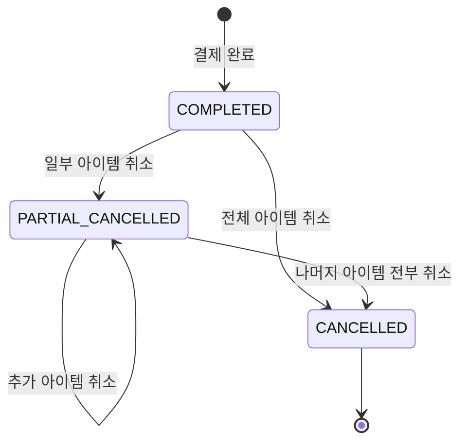
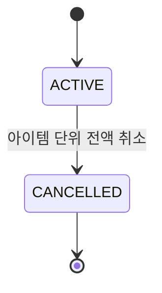
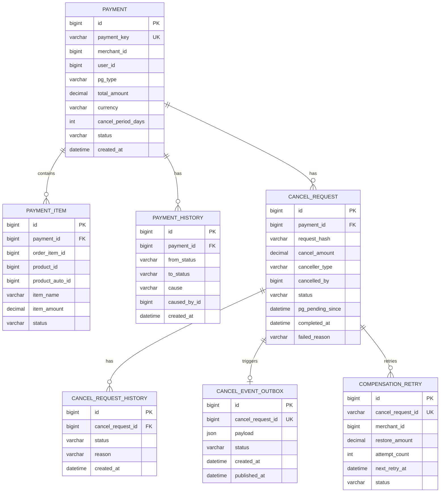
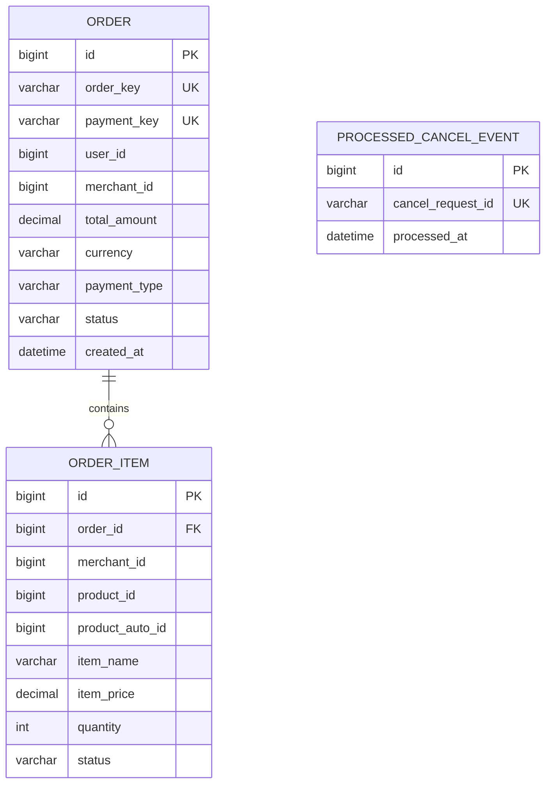
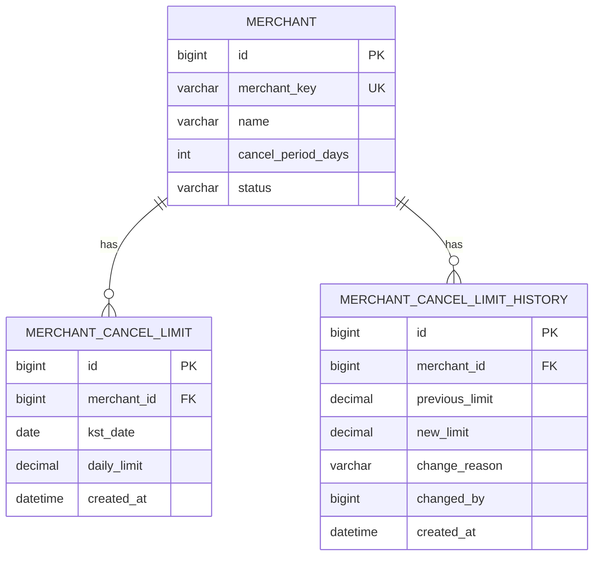
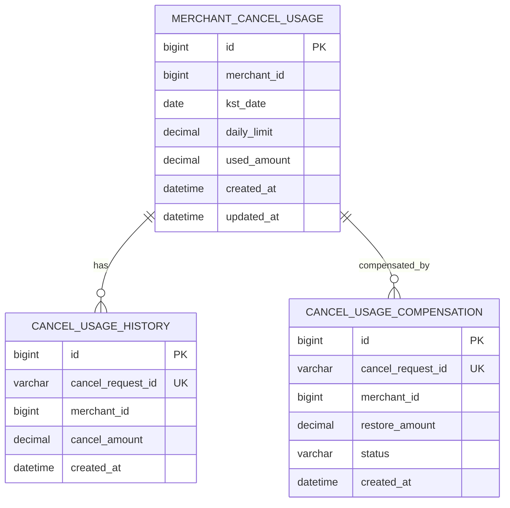
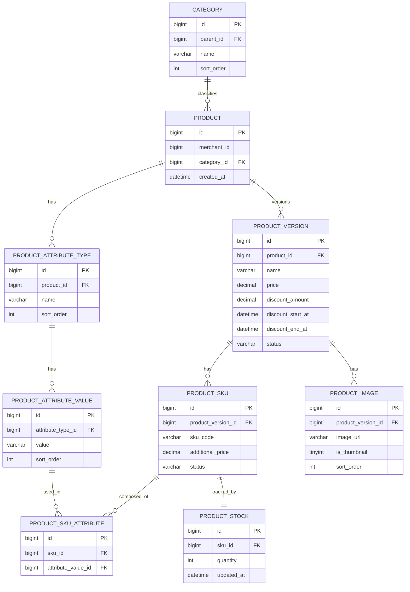

## 6. 상태 전이 규칙

### 6-1. Payment 상태 전이



### 6-2. PaymentItem 상태 전이



```
PaymentItem 부분취소 불가:
  아이템 단위 전액 취소만 허용
  PARTIAL_CANCELLED 상태 없음
  cancelled_amount 컬럼 없음
  version (낙관적 락) 없음
  → cancel_request (payment_id, request_hash) UK로 동시성 제어
```

### 6-3. 취소 불가 상태

```
Payment 취소 불가: PENDING, CANCELLED, CANCEL_FAILED
PaymentItem 취소 불가: CANCELLED
Order 취소 불가: DELIVERING 이후
```

### 6-4. 검증 순서와 이유

```
1. 요청 형식 오류 (400)
2. 인가 오류 (403)
3. 리소스 없음 (404) — Payment 존재 확인
4. 멱등 중복 (409)
5. 비즈니스 규칙 (422):
     Payment 상태
     PaymentItem 상태
     취소 금액 검증
     취소 기간 검증
     가맹점 한도 검증 (risk-management-service)

순서가 중요한 이유:
  한도 검증(5번)을 리소스 확인(3번) 전에 하면
  존재하지 않는 Payment에 대해 한도가 차감될 수 있음
```

---

## 7. API 설계

### 7-1. 취소 요청 API

```
POST /v1/payments/{paymentKey}/cancel

헤더:
  Authorization: Bearer {token}
  Idempotency-Key: {UUID}

요청:
{
  "cancelAmount": 300000,
  "cancelReason": "고객 단순 변심",
  "cancelItems": [
    { "paymentItemId": 2, "cancelAmount": 300000 }
  ]
}

응답 200:
{
  "cancelRequestId": "cr_abc123",
  "paymentKey": "pay_xyz",
  "cancelAmount": 300000,
  "currency": "KRW",
  "status": "COMPLETED",
  "cancellerType": "USER",
  "cancelledItems": [
    { "paymentItemId": 2, "cancelAmount": 300000, "status": "CANCELLED" }
  ],
  "completedAt": "2026-04-13T10:00:00.000Z"
}
```

**paymentKey를 URL에 사용한 이유:**

```
paymentId(내부 PK): 순차적 숫자
  → 전체 결제 건수 유추 가능
  → 다른 결제 ID 추측 접근 가능 → 보안 취약

paymentKey(PG사 발급 키): 불투명 키
  → 추측 불가
  → 클라이언트가 결제 완료 후 응답으로 받은 값
  → URL에 쓰기 적합
```

### 7-2. 조회 API

```
GET /v1/payments/{paymentKey}/cancel/{cancelRequestId}
GET /v1/payments/{paymentKey}/cancels?page=0&size=20
```

---

## 8. 데이터 설계

### 8-1. 모듈별 테이블 구조

**payment-service**



**order-service**



**merchant-limit-service**



**risk-management-service**



**product-service**



### 8-2. 핵심 테이블 관계

```
payment-service:
  payment (결제 원장)
    └── payment_item (결제 항목, 아이템 단위 취소)
    └── payment_history (상태 변경 이력)
    └── cancel_request (취소 요청, request_hash UK)
        └── cancel_request_history (상태 변경 이력)
    └── cancel_event_outbox (Kafka 발행 보장)
    └── compensation_retry (보상 재시도 — payment-service 관리)

risk-management-service:
  merchant_cancel_usage (가맹점 일일 소진 내역)
    └── cancel_usage_history (차감 이력, 이중 차감 방어)
    └── cancel_usage_compensation (보상 멱등성)
```

### 8-2. 금액 타입

```
FLOAT / DOUBLE 금지 이유:
  0.1 + 0.2 = 0.30000000004
  부동소수점 오차 → 금융에서 절대 금지

선택: DECIMAL(19,2) + currency VARCHAR(3)
  고정소수점으로 정확한 소수점 처리
  Java에서 BigDecimal로 매핑
  currency: ISO 4217 코드 (KRW, USD, EUR)
```

### 8-3. 상품 버저닝

```
product (원본, 불변)
product_version (버전별 상세)
product_sku (버전별 속성 조합 — 색상, 사이즈)

실제 가격 = product_version.price
           - product_version.discount_amount
           + product_sku.additional_price

payment_item 스냅샷:
  product_auto_id: 결제 시점 버전 고정
  item_name, item_price: 결제 시점 값
  → 나중에 상품 정보 변경돼도 결제 내역 불변
```

---

